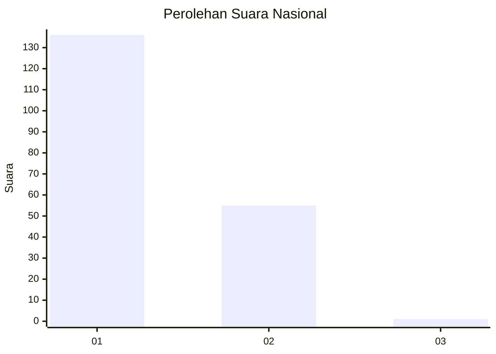
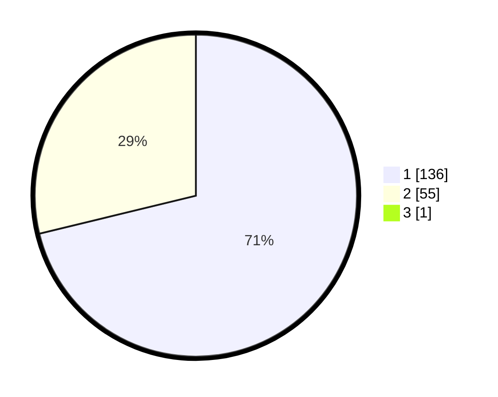

# Hasil

## Grafik

## Tabel

| No. | Nama Paslon    | Suara | Suara (raw) | Persentase |
|:--- |:-------------- | -----:| -----------:| ----------:|
| 1   | ANIES MUHAIMIN | 136   | [136][p-1]  | 70,83      |
| 2   | PRABOWO GIBRAN | 55    | [55][p-2]   | 28,65      |
| 3   | GANJAR MAHFUD  | 1     | [1][p-3]    | 0,52       |

[p-1]: https://github.com/gigit-pemilu/pemilu-2024/blob/main/pilpres/hitung-suara/sub/11-aceh/sub/08-aceh-utara/sub/08-samudera/sub/2039-kitou/sub/002-tps/sub/paslon-1.txt
[p-2]: https://github.com/gigit-pemilu/pemilu-2024/blob/main/pilpres/hitung-suara/sub/11-aceh/sub/08-aceh-utara/sub/08-samudera/sub/2039-kitou/sub/002-tps/sub/paslon-2.txt
[p-3]: https://github.com/gigit-pemilu/pemilu-2024/blob/main/pilpres/hitung-suara/sub/11-aceh/sub/08-aceh-utara/sub/08-samudera/sub/2039-kitou/sub/002-tps/sub/paslon-3.txt

## Foto C Plano

https://sirekap-obj-formc.kpu.go.id/952d/pemilu/ppwp/11/08/08/20/39/1108082039002-20240222-130431--29462c0e-76f7-41c9-8d62-c917887e82e1.jpg

https://sirekap-obj-formc.kpu.go.id/952d/pemilu/ppwp/11/08/08/20/39/1108082039002-20240214-231345--d8c5d376-ae1f-409e-bacd-02a97af88db6.jpg

https://sirekap-obj-formc.kpu.go.id/952d/pemilu/ppwp/11/08/08/20/39/1108082039002-20240215-091608--8a0fda8c-2e4a-4fa9-8788-ec6bd989dfd8.jpg

## Metadata

| Key        | Value               |
| ---------- | ------------------- |
| Time Stamp | 2024-02-22 14:00:00 |

