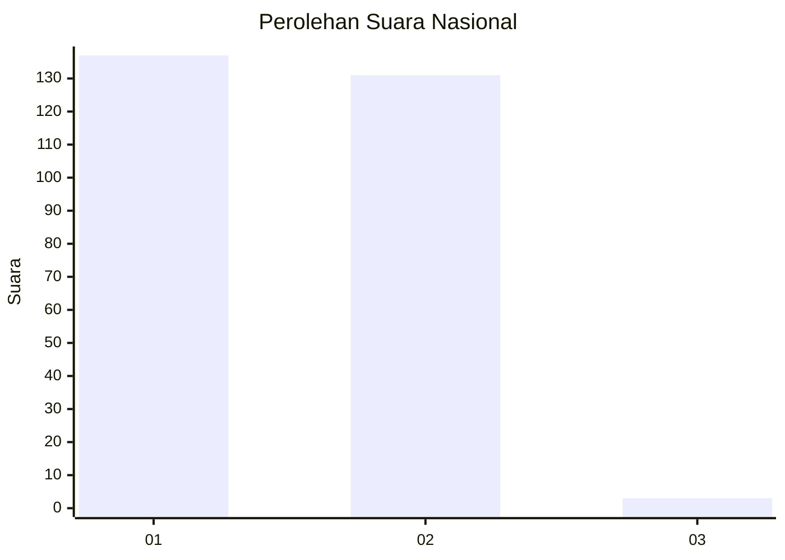
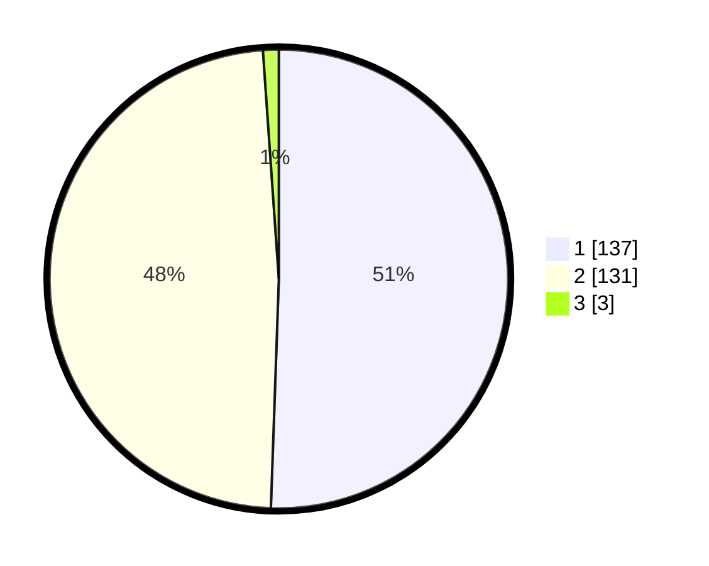

# Hasil

## Grafik

## Tabel

| No. | Nama Paslon    | Suara | Suara (raw) | Persentase |
|:--- |:-------------- | -----:| -----------:| ----------:|
| 1   | ANIES MUHAIMIN | 137   | [137][p-1]  | 50,55      |
| 2   | PRABOWO GIBRAN | 131   | [131][p-2]  | 48,34      |
| 3   | GANJAR MAHFUD  | 3     | [3][p-3]    | 1,11       |

[p-1]: https://github.com/gigit-pemilu/pemilu-2024/blob/main/pilpres/hitung-suara/sub/11-aceh/sub/08-aceh-utara/sub/09-seunuddon/sub/2019-cot-trueng/sub/002-tps/sub/paslon-1.txt
[p-2]: https://github.com/gigit-pemilu/pemilu-2024/blob/main/pilpres/hitung-suara/sub/11-aceh/sub/08-aceh-utara/sub/09-seunuddon/sub/2019-cot-trueng/sub/002-tps/sub/paslon-2.txt
[p-3]: https://github.com/gigit-pemilu/pemilu-2024/blob/main/pilpres/hitung-suara/sub/11-aceh/sub/08-aceh-utara/sub/09-seunuddon/sub/2019-cot-trueng/sub/002-tps/sub/paslon-3.txt

## Foto C Plano

https://sirekap-obj-formc.kpu.go.id/89ed/pemilu/ppwp/11/08/09/20/19/1108092019002-20240215-123739--defa785f-1767-408e-8f69-1a81fddb3b1f.jpg

https://sirekap-obj-formc.kpu.go.id/89ed/pemilu/ppwp/11/08/09/20/19/1108092019002-20240215-124159--d8a2f292-65f4-46f8-b187-7601091f1028.jpg

https://sirekap-obj-formc.kpu.go.id/89ed/pemilu/ppwp/11/08/09/20/19/1108092019002-20240215-124519--6335c014-794c-4c20-a7c1-d7fc574521ed.jpg

## Metadata

| Key        | Value               |
| ---------- | ------------------- |
| Time Stamp | 2024-02-15 17:00:25 |

## DATA PEMILIH TETAP

Jumlah pemilih dalam DPT: **199**.
 * L: **101**.
 * P: **98**.

## DATA PENGGUNA HAK PILIH

Jumlah pengguna hak pilih dalam DPT: **172**.
 * L: **85**.
 * P: **87**.

Jumlah pengguna hak pilih dalam DPTb: **172**.
 * L: **85**.
 * P: **87**.

Jumlah pengguna hak pilih dalam DPK: **1**.
 * L: **0**.
 * P: **1**.

Jumlah pengguna hak pilih: **173**.
 * L: **85**.
 * P: **88**.

## JUMLAH SUARA SAH DAN TIDAK SAH

JUMLAH SELURUH SUARA SAH: **171**.

JUMLAH SUARA TIDAK SAH: **2**.

JUMLAH SELURUH SUARA SAH DAN SUARA TIDAK SAH: **173**.

