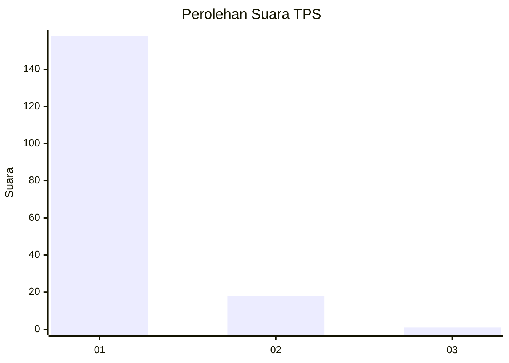
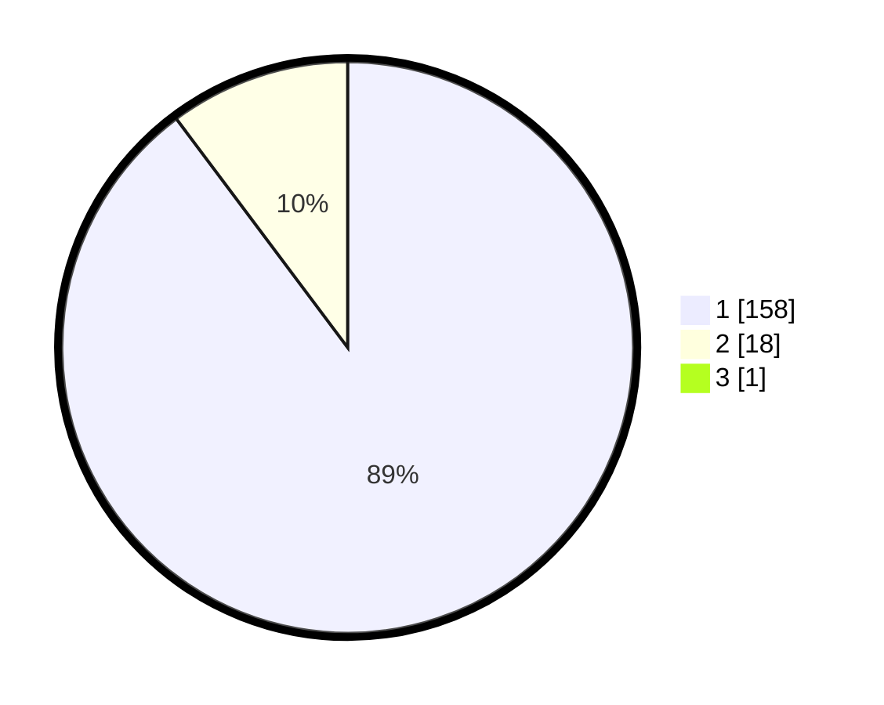

# Hasil

## Grafik

## Tabel

| No. | Nama Paslon    | Suara | Suara (raw) | Persentase |
|:--- |:-------------- | -----:| -----------:| ----------:|
| 1   | ANIES MUHAIMIN | 158   | [158][p-1]  | 89,27      |
| 2   | PRABOWO GIBRAN | 18    | [18][p-2]   | 10,17      |
| 3   | GANJAR MAHFUD  | 1     | [1][p-3]    | 0,56       |

[p-1]: https://github.com/gigit-pemilu/pemilu-2024-11-aceh/blob/main/pilpres/hitung-suara/sub/11-aceh/sub/08-aceh-utara/sub/09-seunuddon/sub/2019-cot-trueng/sub/003-tps/sub/paslon-1.txt
[p-2]: https://github.com/gigit-pemilu/pemilu-2024-11-aceh/blob/main/pilpres/hitung-suara/sub/11-aceh/sub/08-aceh-utara/sub/09-seunuddon/sub/2019-cot-trueng/sub/003-tps/sub/paslon-2.txt
[p-3]: https://github.com/gigit-pemilu/pemilu-2024-11-aceh/blob/main/pilpres/hitung-suara/sub/11-aceh/sub/08-aceh-utara/sub/09-seunuddon/sub/2019-cot-trueng/sub/003-tps/sub/paslon-3.txt

## Foto C Plano

https://sirekap-obj-formc.kpu.go.id/b8a2/pemilu/ppwp/11/08/09/20/19/1108092019003-20240215-124139--69e4bc70-3ce9-4945-970e-4a58401aeba3.jpg

https://sirekap-obj-formc.kpu.go.id/b8a2/pemilu/ppwp/11/08/09/20/19/1108092019003-20240215-124244--fd53c211-7333-4f23-9dd3-57bc52602ad5.jpg

https://sirekap-obj-formc.kpu.go.id/b8a2/pemilu/ppwp/11/08/09/20/19/1108092019003-20240215-124332--6892bbb7-772c-4eb5-b736-778d22715753.jpg

## Metadata

| Key        | Value               |
| ---------- | ------------------- |
| Time Stamp | 2024-02-17 16:00:02 |

