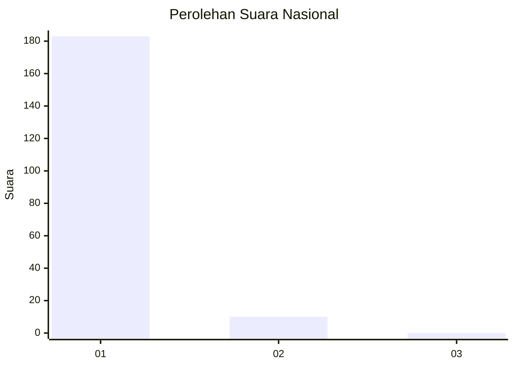
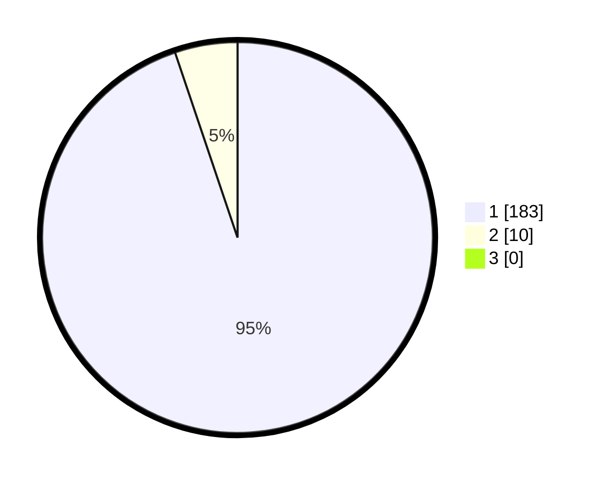

# Hasil

## Grafik

## Tabel

| No. | Nama Paslon    | Suara | Suara (raw) | Persentase |
|:--- |:-------------- | -----:| -----------:| ----------:|
| 1   | ANIES MUHAIMIN | 183   | [183][p-1]  | 94,82      |
| 2   | PRABOWO GIBRAN | 10    | [10][p-2]   | 5,18       |
| 3   | GANJAR MAHFUD  | 0     | [0][p-3]    | 0,00       |

[p-1]: https://github.com/gigit-pemilu/pemilu-2024/blob/main/pilpres/hitung-suara/sub/11-aceh/sub/08-aceh-utara/sub/09-seunuddon/sub/2022-lhok-puuk/sub/004-tps/sub/paslon-1.txt
[p-2]: https://github.com/gigit-pemilu/pemilu-2024/blob/main/pilpres/hitung-suara/sub/11-aceh/sub/08-aceh-utara/sub/09-seunuddon/sub/2022-lhok-puuk/sub/004-tps/sub/paslon-2.txt
[p-3]: https://github.com/gigit-pemilu/pemilu-2024/blob/main/pilpres/hitung-suara/sub/11-aceh/sub/08-aceh-utara/sub/09-seunuddon/sub/2022-lhok-puuk/sub/004-tps/sub/paslon-3.txt

## Foto C Plano

https://sirekap-obj-formc.kpu.go.id/ab8f/pemilu/ppwp/11/08/09/20/22/1108092022004-20240221-180710--0fa15ee1-8b01-4207-b2b3-14babd19851f.jpg

https://sirekap-obj-formc.kpu.go.id/ab8f/pemilu/ppwp/11/08/09/20/22/1108092022004-20240221-180909--660b0771-1d4a-4b83-a868-03981e0fc047.jpg

https://sirekap-obj-formc.kpu.go.id/ab8f/pemilu/ppwp/11/08/09/20/22/1108092022004-20240221-181040--f17c49db-6cf6-4262-9fde-b5b9479bb4b9.jpg

## Metadata

| Key        | Value               |
| ---------- | ------------------- |
| Time Stamp | 2024-02-24 22:31:28 |

