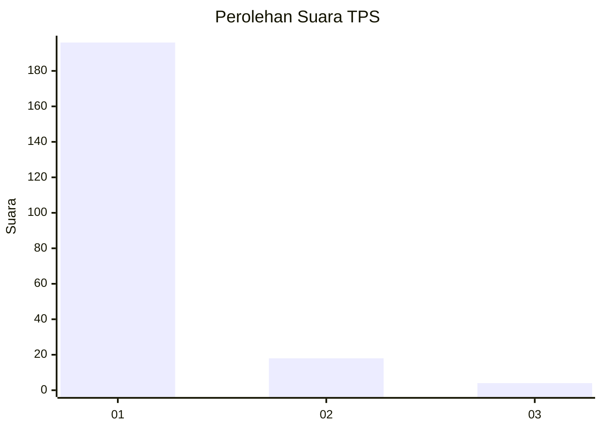
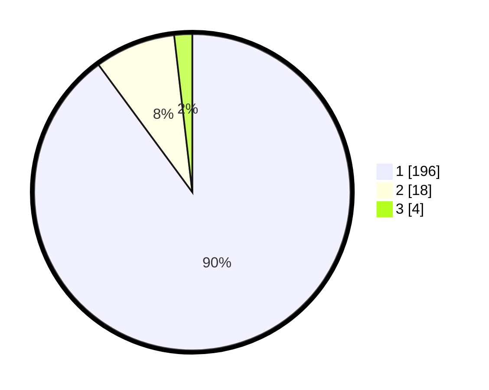

# Hasil

## Grafik

## Tabel

| No. | Nama Paslon    | Suara | Suara (raw) | Persentase |
|:--- |:-------------- | -----:| -----------:| ----------:|
| 1   | ANIES MUHAIMIN | 196   | [196][p-1]  | 89,91      |
| 2   | PRABOWO GIBRAN | 18    | [18][p-2]   | 8,26       |
| 3   | GANJAR MAHFUD  | 4     | [4][p-3]    | 1,83       |

[p-1]: https://github.com/gigit-pemilu/pemilu-2024-11-aceh/blob/main/pilpres/hitung-suara/sub/11-aceh/sub/08-aceh-utara/sub/09-seunuddon/sub/2024-ulee-rubek-timu/sub/001-tps/sub/paslon-1.txt
[p-2]: https://github.com/gigit-pemilu/pemilu-2024-11-aceh/blob/main/pilpres/hitung-suara/sub/11-aceh/sub/08-aceh-utara/sub/09-seunuddon/sub/2024-ulee-rubek-timu/sub/001-tps/sub/paslon-2.txt
[p-3]: https://github.com/gigit-pemilu/pemilu-2024-11-aceh/blob/main/pilpres/hitung-suara/sub/11-aceh/sub/08-aceh-utara/sub/09-seunuddon/sub/2024-ulee-rubek-timu/sub/001-tps/sub/paslon-3.txt

## Foto C Plano

https://sirekap-obj-formc.kpu.go.id/8efc/pemilu/ppwp/11/08/09/20/24/1108092024001-20240215-113012--d7d2b615-7664-4544-aac1-b8e1ec5d003c.jpg

https://sirekap-obj-formc.kpu.go.id/8efc/pemilu/ppwp/11/08/09/20/24/1108092024001-20240215-115038--84e4dd09-16db-46ea-80b2-3497ee19291e.jpg

https://sirekap-obj-formc.kpu.go.id/8efc/pemilu/ppwp/11/08/09/20/24/1108092024001-20240215-115151--bb98b6c4-6c5e-49ae-967b-e33266a7a980.jpg

## Metadata

| Key        | Value               |
| ---------- | ------------------- |
| Time Stamp | 2024-02-17 16:00:02 |

