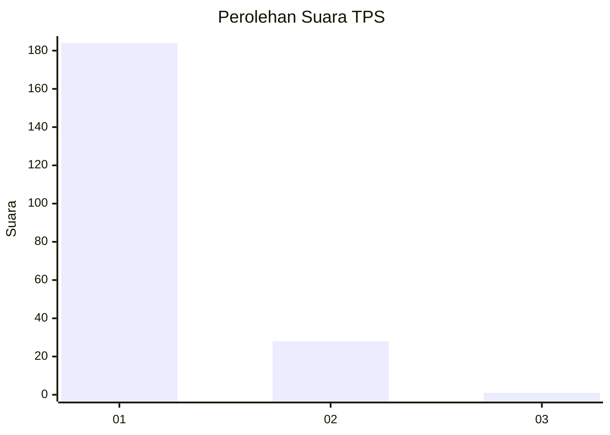
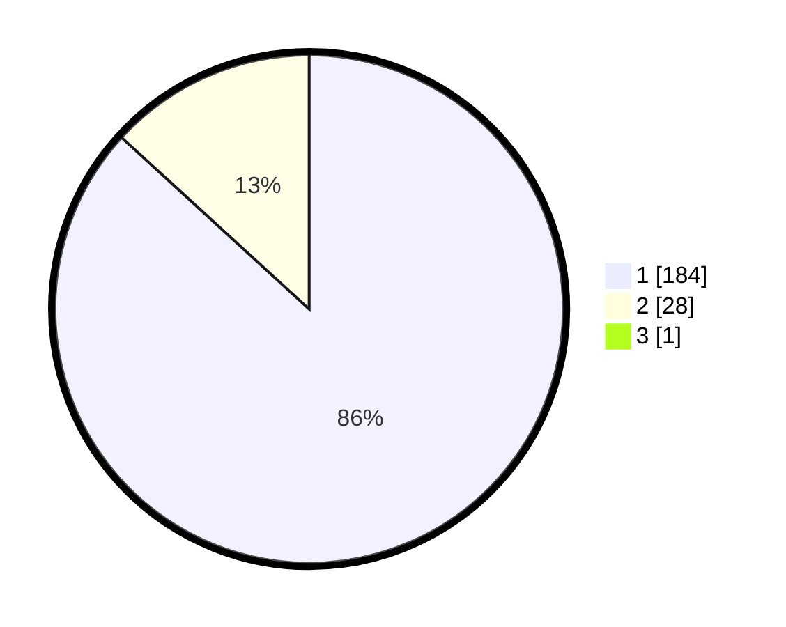

# Hasil

## Grafik

## Tabel

| No. | Nama Paslon    | Suara | Suara (raw) | Persentase |
|:--- |:-------------- | -----:| -----------:| ----------:|
| 1   | ANIES MUHAIMIN | 184   | [184][p-1]  | 86,38      |
| 2   | PRABOWO GIBRAN | 28    | [28][p-2]   | 13,15      |
| 3   | GANJAR MAHFUD  | 1     | [1][p-3]    | 0,47       |

[p-1]: https://github.com/gigit-pemilu/pemilu-2024-11-aceh/blob/main/pilpres/hitung-suara/sub/11-aceh/sub/08-aceh-utara/sub/09-seunuddon/sub/2024-ulee-rubek-timu/sub/002-tps/sub/paslon-1.txt
[p-2]: https://github.com/gigit-pemilu/pemilu-2024-11-aceh/blob/main/pilpres/hitung-suara/sub/11-aceh/sub/08-aceh-utara/sub/09-seunuddon/sub/2024-ulee-rubek-timu/sub/002-tps/sub/paslon-2.txt
[p-3]: https://github.com/gigit-pemilu/pemilu-2024-11-aceh/blob/main/pilpres/hitung-suara/sub/11-aceh/sub/08-aceh-utara/sub/09-seunuddon/sub/2024-ulee-rubek-timu/sub/002-tps/sub/paslon-3.txt

## Foto C Plano

https://sirekap-obj-formc.kpu.go.id/3b02/pemilu/ppwp/11/08/09/20/24/1108092024002-20240215-120748--ca760ab1-8171-4323-b2e5-c5d675371c56.jpg

https://sirekap-obj-formc.kpu.go.id/3b02/pemilu/ppwp/11/08/09/20/24/1108092024002-20240215-120630--e5bd982e-4d2b-488d-b32f-2316205e88f8.jpg

https://sirekap-obj-formc.kpu.go.id/3b02/pemilu/ppwp/11/08/09/20/24/1108092024002-20240215-121632--0e90062a-387e-435b-8f4e-f2128152bd1b.jpg

## Metadata

| Key        | Value               |
| ---------- | ------------------- |
| Time Stamp | 2024-02-17 16:00:02 |

