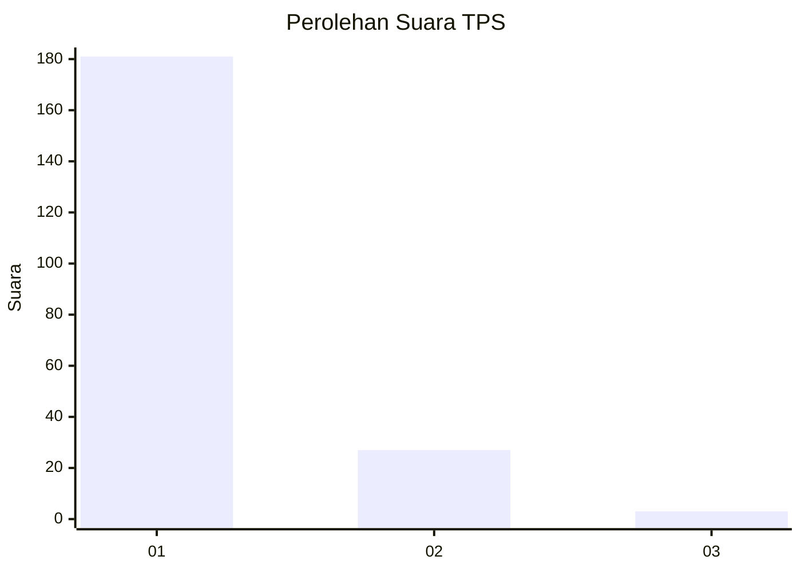
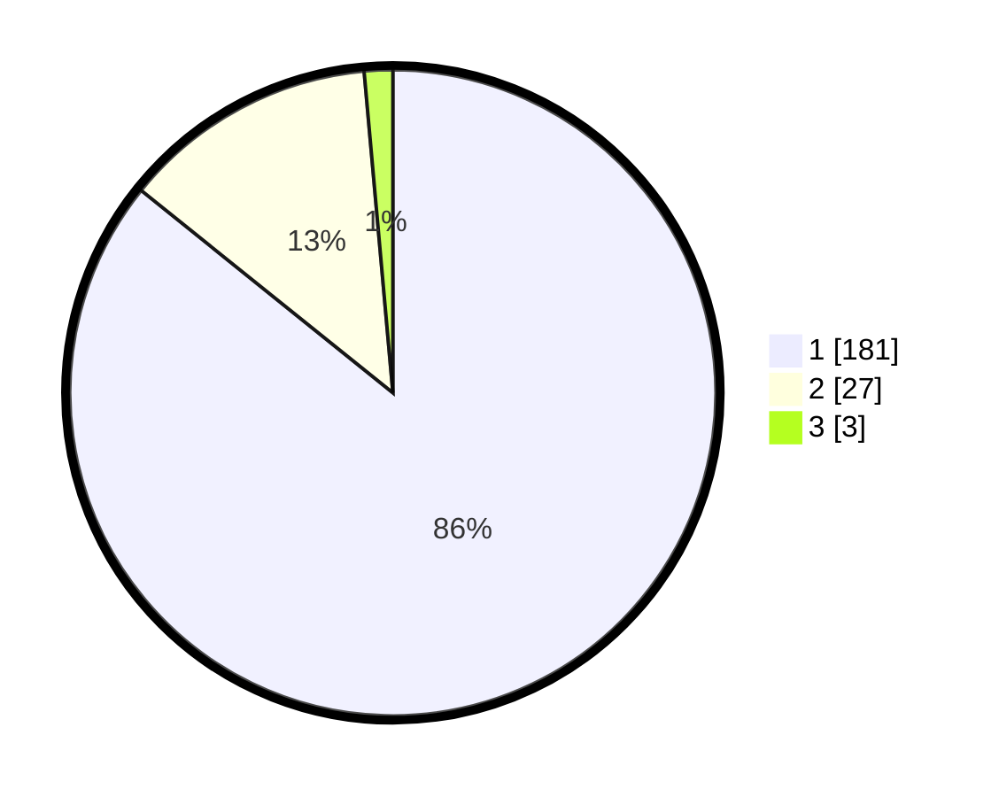

# Hasil

## Grafik

## Tabel

| No. | Nama Paslon    | Suara | Suara (raw) | Persentase |
|:--- |:-------------- | -----:| -----------:| ----------:|
| 1   | ANIES MUHAIMIN | 181   | [181][p-1]  | 85,78      |
| 2   | PRABOWO GIBRAN | 27    | [27][p-2]   | 12,80      |
| 3   | GANJAR MAHFUD  | 3     | [3][p-3]    | 1,42       |

[p-1]: https://github.com/gigit-pemilu/pemilu-2024-11-aceh/blob/main/pilpres/hitung-suara/sub/11-aceh/sub/08-aceh-utara/sub/09-seunuddon/sub/2024-ulee-rubek-timu/sub/003-tps/sub/paslon-1.txt
[p-2]: https://github.com/gigit-pemilu/pemilu-2024-11-aceh/blob/main/pilpres/hitung-suara/sub/11-aceh/sub/08-aceh-utara/sub/09-seunuddon/sub/2024-ulee-rubek-timu/sub/003-tps/sub/paslon-2.txt
[p-3]: https://github.com/gigit-pemilu/pemilu-2024-11-aceh/blob/main/pilpres/hitung-suara/sub/11-aceh/sub/08-aceh-utara/sub/09-seunuddon/sub/2024-ulee-rubek-timu/sub/003-tps/sub/paslon-3.txt

## Foto C Plano

https://sirekap-obj-formc.kpu.go.id/c986/pemilu/ppwp/11/08/09/20/24/1108092024003-20240215-121122--4553dab1-473c-4e8c-a118-91409087b3e0.jpg

https://sirekap-obj-formc.kpu.go.id/c986/pemilu/ppwp/11/08/09/20/24/1108092024003-20240215-121334--3ec6f79d-7bcf-4be8-a65e-8cd93ffc7582.jpg

https://sirekap-obj-formc.kpu.go.id/c986/pemilu/ppwp/11/08/09/20/24/1108092024003-20240215-122313--1042836d-d857-4200-b92a-b3357dea8b3d.jpg

## Metadata

| Key        | Value               |
| ---------- | ------------------- |
| Time Stamp | 2024-02-17 16:00:02 |

