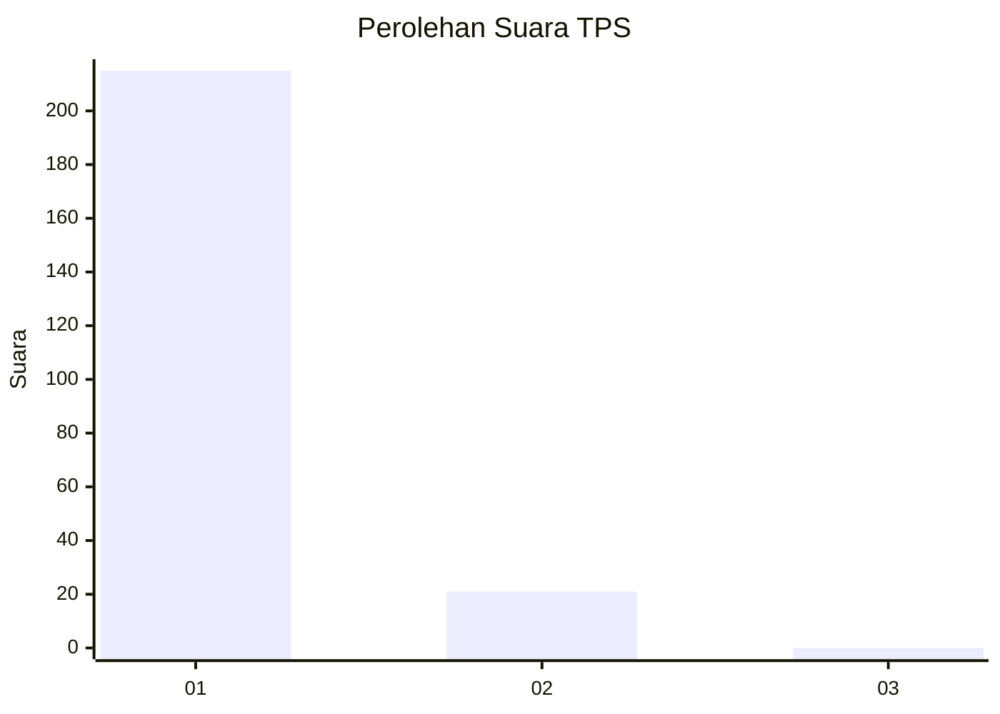
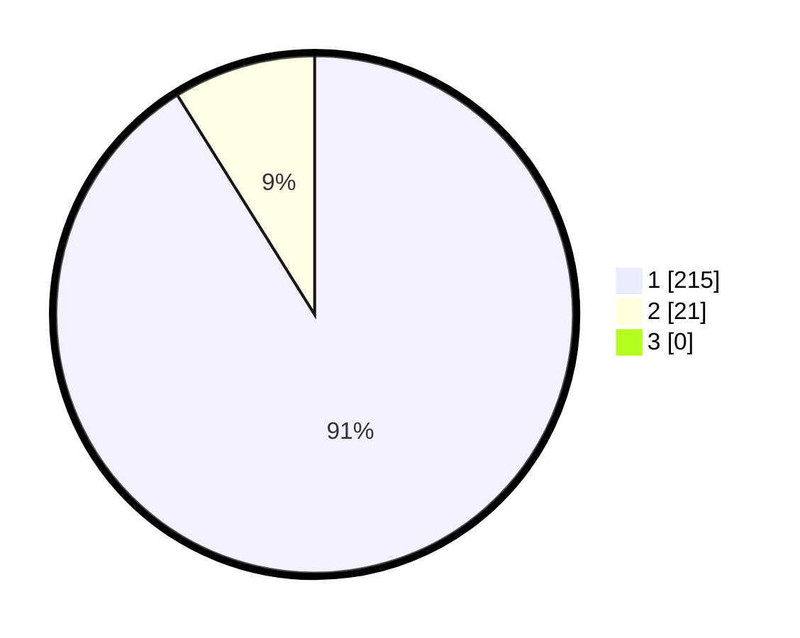

# Hasil

## Grafik

## Tabel

| No. | Nama Paslon    | Suara | Suara (raw) | Persentase |
|:--- |:-------------- | -----:| -----------:| ----------:|
| 1   | ANIES MUHAIMIN | 215   | [215][p-1]  | 91,10      |
| 2   | PRABOWO GIBRAN | 21    | [21][p-2]   | 8,90       |
| 3   | GANJAR MAHFUD  | 0     | [0][p-3]    | 0,00       |

[p-1]: https://github.com/gigit-pemilu/pemilu-2024-11-aceh/blob/main/pilpres/hitung-suara/sub/11-aceh/sub/08-aceh-utara/sub/09-seunuddon/sub/2027-matang-lada/sub/003-tps/sub/paslon-1.txt
[p-2]: https://github.com/gigit-pemilu/pemilu-2024-11-aceh/blob/main/pilpres/hitung-suara/sub/11-aceh/sub/08-aceh-utara/sub/09-seunuddon/sub/2027-matang-lada/sub/003-tps/sub/paslon-2.txt
[p-3]: https://github.com/gigit-pemilu/pemilu-2024-11-aceh/blob/main/pilpres/hitung-suara/sub/11-aceh/sub/08-aceh-utara/sub/09-seunuddon/sub/2027-matang-lada/sub/003-tps/sub/paslon-3.txt

## Foto C Plano

https://sirekap-obj-formc.kpu.go.id/acab/pemilu/ppwp/11/08/09/20/27/1108092027003-20240215-063810--5e28b6a1-802f-4a3d-9f82-6e69d3d2ab62.jpg

https://sirekap-obj-formc.kpu.go.id/acab/pemilu/ppwp/11/08/09/20/27/1108092027003-20240215-064054--11402f6c-861f-49cf-b15c-24e82f2fee5a.jpg

https://sirekap-obj-formc.kpu.go.id/acab/pemilu/ppwp/11/08/09/20/27/1108092027003-20240215-064251--32aae57e-71bb-4428-bd4d-546d454d7f48.jpg

## Metadata

| Key        | Value               |
| ---------- | ------------------- |
| Time Stamp | 2024-02-17 16:00:02 |

