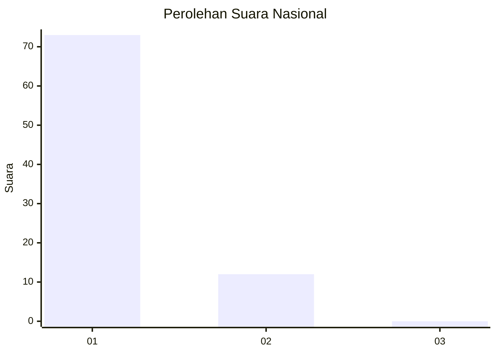
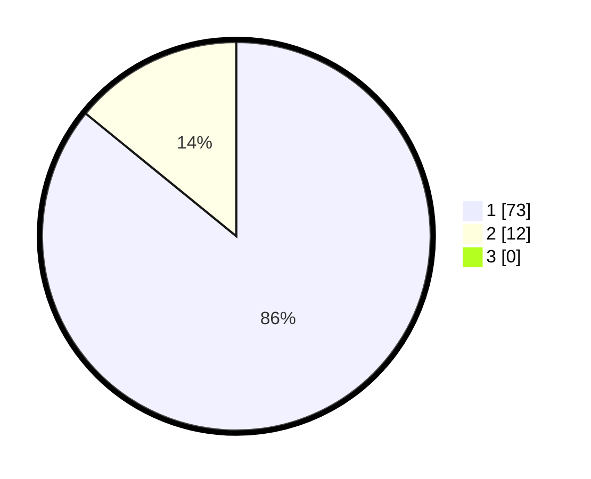

# Hasil

## Grafik

## Tabel

| No. | Nama Paslon    | Suara | Suara (raw) | Persentase |
|:--- |:-------------- | -----:| -----------:| ----------:|
| 1   | ANIES MUHAIMIN | 73    | [73][p-1]   | 85,88      |
| 2   | PRABOWO GIBRAN | 12    | [12][p-2]   | 14,12      |
| 3   | GANJAR MAHFUD  | 0     | [0][p-3]    | 0,00       |

[p-1]: https://github.com/gigit-pemilu/pemilu-2024/blob/main/pilpres/hitung-suara/sub/11-aceh/sub/08-aceh-utara/sub/10-syamtalira-aron/sub/2001-keude-aron/sub/001-tps/sub/paslon-1.txt
[p-2]: https://github.com/gigit-pemilu/pemilu-2024/blob/main/pilpres/hitung-suara/sub/11-aceh/sub/08-aceh-utara/sub/10-syamtalira-aron/sub/2001-keude-aron/sub/001-tps/sub/paslon-2.txt
[p-3]: https://github.com/gigit-pemilu/pemilu-2024/blob/main/pilpres/hitung-suara/sub/11-aceh/sub/08-aceh-utara/sub/10-syamtalira-aron/sub/2001-keude-aron/sub/001-tps/sub/paslon-3.txt

## Foto C Plano

https://sirekap-obj-formc.kpu.go.id/0626/pemilu/ppwp/11/08/10/20/01/1108102001001-20240216-144025--bb127621-8bf4-472c-8a14-eee299496b94.jpg

https://sirekap-obj-formc.kpu.go.id/0626/pemilu/ppwp/11/08/10/20/01/1108102001001-20240216-144026--d76dbe67-d395-4691-be78-ba3e0858a99b.jpg

https://sirekap-obj-formc.kpu.go.id/0626/pemilu/ppwp/11/08/10/20/01/1108102001001-20240216-144026--1553b295-6de9-45cd-a4fb-a76bfd1c1a05.jpg

## Metadata

| Key        | Value               |
| ---------- | ------------------- |
| Time Stamp | 2024-02-17 00:00:00 |

## DATA PEMILIH TETAP

Jumlah pemilih dalam DPT: **90**.
 * L: **47**.
 * P: **43**.

## DATA PENGGUNA HAK PILIH

Jumlah pengguna hak pilih dalam DPT: **85**.
 * L: **44**.
 * P: **41**.

Jumlah pengguna hak pilih dalam DPTb: **1**.
 * L: **1**.
 * P: **0**.

Jumlah pengguna hak pilih dalam DPK: **1**.
 * L: **1**.
 * P: **0**.

Jumlah pengguna hak pilih: **87**.
 * L: **46**.
 * P: **41**.

## JUMLAH SUARA SAH DAN TIDAK SAH

JUMLAH SELURUH SUARA SAH: **85**.

JUMLAH SUARA TIDAK SAH: **2**.

JUMLAH SELURUH SUARA SAH DAN SUARA TIDAK SAH: **87**.

