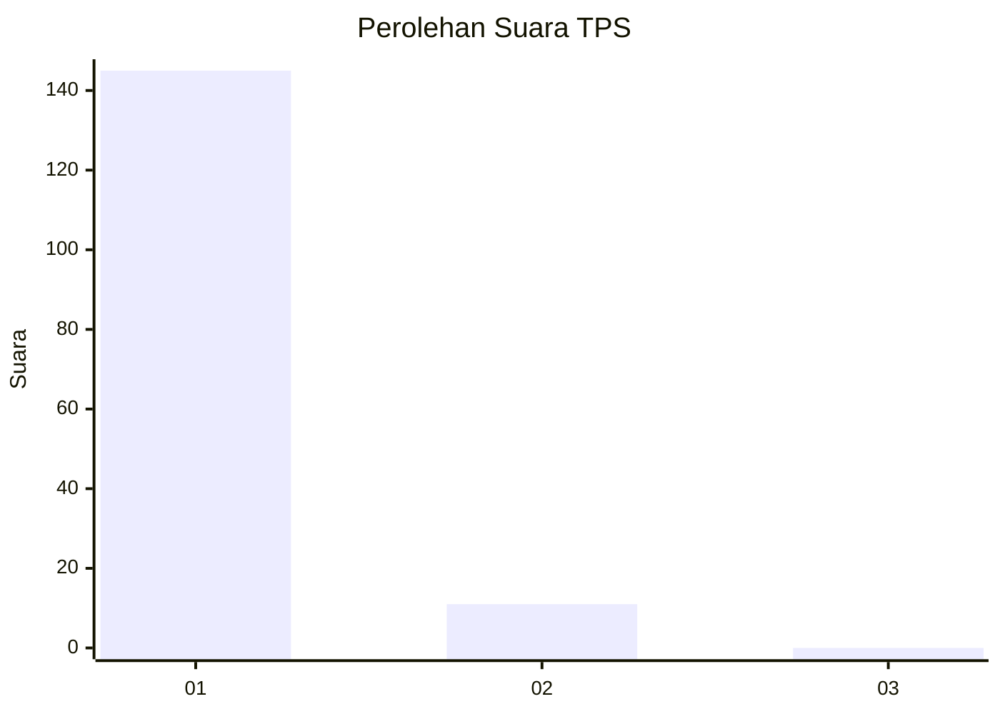
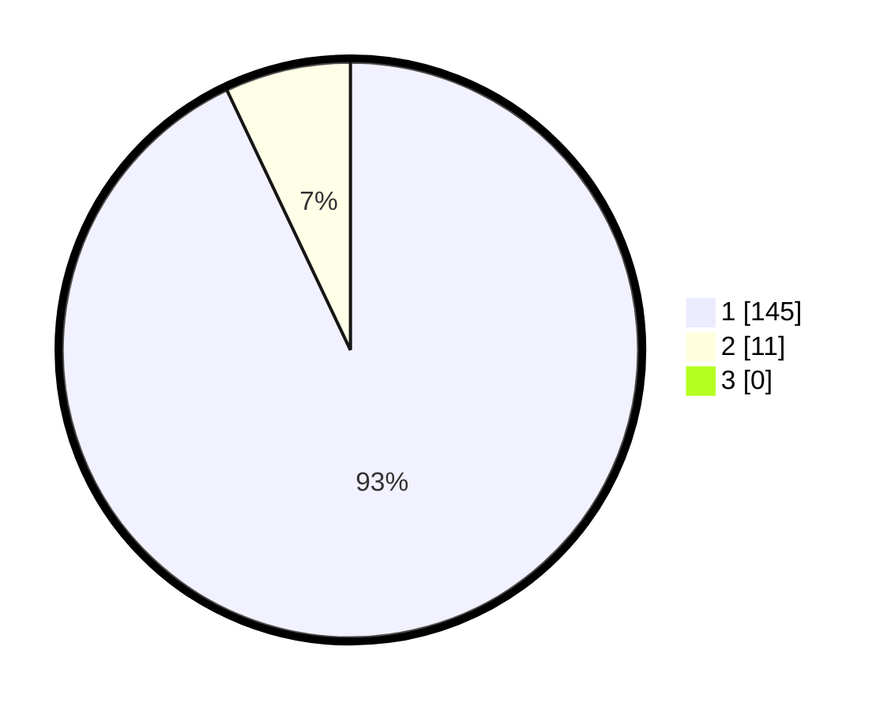

# Hasil

## Grafik

## Tabel

| No. | Nama Paslon    | Suara | Suara (raw) | Persentase |
|:--- |:-------------- | -----:| -----------:| ----------:|
| 1   | ANIES MUHAIMIN | 145   | [145][p-1]  | 92,95      |
| 2   | PRABOWO GIBRAN | 11    | [11][p-2]   | 7,05       |
| 3   | GANJAR MAHFUD  | 0     | [0][p-3]    | 0,00       |

[p-1]: https://github.com/gigit-pemilu/pemilu-2024-11-aceh/blob/main/pilpres/hitung-suara/sub/11-aceh/sub/08-aceh-utara/sub/10-syamtalira-aron/sub/2007-glok/sub/002-tps/sub/paslon-1.txt
[p-2]: https://github.com/gigit-pemilu/pemilu-2024-11-aceh/blob/main/pilpres/hitung-suara/sub/11-aceh/sub/08-aceh-utara/sub/10-syamtalira-aron/sub/2007-glok/sub/002-tps/sub/paslon-2.txt
[p-3]: https://github.com/gigit-pemilu/pemilu-2024-11-aceh/blob/main/pilpres/hitung-suara/sub/11-aceh/sub/08-aceh-utara/sub/10-syamtalira-aron/sub/2007-glok/sub/002-tps/sub/paslon-3.txt

## Foto C Plano

https://sirekap-obj-formc.kpu.go.id/234b/pemilu/ppwp/11/08/10/20/07/1108102007002-20240215-064125--eed0a919-6e3b-4177-96e4-bc0182d75abc.jpg

https://sirekap-obj-formc.kpu.go.id/234b/pemilu/ppwp/11/08/10/20/07/1108102007002-20240215-064328--4ebf987a-ce7f-4691-a635-3062ad0473fd.jpg

https://sirekap-obj-formc.kpu.go.id/234b/pemilu/ppwp/11/08/10/20/07/1108102007002-20240215-064614--79675600-c5af-46d7-8514-38077efc170e.jpg

## Metadata

| Key        | Value               |
| ---------- | ------------------- |
| Time Stamp | 2024-02-16 23:45:47 |

