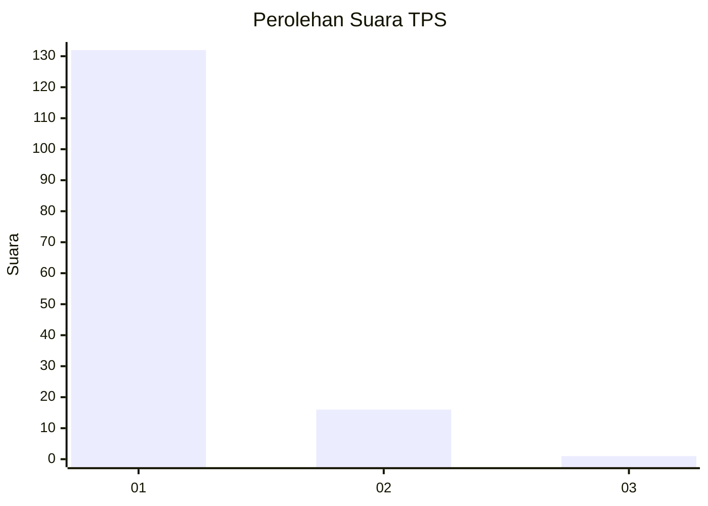
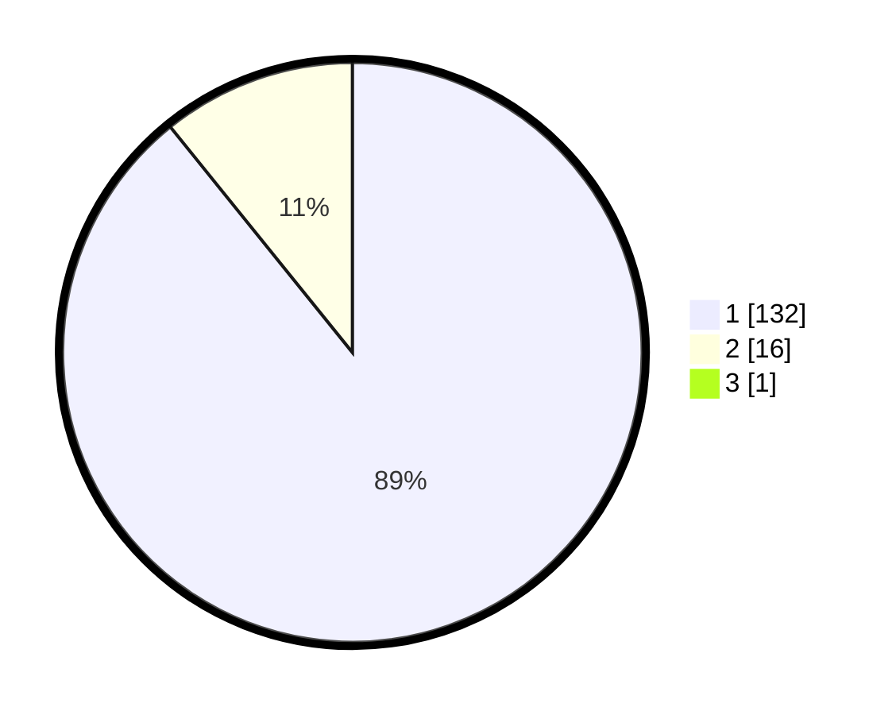

# Hasil

## Grafik

## Tabel

| No. | Nama Paslon    | Suara | Suara (raw) | Persentase |
|:--- |:-------------- | -----:| -----------:| ----------:|
| 1   | ANIES MUHAIMIN | 132   | [132][p-1]  | 88,59      |
| 2   | PRABOWO GIBRAN | 16    | [16][p-2]   | 10,74      |
| 3   | GANJAR MAHFUD  | 1     | [1][p-3]    | 0,67       |

[p-1]: https://github.com/gigit-pemilu/pemilu-2024-11-aceh/blob/main/pilpres/hitung-suara/sub/11-aceh/sub/08-aceh-utara/sub/10-syamtalira-aron/sub/2008-cibrek-baroh/sub/002-tps/sub/paslon-1.txt
[p-2]: https://github.com/gigit-pemilu/pemilu-2024-11-aceh/blob/main/pilpres/hitung-suara/sub/11-aceh/sub/08-aceh-utara/sub/10-syamtalira-aron/sub/2008-cibrek-baroh/sub/002-tps/sub/paslon-2.txt
[p-3]: https://github.com/gigit-pemilu/pemilu-2024-11-aceh/blob/main/pilpres/hitung-suara/sub/11-aceh/sub/08-aceh-utara/sub/10-syamtalira-aron/sub/2008-cibrek-baroh/sub/002-tps/sub/paslon-3.txt

## Foto C Plano

https://sirekap-obj-formc.kpu.go.id/e8a9/pemilu/ppwp/11/08/10/20/08/1108102008002-20240215-031704--f1e0791d-ed5b-4e6e-9856-b2b89474003b.jpg

https://sirekap-obj-formc.kpu.go.id/e8a9/pemilu/ppwp/11/08/10/20/08/1108102008002-20240215-025903--ec36dcc6-8a20-48c3-93ca-5d50d2e6e64b.jpg

https://sirekap-obj-formc.kpu.go.id/e8a9/pemilu/ppwp/11/08/10/20/08/1108102008002-20240215-025932--19e0d8b6-294d-49e1-bc66-ccdaf5e80f82.jpg

## Metadata

| Key        | Value               |
| ---------- | ------------------- |
| Time Stamp | 2024-02-15 15:30:25 |

