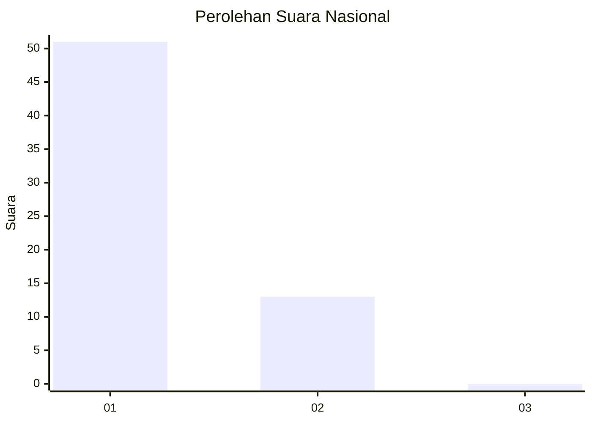
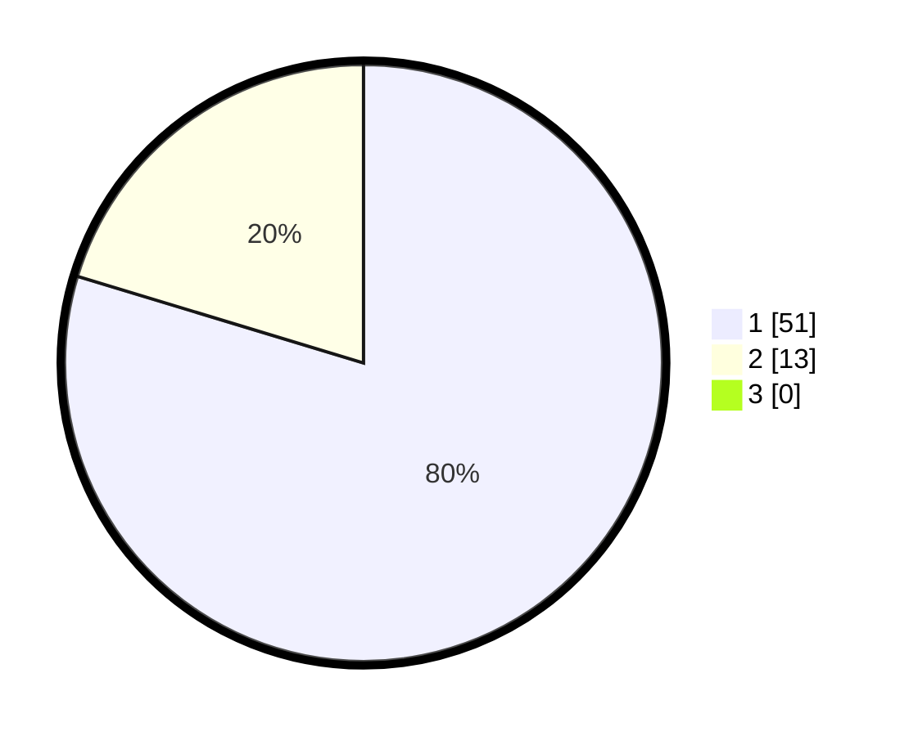

# Hasil

## Grafik

## Tabel

| No. | Nama Paslon    | Suara | Suara (raw) | Persentase |
|:--- |:-------------- | -----:| -----------:| ----------:|
| 1   | ANIES MUHAIMIN | 51    | [51][p-1]   | 79,69      |
| 2   | PRABOWO GIBRAN | 13    | [13][p-2]   | 20,31      |
| 3   | GANJAR MAHFUD  | 0     | [0][p-3]    | 0,00       |

[p-1]: https://github.com/gigit-pemilu/pemilu-2024/blob/main/pilpres/hitung-suara/sub/11-aceh/sub/08-aceh-utara/sub/10-syamtalira-aron/sub/2017-keude-teupin-punti/sub/001-tps/sub/paslon-1.txt
[p-2]: https://github.com/gigit-pemilu/pemilu-2024/blob/main/pilpres/hitung-suara/sub/11-aceh/sub/08-aceh-utara/sub/10-syamtalira-aron/sub/2017-keude-teupin-punti/sub/001-tps/sub/paslon-2.txt
[p-3]: https://github.com/gigit-pemilu/pemilu-2024/blob/main/pilpres/hitung-suara/sub/11-aceh/sub/08-aceh-utara/sub/10-syamtalira-aron/sub/2017-keude-teupin-punti/sub/001-tps/sub/paslon-3.txt

## Foto C Plano

https://sirekap-obj-formc.kpu.go.id/5d4e/pemilu/ppwp/11/08/10/20/17/1108102017001-20240215-052202--5c4b4f31-accf-4021-b3f8-1182f7a36b9c.jpg

https://sirekap-obj-formc.kpu.go.id/5d4e/pemilu/ppwp/11/08/10/20/17/1108102017001-20240215-052213--e028ab8e-9d03-4c20-8a95-81a273c6856d.jpg

https://sirekap-obj-formc.kpu.go.id/5d4e/pemilu/ppwp/11/08/10/20/17/1108102017001-20240215-052223--97446bae-b076-47d9-937d-ce7f90f05726.jpg

## Metadata

| Key        | Value               |
| ---------- | ------------------- |
| Time Stamp | 2024-02-16 16:25:10 |

