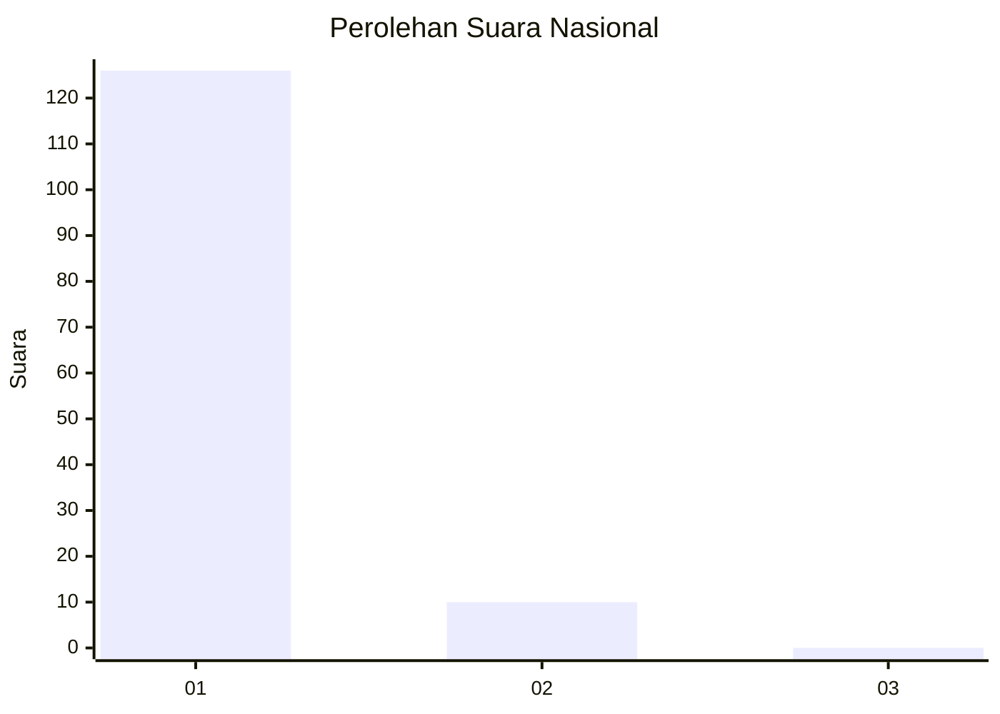
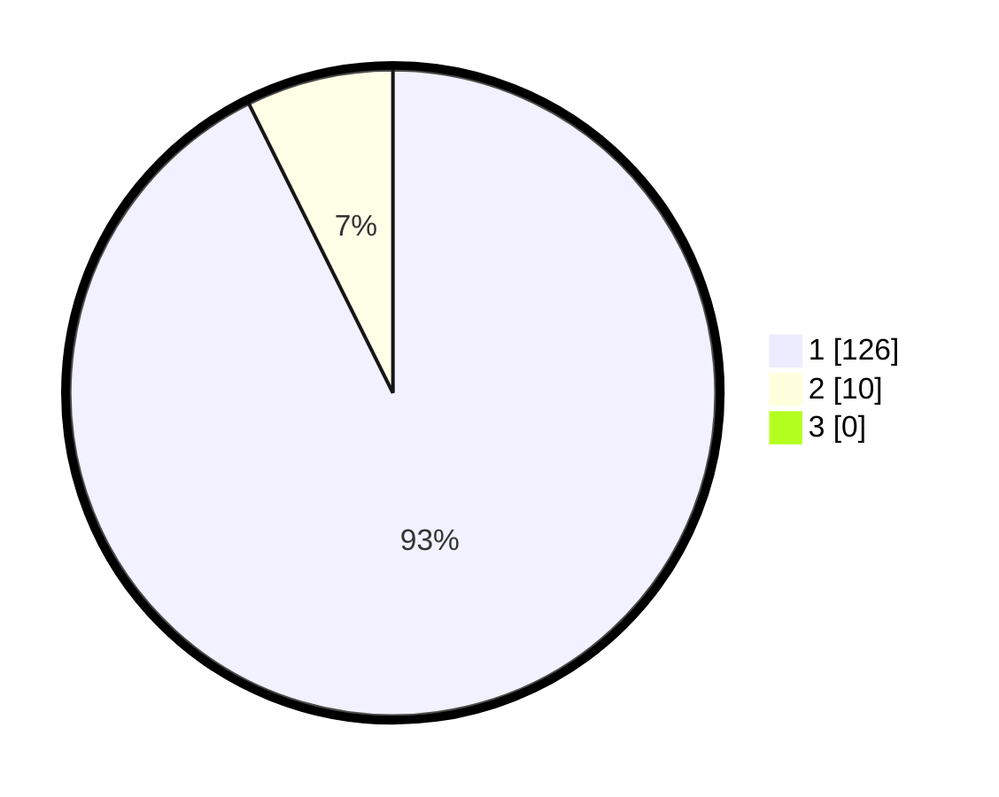

# Hasil

## Grafik

## Tabel

| No. | Nama Paslon    | Suara | Suara (raw) | Persentase |
|:--- |:-------------- | -----:| -----------:| ----------:|
| 1   | ANIES MUHAIMIN | 126   | [126][p-1]  | 92,65      |
| 2   | PRABOWO GIBRAN | 10    | [10][p-2]   | 7,35       |
| 3   | GANJAR MAHFUD  | 0     | [0][p-3]    | 0,00       |

[p-1]: https://github.com/gigit-pemilu/pemilu-2024/blob/main/pilpres/hitung-suara/sub/11-aceh/sub/08-aceh-utara/sub/10-syamtalira-aron/sub/2027-dayah-meuria/sub/001-tps/sub/paslon-1.txt
[p-2]: https://github.com/gigit-pemilu/pemilu-2024/blob/main/pilpres/hitung-suara/sub/11-aceh/sub/08-aceh-utara/sub/10-syamtalira-aron/sub/2027-dayah-meuria/sub/001-tps/sub/paslon-2.txt
[p-3]: https://github.com/gigit-pemilu/pemilu-2024/blob/main/pilpres/hitung-suara/sub/11-aceh/sub/08-aceh-utara/sub/10-syamtalira-aron/sub/2027-dayah-meuria/sub/001-tps/sub/paslon-3.txt

## Foto C Plano

https://sirekap-obj-formc.kpu.go.id/f775/pemilu/ppwp/11/08/10/20/27/1108102027001-20240214-203845--f6de798a-3a5f-4d68-9acd-df28a140b619.jpg

https://sirekap-obj-formc.kpu.go.id/f775/pemilu/ppwp/11/08/10/20/27/1108102027001-20240214-204146--40e1e87d-2479-4c86-bceb-80c339c71ce9.jpg

https://sirekap-obj-formc.kpu.go.id/f775/pemilu/ppwp/11/08/10/20/27/1108102027001-20240215-022748--f5c97bf3-1586-4473-8276-5031ed02c557.jpg

## Metadata

| Key        | Value               |
| ---------- | ------------------- |
| Time Stamp | 2024-02-16 12:51:22 |

