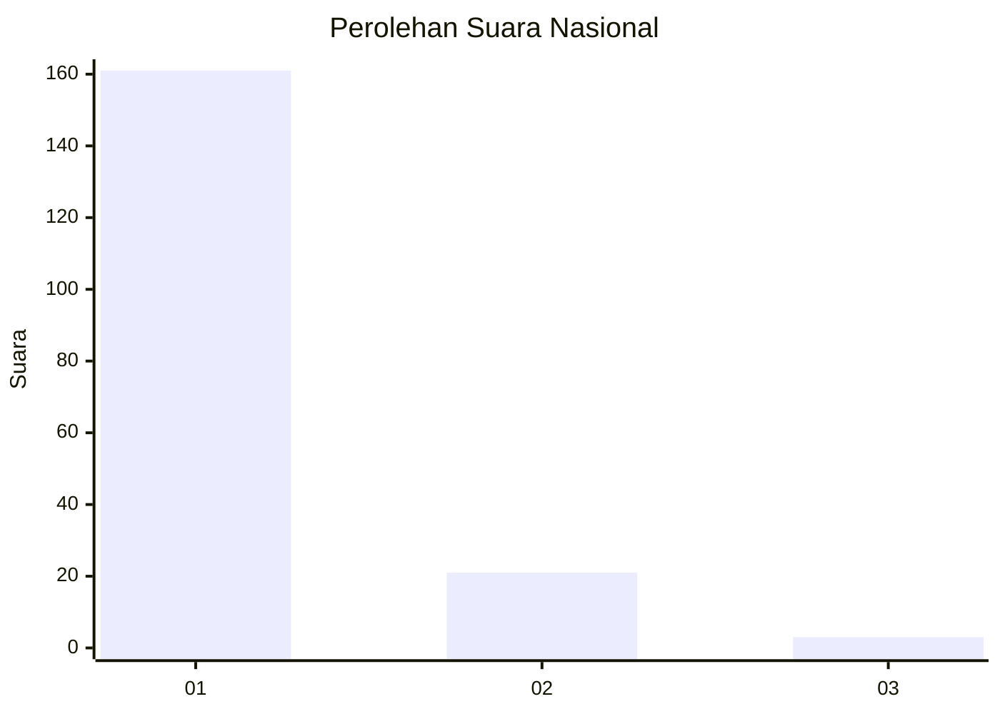
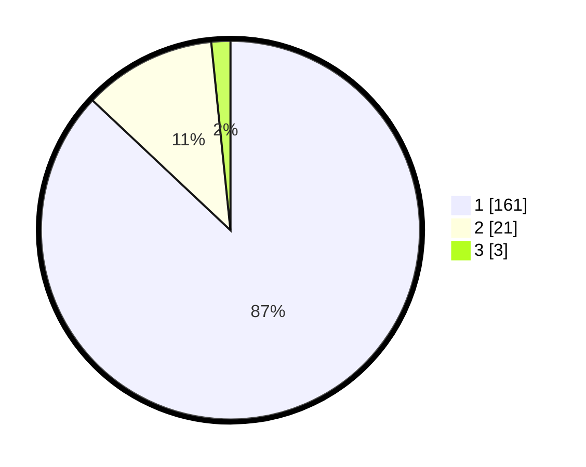

# Hasil

## Grafik

## Tabel

| No. | Nama Paslon    | Suara | Suara (raw) | Persentase |
|:--- |:-------------- | -----:| -----------:| ----------:|
| 1   | ANIES MUHAIMIN | 161   | [161][p-1]  | 87,03      |
| 2   | PRABOWO GIBRAN | 21    | [21][p-2]   | 11,35      |
| 3   | GANJAR MAHFUD  | 3     | [3][p-3]    | 1,62       |

[p-1]: https://github.com/gigit-pemilu/pemilu-2024/blob/main/pilpres/hitung-suara/sub/11-aceh/sub/08-aceh-utara/sub/10-syamtalira-aron/sub/2031-hagu/sub/001-tps/sub/paslon-1.txt
[p-2]: https://github.com/gigit-pemilu/pemilu-2024/blob/main/pilpres/hitung-suara/sub/11-aceh/sub/08-aceh-utara/sub/10-syamtalira-aron/sub/2031-hagu/sub/001-tps/sub/paslon-2.txt
[p-3]: https://github.com/gigit-pemilu/pemilu-2024/blob/main/pilpres/hitung-suara/sub/11-aceh/sub/08-aceh-utara/sub/10-syamtalira-aron/sub/2031-hagu/sub/001-tps/sub/paslon-3.txt

## Foto C Plano

https://sirekap-obj-formc.kpu.go.id/a0d3/pemilu/ppwp/11/08/10/20/31/1108102031001-20240215-020814--9a8b7431-fcd0-4bbf-ad38-826d56b6ef6a.jpg

https://sirekap-obj-formc.kpu.go.id/a0d3/pemilu/ppwp/11/08/10/20/31/1108102031001-20240215-021004--ad5c454a-a3ad-4466-a677-291990ff392d.jpg

https://sirekap-obj-formc.kpu.go.id/a0d3/pemilu/ppwp/11/08/10/20/31/1108102031001-20240215-021216--702f5cfe-420a-4bbf-976c-6b727209860a.jpg

## Metadata

| Key        | Value               |
| ---------- | ------------------- |
| Time Stamp | 2024-02-17 16:00:02 |

