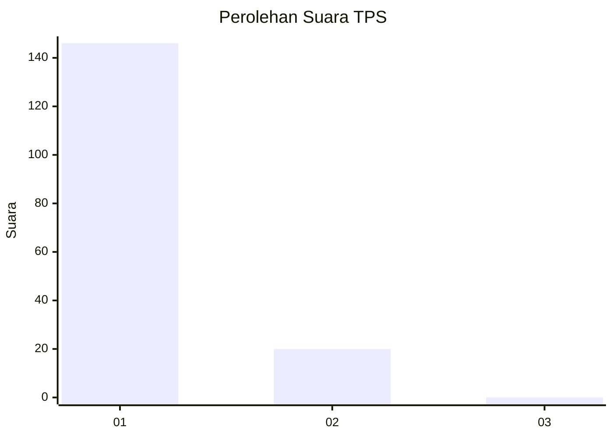
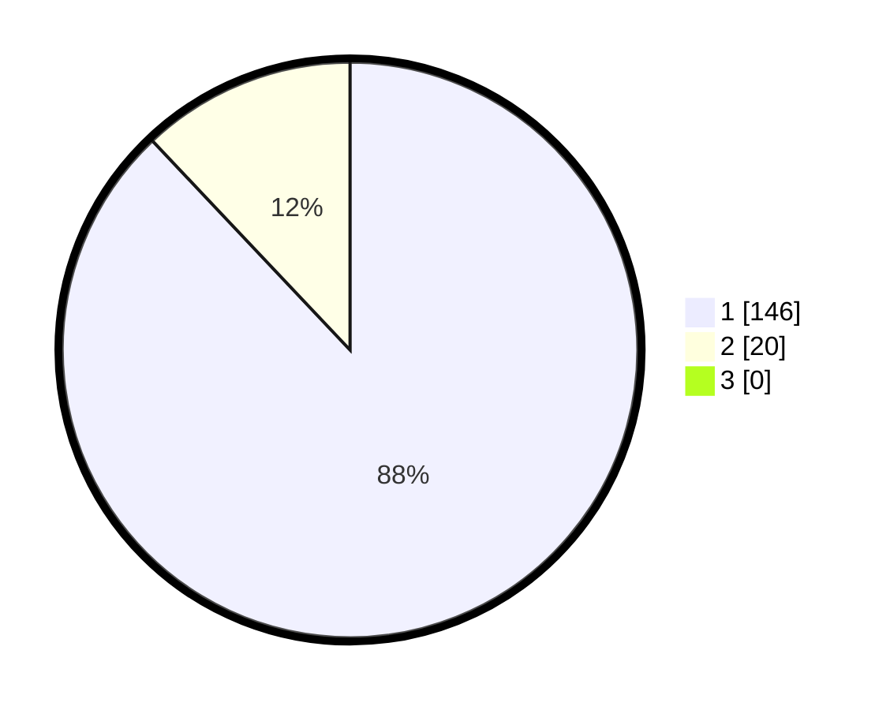

# Hasil

## Grafik

## Tabel

| No. | Nama Paslon    | Suara | Suara (raw) | Persentase |
|:--- |:-------------- | -----:| -----------:| ----------:|
| 1   | ANIES MUHAIMIN | 146   | [146][p-1]  | 87,95      |
| 2   | PRABOWO GIBRAN | 20    | [20][p-2]   | 12,05      |
| 3   | GANJAR MAHFUD  | 0     | [0][p-3]    | 0,00       |

[p-1]: https://github.com/gigit-pemilu/pemilu-2024-11-aceh/blob/main/pilpres/hitung-suara/sub/11-aceh/sub/08-aceh-utara/sub/10-syamtalira-aron/sub/2032-awe/sub/001-tps/sub/paslon-1.txt
[p-2]: https://github.com/gigit-pemilu/pemilu-2024-11-aceh/blob/main/pilpres/hitung-suara/sub/11-aceh/sub/08-aceh-utara/sub/10-syamtalira-aron/sub/2032-awe/sub/001-tps/sub/paslon-2.txt
[p-3]: https://github.com/gigit-pemilu/pemilu-2024-11-aceh/blob/main/pilpres/hitung-suara/sub/11-aceh/sub/08-aceh-utara/sub/10-syamtalira-aron/sub/2032-awe/sub/001-tps/sub/paslon-3.txt

## Foto C Plano

https://sirekap-obj-formc.kpu.go.id/6dce/pemilu/ppwp/11/08/10/20/32/1108102032001-20240215-102106--61e71813-78bc-4c5e-bfcd-369af8efcd50.jpg

https://sirekap-obj-formc.kpu.go.id/6dce/pemilu/ppwp/11/08/10/20/32/1108102032001-20240215-102050--4c87ce91-7e46-4ca3-9b93-3253daee8267.jpg

https://sirekap-obj-formc.kpu.go.id/6dce/pemilu/ppwp/11/08/10/20/32/1108102032001-20240215-102205--ff61c0aa-b6ae-4b29-9d35-12c1407839d9.jpg

## Metadata

| Key        | Value               |
| ---------- | ------------------- |
| Time Stamp | 2024-02-15 17:00:25 |

