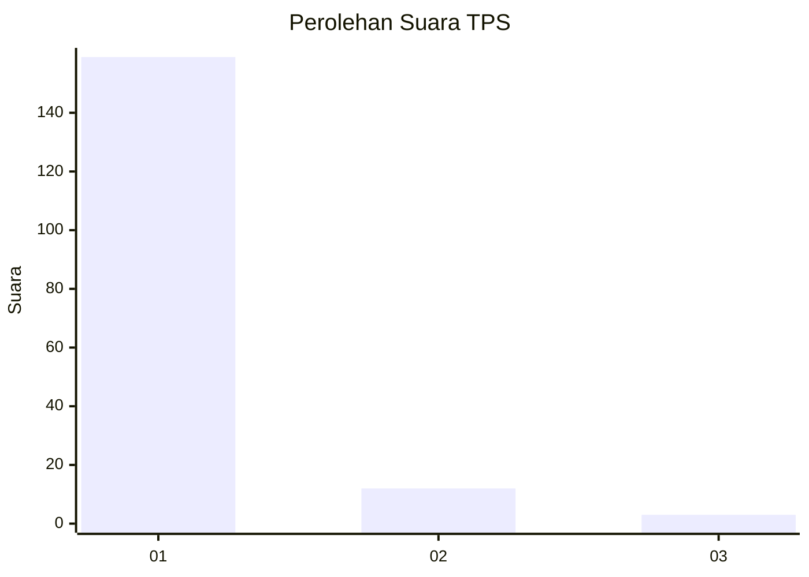
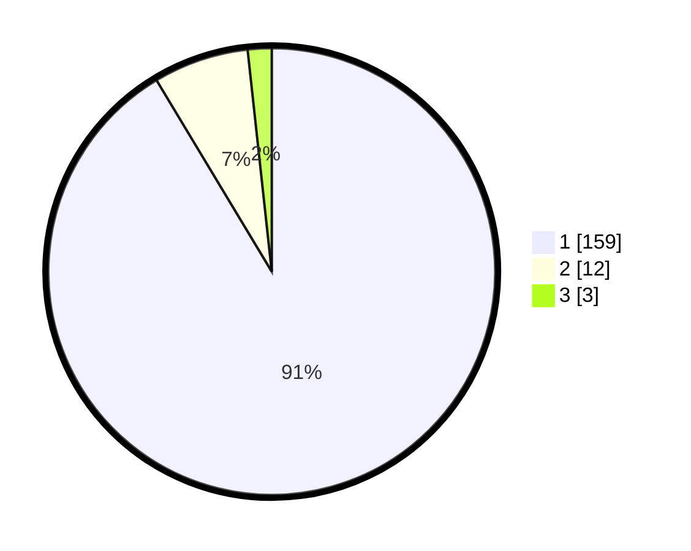

# Hasil

## Grafik

## Tabel

| No. | Nama Paslon    | Suara | Suara (raw) | Persentase |
|:--- |:-------------- | -----:| -----------:| ----------:|
| 1   | ANIES MUHAIMIN | 159   | [159][p-1]  | 91,38      |
| 2   | PRABOWO GIBRAN | 12    | [12][p-2]   | 6,90       |
| 3   | GANJAR MAHFUD  | 3     | [3][p-3]    | 1,72       |

[p-1]: https://github.com/gigit-pemilu/pemilu-2024-11-aceh/blob/main/pilpres/hitung-suara/sub/11-aceh/sub/08-aceh-utara/sub/11-syamtalira-bayu/sub/2002-bie/sub/002-tps/sub/paslon-1.txt
[p-2]: https://github.com/gigit-pemilu/pemilu-2024-11-aceh/blob/main/pilpres/hitung-suara/sub/11-aceh/sub/08-aceh-utara/sub/11-syamtalira-bayu/sub/2002-bie/sub/002-tps/sub/paslon-2.txt
[p-3]: https://github.com/gigit-pemilu/pemilu-2024-11-aceh/blob/main/pilpres/hitung-suara/sub/11-aceh/sub/08-aceh-utara/sub/11-syamtalira-bayu/sub/2002-bie/sub/002-tps/sub/paslon-3.txt

## Foto C Plano

https://sirekap-obj-formc.kpu.go.id/67f7/pemilu/ppwp/11/08/11/20/02/1108112002002-20240216-134027--e873d1e0-cbc2-4220-bb52-69854dd388bd.jpg

https://sirekap-obj-formc.kpu.go.id/67f7/pemilu/ppwp/11/08/11/20/02/1108112002002-20240216-134028--f8522b36-ef39-4d86-9690-feeb34dd60b4.jpg

https://sirekap-obj-formc.kpu.go.id/67f7/pemilu/ppwp/11/08/11/20/02/1108112002002-20240216-134028--31fb7300-336f-40e5-b941-731c31f68e4c.jpg

## Metadata

| Key        | Value               |
| ---------- | ------------------- |
| Time Stamp | 2024-02-17 00:00:00 |

## DATA PEMILIH TETAP

Jumlah pemilih dalam DPT: **206**.
 * L: **97**.
 * P: **109**.

## DATA PENGGUNA HAK PILIH

Jumlah pengguna hak pilih dalam DPT: **175**.
 * L: **78**.
 * P: **97**.

Jumlah pengguna hak pilih dalam DPTb: **0**.
 * L: **0**.
 * P: **0**.

Jumlah pengguna hak pilih dalam DPK: **1**.
 * L: **0**.
 * P: **1**.

Jumlah pengguna hak pilih: **176**.
 * L: **78**.
 * P: **98**.

## JUMLAH SUARA SAH DAN TIDAK SAH

JUMLAH SELURUH SUARA SAH: **174**.

JUMLAH SUARA TIDAK SAH: **2**.

JUMLAH SELURUH SUARA SAH DAN SUARA TIDAK SAH: **176**.

