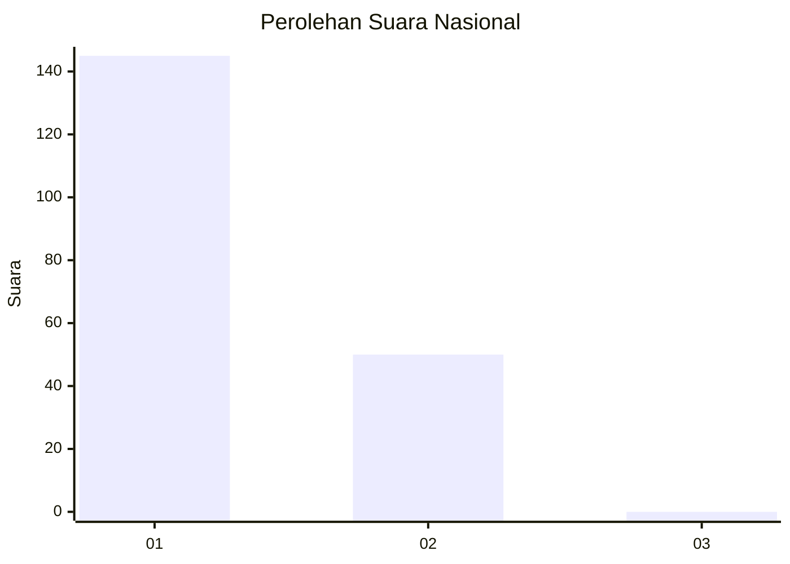
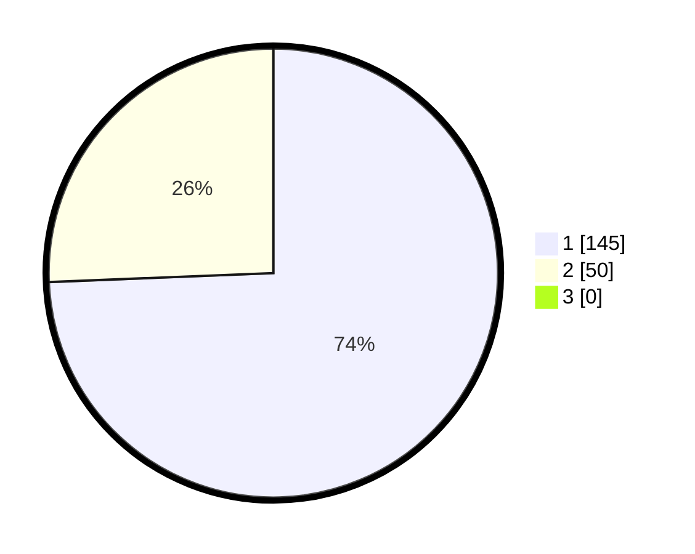

# Hasil

## Grafik

## Tabel

| No. | Nama Paslon    | Suara | Suara (raw) | Persentase |
|:--- |:-------------- | -----:| -----------:| ----------:|
| 1   | ANIES MUHAIMIN | 145   | [145][p-1]  | 74,36      |
| 2   | PRABOWO GIBRAN | 50    | [50][p-2]   | 25,64      |
| 3   | GANJAR MAHFUD  | 0     | [0][p-3]    | 0,00       |

[p-1]: https://github.com/gigit-pemilu/pemilu-2024/blob/main/pilpres/hitung-suara/sub/11-aceh/sub/08-aceh-utara/sub/11-syamtalira-bayu/sub/2006-nibong/sub/001-tps/sub/paslon-1.txt
[p-2]: https://github.com/gigit-pemilu/pemilu-2024/blob/main/pilpres/hitung-suara/sub/11-aceh/sub/08-aceh-utara/sub/11-syamtalira-bayu/sub/2006-nibong/sub/001-tps/sub/paslon-2.txt
[p-3]: https://github.com/gigit-pemilu/pemilu-2024/blob/main/pilpres/hitung-suara/sub/11-aceh/sub/08-aceh-utara/sub/11-syamtalira-bayu/sub/2006-nibong/sub/001-tps/sub/paslon-3.txt

## Foto C Plano

https://sirekap-obj-formc.kpu.go.id/f9d7/pemilu/ppwp/11/08/11/20/06/1108112006001-20240215-112904--a85939d4-252a-4a34-94a0-d4c9f06b88ee.jpg

https://sirekap-obj-formc.kpu.go.id/f9d7/pemilu/ppwp/11/08/11/20/06/1108112006001-20240215-114005--1a9ba7c1-4afe-47b0-bbcb-70d474714296.jpg

https://sirekap-obj-formc.kpu.go.id/f9d7/pemilu/ppwp/11/08/11/20/06/1108112006001-20240215-114136--e816be01-3f39-49cd-9216-ffbac2085408.jpg

## Metadata

| Key        | Value               |
| ---------- | ------------------- |
| Time Stamp | 2024-02-15 16:00:26 |

