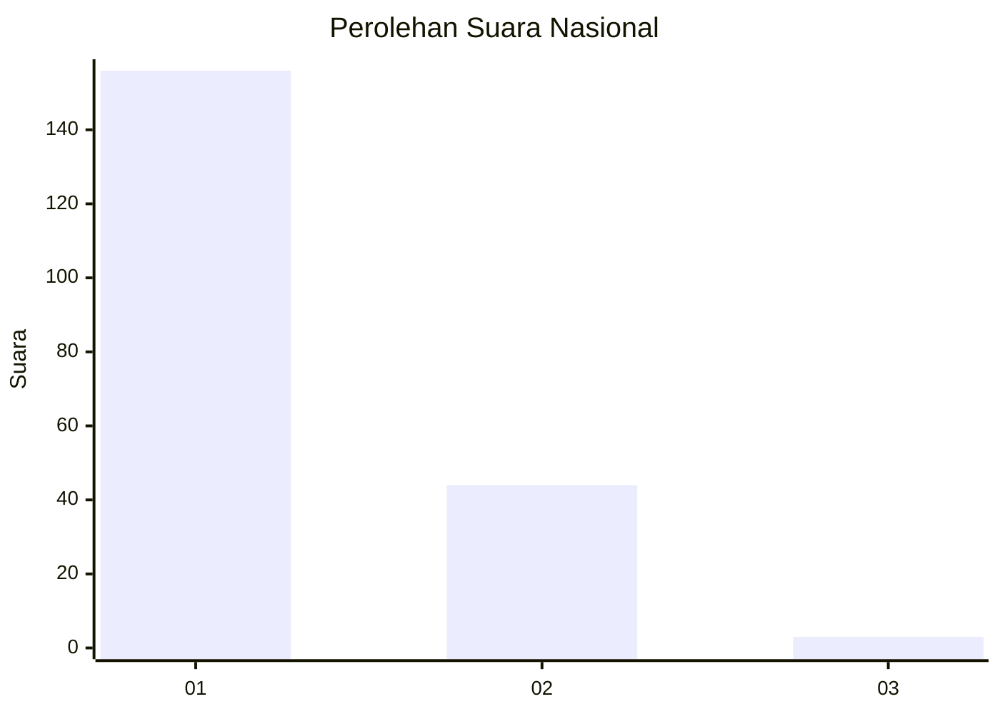
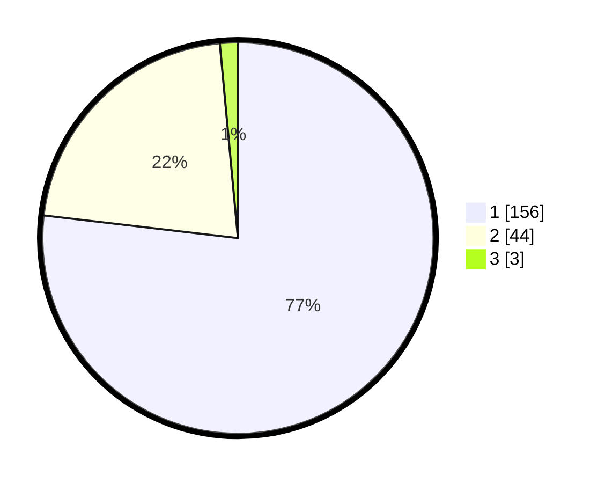

# Hasil

## Grafik

## Tabel

| No. | Nama Paslon    | Suara | Suara (raw) | Persentase |
|:--- |:-------------- | -----:| -----------:| ----------:|
| 1   | ANIES MUHAIMIN | 156   | [156][p-1]  | 76,85      |
| 2   | PRABOWO GIBRAN | 44    | [44][p-2]   | 21,67      |
| 3   | GANJAR MAHFUD  | 3     | [3][p-3]    | 1,48       |

[p-1]: https://github.com/gigit-pemilu/pemilu-2024/blob/main/pilpres/hitung-suara/sub/11-aceh/sub/08-aceh-utara/sub/11-syamtalira-bayu/sub/2006-nibong/sub/002-tps/sub/paslon-1.txt
[p-2]: https://github.com/gigit-pemilu/pemilu-2024/blob/main/pilpres/hitung-suara/sub/11-aceh/sub/08-aceh-utara/sub/11-syamtalira-bayu/sub/2006-nibong/sub/002-tps/sub/paslon-2.txt
[p-3]: https://github.com/gigit-pemilu/pemilu-2024/blob/main/pilpres/hitung-suara/sub/11-aceh/sub/08-aceh-utara/sub/11-syamtalira-bayu/sub/2006-nibong/sub/002-tps/sub/paslon-3.txt

## Foto C Plano

https://sirekap-obj-formc.kpu.go.id/ec9d/pemilu/ppwp/11/08/11/20/06/1108112006002-20240221-232419--d5362ad0-2fce-45bf-b257-143aa7b8d944.jpg

https://sirekap-obj-formc.kpu.go.id/ec9d/pemilu/ppwp/11/08/11/20/06/1108112006002-20240215-112627--41dd5978-c894-4c25-b233-7c6dc47ca93d.jpg

https://sirekap-obj-formc.kpu.go.id/ec9d/pemilu/ppwp/11/08/11/20/06/1108112006002-20240215-112736--6e601fbc-f650-4118-abb0-8df39b0e5cac.jpg

## Metadata

| Key        | Value               |
| ---------- | ------------------- |
| Time Stamp | 2024-02-22 00:00:00 |

