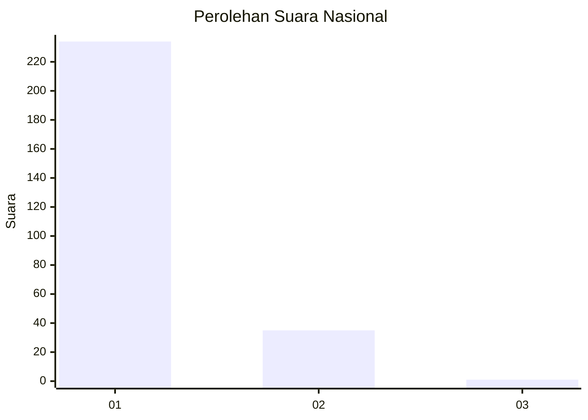
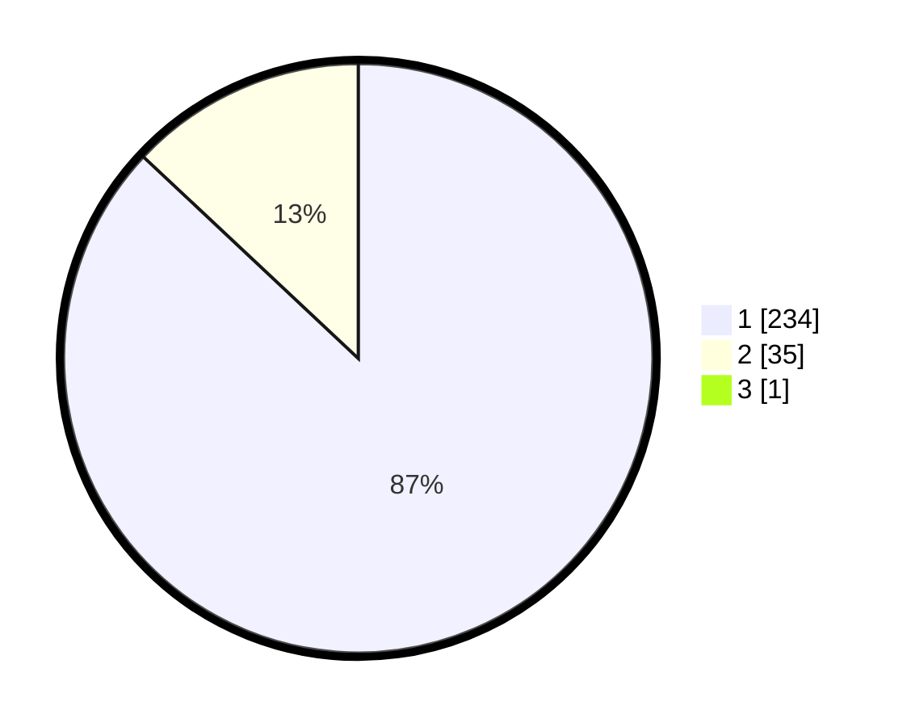

# Hasil

## Grafik

## Tabel

| No. | Nama Paslon    | Suara | Suara (raw) | Persentase |
|:--- |:-------------- | -----:| -----------:| ----------:|
| 1   | ANIES MUHAIMIN | 234   | [234][p-1]  | 86,67      |
| 2   | PRABOWO GIBRAN | 35    | [35][p-2]   | 12,96      |
| 3   | GANJAR MAHFUD  | 1     | [1][p-3]    | 0,37       |

[p-1]: https://github.com/gigit-pemilu/pemilu-2024/blob/main/pilpres/hitung-suara/sub/11-aceh/sub/08-aceh-utara/sub/11-syamtalira-bayu/sub/2008-beunot/sub/003-tps/sub/paslon-1.txt
[p-2]: https://github.com/gigit-pemilu/pemilu-2024/blob/main/pilpres/hitung-suara/sub/11-aceh/sub/08-aceh-utara/sub/11-syamtalira-bayu/sub/2008-beunot/sub/003-tps/sub/paslon-2.txt
[p-3]: https://github.com/gigit-pemilu/pemilu-2024/blob/main/pilpres/hitung-suara/sub/11-aceh/sub/08-aceh-utara/sub/11-syamtalira-bayu/sub/2008-beunot/sub/003-tps/sub/paslon-3.txt

## Foto C Plano

https://sirekap-obj-formc.kpu.go.id/10a2/pemilu/ppwp/11/08/11/20/08/1108112008003-20240215-122051--126df5a1-4a5b-4618-be61-28c9f261b424.jpg

https://sirekap-obj-formc.kpu.go.id/10a2/pemilu/ppwp/11/08/11/20/08/1108112008003-20240215-122137--3f085ace-ec97-449c-9855-56ff0bf59293.jpg

https://sirekap-obj-formc.kpu.go.id/10a2/pemilu/ppwp/11/08/11/20/08/1108112008003-20240215-122218--2f1b0e9b-5ffe-449f-8ee8-918b6466c0d6.jpg

## Metadata

| Key        | Value               |
| ---------- | ------------------- |
| Time Stamp | 2024-02-15 16:30:25 |

