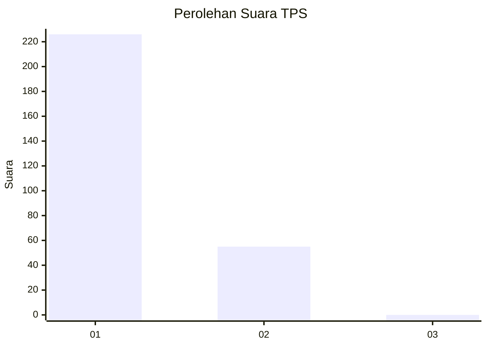
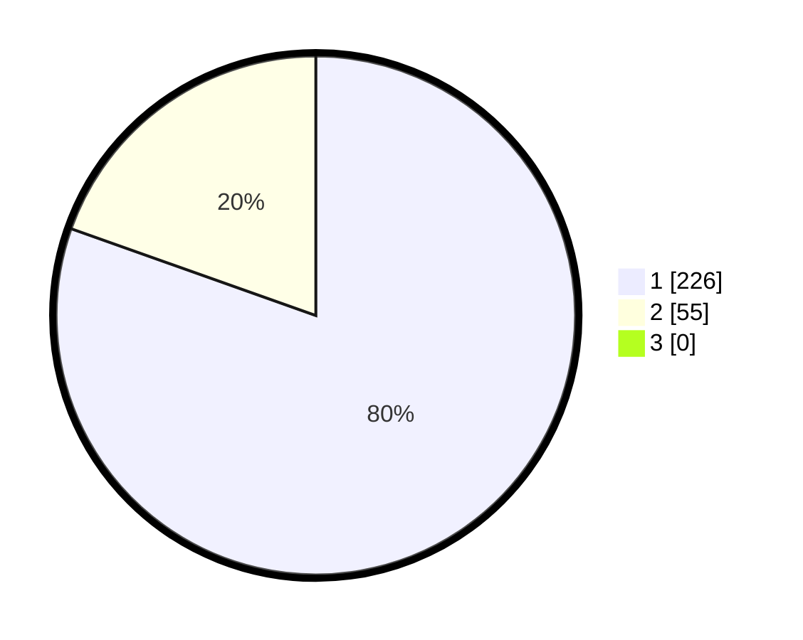

# Hasil

## Grafik

## Tabel

| No. | Nama Paslon    | Suara | Suara (raw) | Persentase |
|:--- |:-------------- | -----:| -----------:| ----------:|
| 1   | ANIES MUHAIMIN | 226   | [226][p-1]  | 80,43      |
| 2   | PRABOWO GIBRAN | 55    | [55][p-2]   | 19,57      |
| 3   | GANJAR MAHFUD  | 0     | [0][p-3]    | 0,00       |

[p-1]: https://github.com/gigit-pemilu/pemilu-2024-11-aceh/blob/main/pilpres/hitung-suara/sub/11-aceh/sub/08-aceh-utara/sub/11-syamtalira-bayu/sub/2008-beunot/sub/004-tps/sub/paslon-1.txt
[p-2]: https://github.com/gigit-pemilu/pemilu-2024-11-aceh/blob/main/pilpres/hitung-suara/sub/11-aceh/sub/08-aceh-utara/sub/11-syamtalira-bayu/sub/2008-beunot/sub/004-tps/sub/paslon-2.txt
[p-3]: https://github.com/gigit-pemilu/pemilu-2024-11-aceh/blob/main/pilpres/hitung-suara/sub/11-aceh/sub/08-aceh-utara/sub/11-syamtalira-bayu/sub/2008-beunot/sub/004-tps/sub/paslon-3.txt

## Foto C Plano

https://sirekap-obj-formc.kpu.go.id/b646/pemilu/ppwp/11/08/11/20/08/1108112008004-20240219-023016--7c15774d-0344-4713-a814-5e8999ab7238.jpg

https://sirekap-obj-formc.kpu.go.id/b646/pemilu/ppwp/11/08/11/20/08/1108112008004-20240219-023551--a5a1993c-f445-4cb8-9e30-c26b9925df60.jpg

https://sirekap-obj-formc.kpu.go.id/b646/pemilu/ppwp/11/08/11/20/08/1108112008004-20240219-023732--1efe17c4-f3a0-4149-96f6-fe732f0c858c.jpg

## Metadata

| Key        | Value               |
| ---------- | ------------------- |
| Time Stamp | 2024-02-25 11:00:00 |

