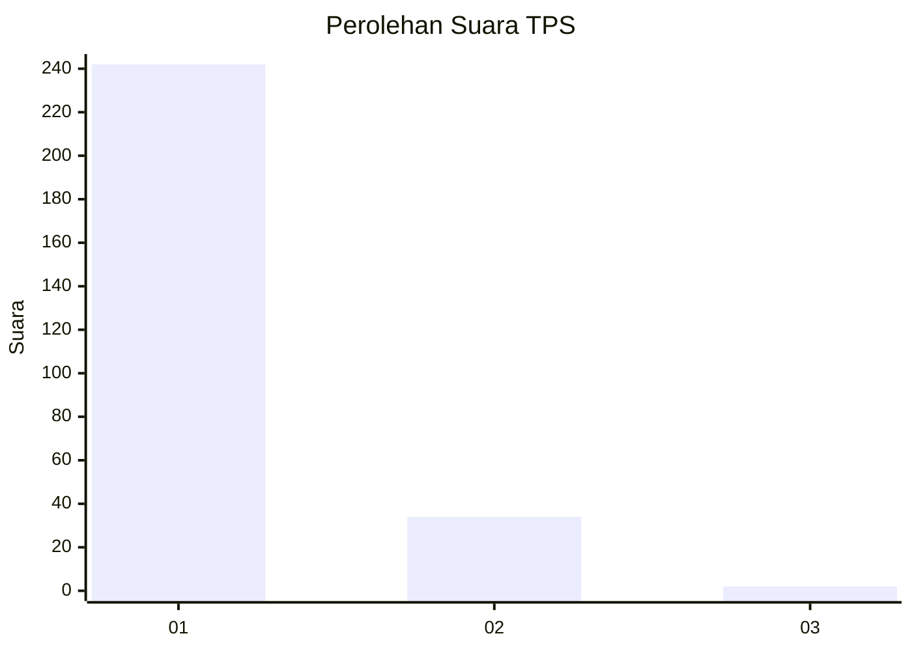
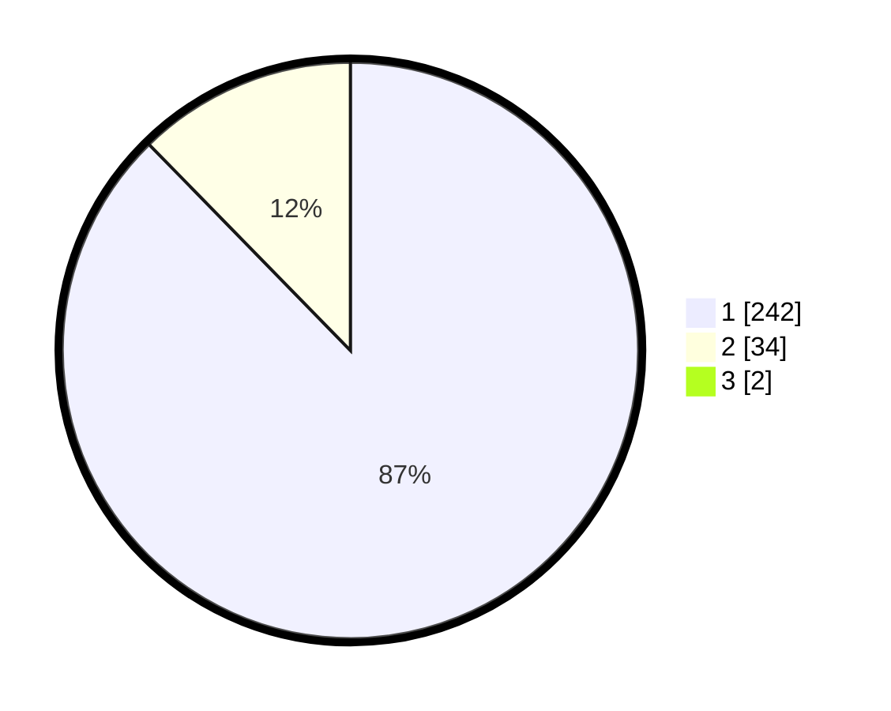

# Hasil

## Grafik

## Tabel

| No. | Nama Paslon    | Suara | Suara (raw) | Persentase |
|:--- |:-------------- | -----:| -----------:| ----------:|
| 1   | ANIES MUHAIMIN | 242   | [242][p-1]  | 87,05      |
| 2   | PRABOWO GIBRAN | 34    | [34][p-2]   | 12,23      |
| 3   | GANJAR MAHFUD  | 2     | [2][p-3]    | 0,72       |

[p-1]: https://github.com/gigit-pemilu/pemilu-2024-11-aceh/blob/main/pilpres/hitung-suara/sub/11-aceh/sub/08-aceh-utara/sub/11-syamtalira-bayu/sub/2031-dayah-blang-seureukuy/sub/001-tps/sub/paslon-1.txt
[p-2]: https://github.com/gigit-pemilu/pemilu-2024-11-aceh/blob/main/pilpres/hitung-suara/sub/11-aceh/sub/08-aceh-utara/sub/11-syamtalira-bayu/sub/2031-dayah-blang-seureukuy/sub/001-tps/sub/paslon-2.txt
[p-3]: https://github.com/gigit-pemilu/pemilu-2024-11-aceh/blob/main/pilpres/hitung-suara/sub/11-aceh/sub/08-aceh-utara/sub/11-syamtalira-bayu/sub/2031-dayah-blang-seureukuy/sub/001-tps/sub/paslon-3.txt

## Foto C Plano

https://sirekap-obj-formc.kpu.go.id/aa88/pemilu/ppwp/11/08/11/20/31/1108112031001-20240215-122040--35db99fe-46bc-4c60-96f7-f6d86b1bc2d0.jpg

https://sirekap-obj-formc.kpu.go.id/aa88/pemilu/ppwp/11/08/11/20/31/1108112031001-20240215-122515--755b5aea-8ee5-4abf-a94d-d9d541fd2422.jpg

https://sirekap-obj-formc.kpu.go.id/aa88/pemilu/ppwp/11/08/11/20/31/1108112031001-20240215-122544--1cab6dad-d02e-4cf3-a93f-9bfb10f4473c.jpg

## Metadata

| Key        | Value               |
| ---------- | ------------------- |
| Time Stamp | 2024-02-15 17:00:25 |

