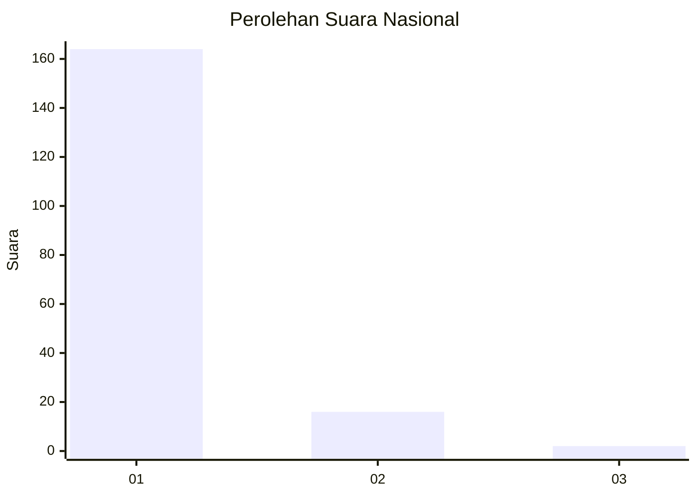
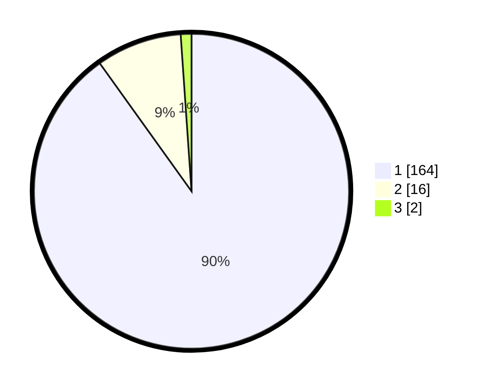

# Hasil

## Grafik

## Tabel

| No. | Nama Paslon    | Suara | Suara (raw) | Persentase |
|:--- |:-------------- | -----:| -----------:| ----------:|
| 1   | ANIES MUHAIMIN | 164   | [164][p-1]  | 90,11      |
| 2   | PRABOWO GIBRAN | 16    | [16][p-2]   | 8,79       |
| 3   | GANJAR MAHFUD  | 2     | [2][p-3]    | 1,10       |

[p-1]: https://github.com/gigit-pemilu/pemilu-2024/blob/main/pilpres/hitung-suara/sub/11-aceh/sub/08-aceh-utara/sub/11-syamtalira-bayu/sub/2032-blang-patra/sub/001-tps/sub/paslon-1.txt
[p-2]: https://github.com/gigit-pemilu/pemilu-2024/blob/main/pilpres/hitung-suara/sub/11-aceh/sub/08-aceh-utara/sub/11-syamtalira-bayu/sub/2032-blang-patra/sub/001-tps/sub/paslon-2.txt
[p-3]: https://github.com/gigit-pemilu/pemilu-2024/blob/main/pilpres/hitung-suara/sub/11-aceh/sub/08-aceh-utara/sub/11-syamtalira-bayu/sub/2032-blang-patra/sub/001-tps/sub/paslon-3.txt

## Foto C Plano

https://sirekap-obj-formc.kpu.go.id/c34a/pemilu/ppwp/11/08/11/20/32/1108112032001-20240215-022007--1029ef5d-a7af-4942-8a24-56845ba0f885.jpg

https://sirekap-obj-formc.kpu.go.id/c34a/pemilu/ppwp/11/08/11/20/32/1108112032001-20240215-022217--db04ef2b-9510-4aad-9930-e654c3433f9c.jpg

https://sirekap-obj-formc.kpu.go.id/c34a/pemilu/ppwp/11/08/11/20/32/1108112032001-20240215-043348--57f881a9-069f-48f4-8065-e34b43650e6e.jpg

## Metadata

| Key        | Value               |
| ---------- | ------------------- |
| Time Stamp | 2024-02-15 17:30:25 |

