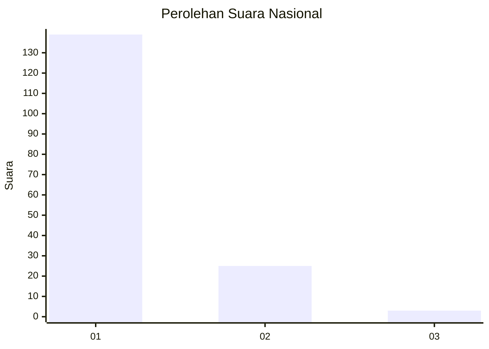
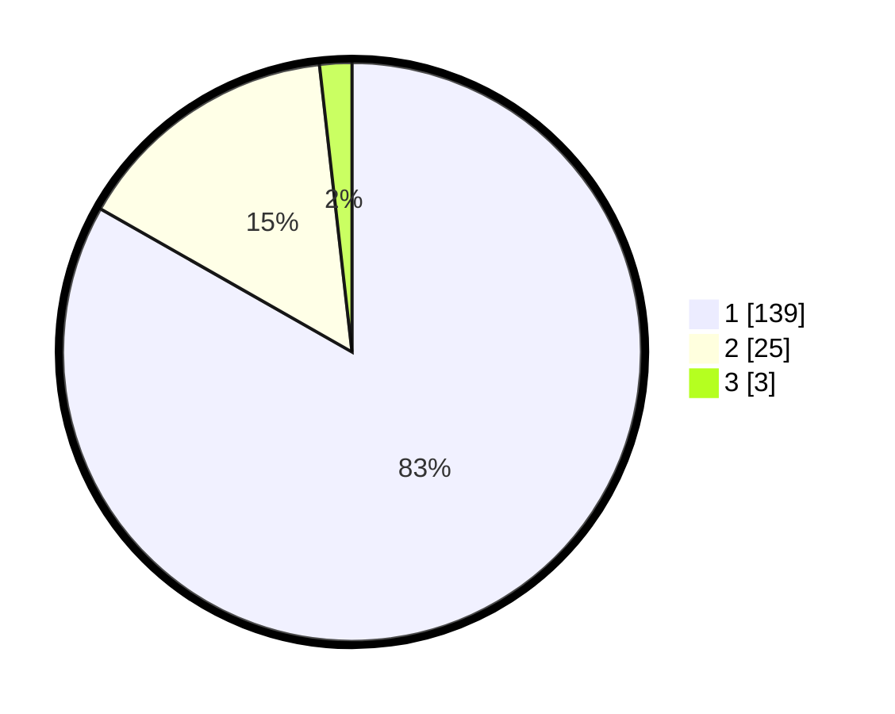

# Hasil

## Grafik

## Tabel

| No. | Nama Paslon    | Suara | Suara (raw) | Persentase |
|:--- |:-------------- | -----:| -----------:| ----------:|
| 1   | ANIES MUHAIMIN | 139   | [139][p-1]  | 83,23      |
| 2   | PRABOWO GIBRAN | 25    | [25][p-2]   | 14,97      |
| 3   | GANJAR MAHFUD  | 3     | [3][p-3]    | 1,80       |

[p-1]: https://github.com/gigit-pemilu/pemilu-2024/blob/main/pilpres/hitung-suara/sub/11-aceh/sub/08-aceh-utara/sub/12-tanah-luas/sub/2002-matang-ben/sub/003-tps/sub/paslon-1.txt
[p-2]: https://github.com/gigit-pemilu/pemilu-2024/blob/main/pilpres/hitung-suara/sub/11-aceh/sub/08-aceh-utara/sub/12-tanah-luas/sub/2002-matang-ben/sub/003-tps/sub/paslon-2.txt
[p-3]: https://github.com/gigit-pemilu/pemilu-2024/blob/main/pilpres/hitung-suara/sub/11-aceh/sub/08-aceh-utara/sub/12-tanah-luas/sub/2002-matang-ben/sub/003-tps/sub/paslon-3.txt

## Foto C Plano

https://sirekap-obj-formc.kpu.go.id/f890/pemilu/ppwp/11/08/12/20/02/1108122002003-20240215-133147--d49e7f82-448e-4495-9b77-7610387e9d4f.jpg

https://sirekap-obj-formc.kpu.go.id/f890/pemilu/ppwp/11/08/12/20/02/1108122002003-20240215-133254--64633011-8ff5-417a-a226-77c98537cc76.jpg

https://sirekap-obj-formc.kpu.go.id/f890/pemilu/ppwp/11/08/12/20/02/1108122002003-20240215-080643--2969a2b7-8f84-4adc-a5bb-630ceeff6f93.jpg

## Metadata

| Key        | Value               |
| ---------- | ------------------- |
| Time Stamp | 2024-02-16 12:51:22 |

## DATA PEMILIH TETAP

Jumlah pemilih dalam DPT: **208**.
 * L: **91**.
 * P: **117**.

## DATA PENGGUNA HAK PILIH

Jumlah pengguna hak pilih dalam DPT: **188**.
 * L: **82**.
 * P: **106**.

Jumlah pengguna hak pilih dalam DPTb: **0**.
 * L: **0**.
 * P: **0**.

Jumlah pengguna hak pilih dalam DPK: **2**.
 * L: **1**.
 * P: **1**.

Jumlah pengguna hak pilih: **190**.
 * L: **83**.
 * P: **107**.

## JUMLAH SUARA SAH DAN TIDAK SAH

JUMLAH SELURUH SUARA SAH: **167**.

JUMLAH SUARA TIDAK SAH: **23**.

JUMLAH SELURUH SUARA SAH DAN SUARA TIDAK SAH: **190**.

