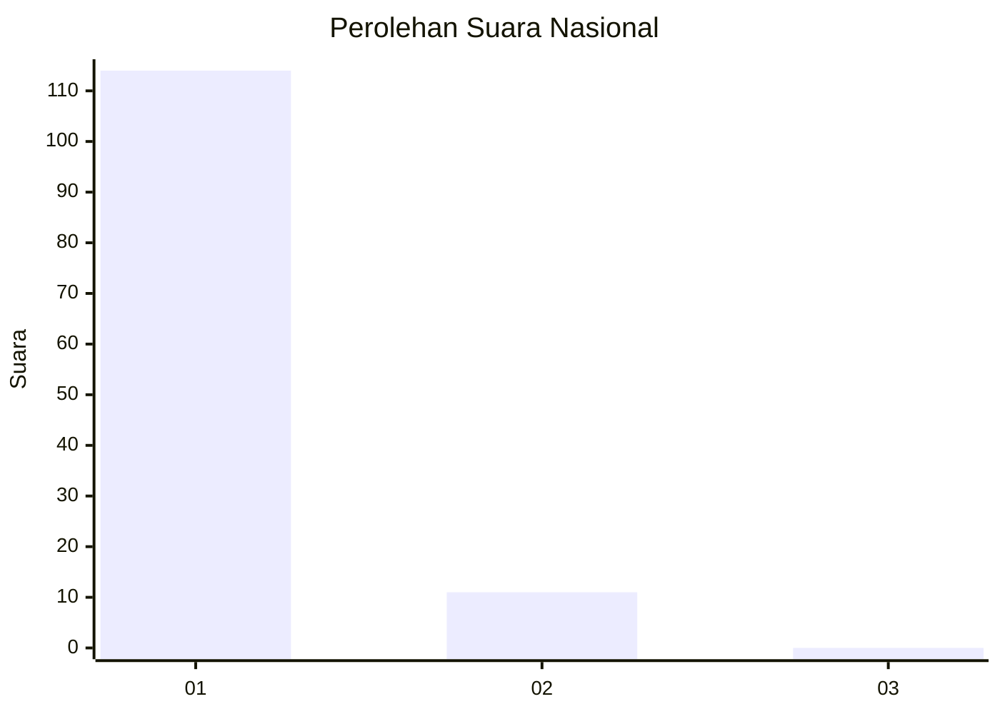
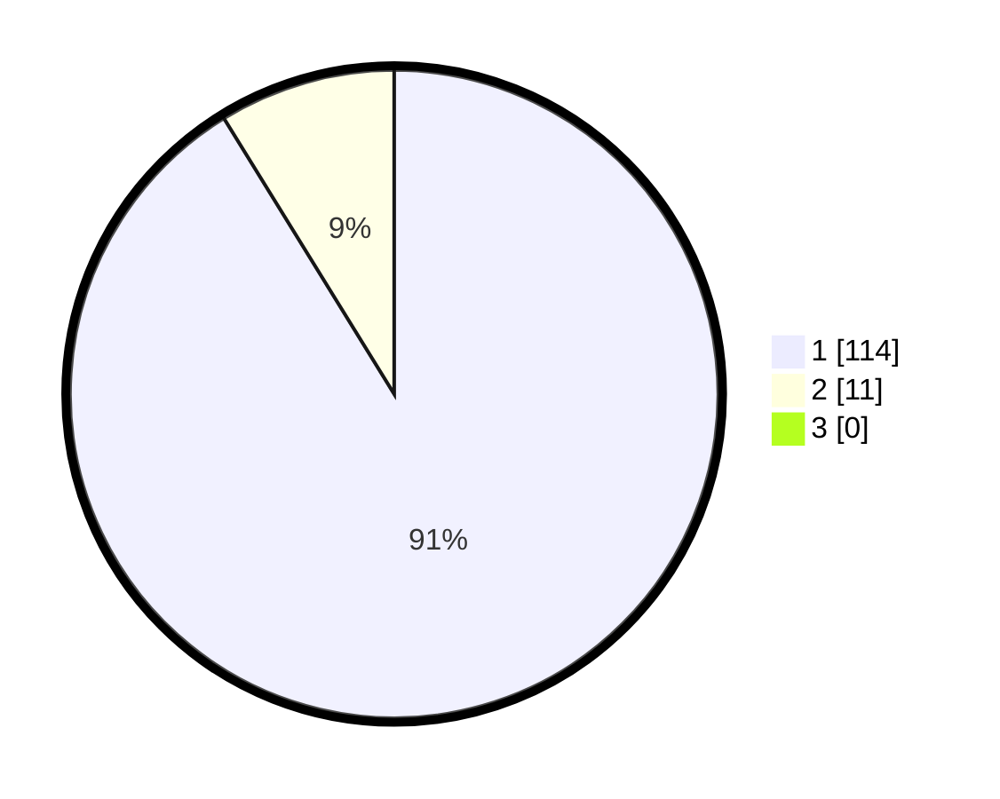

# Hasil

## Grafik

## Tabel

| No. | Nama Paslon    | Suara | Suara (raw) | Persentase |
|:--- |:-------------- | -----:| -----------:| ----------:|
| 1   | ANIES MUHAIMIN | 114   | [114][p-1]  | 91,20      |
| 2   | PRABOWO GIBRAN | 11    | [11][p-2]   | 8,80       |
| 3   | GANJAR MAHFUD  | 0     | [0][p-3]    | 0,00       |

[p-1]: https://github.com/gigit-pemilu/pemilu-2024/blob/main/pilpres/hitung-suara/sub/11-aceh/sub/08-aceh-utara/sub/12-tanah-luas/sub/2005-rawa/sub/002-tps/sub/paslon-1.txt
[p-2]: https://github.com/gigit-pemilu/pemilu-2024/blob/main/pilpres/hitung-suara/sub/11-aceh/sub/08-aceh-utara/sub/12-tanah-luas/sub/2005-rawa/sub/002-tps/sub/paslon-2.txt
[p-3]: https://github.com/gigit-pemilu/pemilu-2024/blob/main/pilpres/hitung-suara/sub/11-aceh/sub/08-aceh-utara/sub/12-tanah-luas/sub/2005-rawa/sub/002-tps/sub/paslon-3.txt

## Foto C Plano

https://sirekap-obj-formc.kpu.go.id/56f1/pemilu/ppwp/11/08/12/20/05/1108122005002-20240214-201139--aff2d4ea-8820-49b7-9f2c-589240a882a9.jpg

https://sirekap-obj-formc.kpu.go.id/56f1/pemilu/ppwp/11/08/12/20/05/1108122005002-20240214-201208--6d569cd8-b239-40ed-8290-e11cd64e54d5.jpg

https://sirekap-obj-formc.kpu.go.id/56f1/pemilu/ppwp/11/08/12/20/05/1108122005002-20240214-201645--0c200f8d-c7e9-4e90-8d55-7ab5a91ad450.jpg

## Metadata

| Key        | Value               |
| ---------- | ------------------- |
| Time Stamp | 2024-02-15 17:00:25 |

