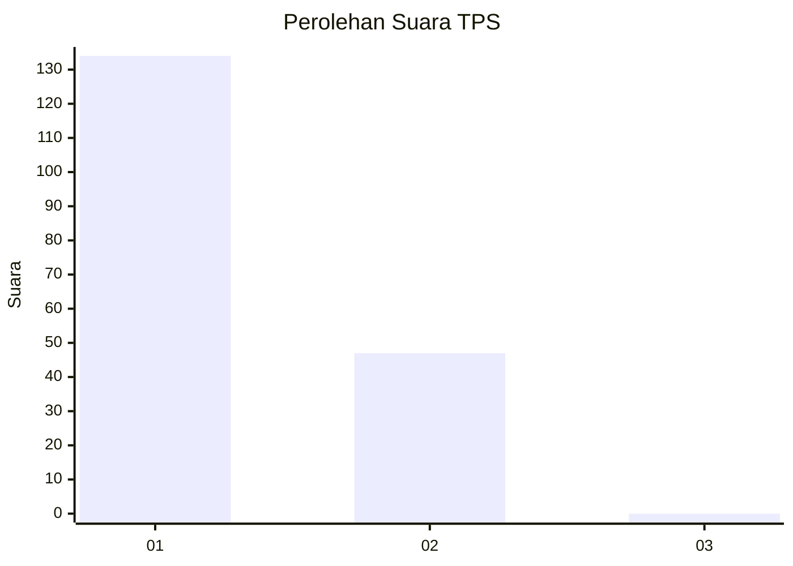
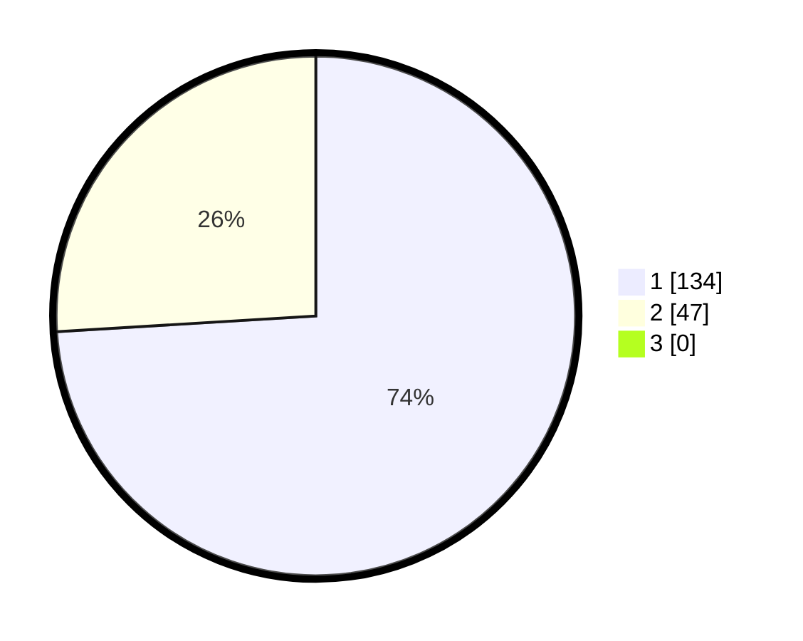

# Hasil

## Grafik

## Tabel

| No. | Nama Paslon    | Suara | Suara (raw) | Persentase |
|:--- |:-------------- | -----:| -----------:| ----------:|
| 1   | ANIES MUHAIMIN | 134   | [134][p-1]  | 74,03      |
| 2   | PRABOWO GIBRAN | 47    | [47][p-2]   | 25,97      |
| 3   | GANJAR MAHFUD  | 0     | [0][p-3]    | 0,00       |

[p-1]: https://github.com/gigit-pemilu/pemilu-2024-11-aceh/blob/main/pilpres/hitung-suara/sub/11-aceh/sub/08-aceh-utara/sub/12-tanah-luas/sub/2007-alue-pangkat/sub/001-tps/sub/paslon-1.txt
[p-2]: https://github.com/gigit-pemilu/pemilu-2024-11-aceh/blob/main/pilpres/hitung-suara/sub/11-aceh/sub/08-aceh-utara/sub/12-tanah-luas/sub/2007-alue-pangkat/sub/001-tps/sub/paslon-2.txt
[p-3]: https://github.com/gigit-pemilu/pemilu-2024-11-aceh/blob/main/pilpres/hitung-suara/sub/11-aceh/sub/08-aceh-utara/sub/12-tanah-luas/sub/2007-alue-pangkat/sub/001-tps/sub/paslon-3.txt

## Foto C Plano

https://sirekap-obj-formc.kpu.go.id/f278/pemilu/ppwp/11/08/12/20/07/1108122007001-20240215-122821--141d1953-cd5b-4169-a4b9-7444af737be1.jpg

https://sirekap-obj-formc.kpu.go.id/f278/pemilu/ppwp/11/08/12/20/07/1108122007001-20240215-122923--19c18f92-2d48-4d8e-bedd-e020bb08a427.jpg

https://sirekap-obj-formc.kpu.go.id/f278/pemilu/ppwp/11/08/12/20/07/1108122007001-20240215-123031--ccce2eb3-e603-4300-b4f8-f97fc013372e.jpg

## Metadata

| Key        | Value               |
| ---------- | ------------------- |
| Time Stamp | 2024-02-17 14:56:33 |

