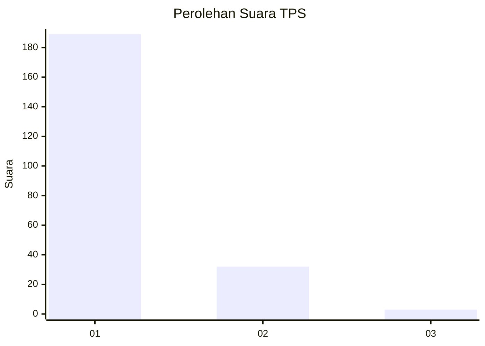
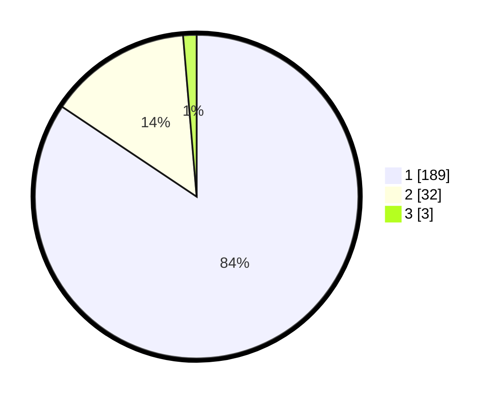

# Hasil

## Grafik

## Tabel

| No. | Nama Paslon    | Suara | Suara (raw) | Persentase |
|:--- |:-------------- | -----:| -----------:| ----------:|
| 1   | ANIES MUHAIMIN | 189   | [189][p-1]  | 84,38      |
| 2   | PRABOWO GIBRAN | 32    | [32][p-2]   | 14,29      |
| 3   | GANJAR MAHFUD  | 3     | [3][p-3]    | 1,34       |

[p-1]: https://github.com/gigit-pemilu/pemilu-2024-11-aceh/blob/main/pilpres/hitung-suara/sub/11-aceh/sub/08-aceh-utara/sub/12-tanah-luas/sub/2010-pulo-u/sub/001-tps/sub/paslon-1.txt
[p-2]: https://github.com/gigit-pemilu/pemilu-2024-11-aceh/blob/main/pilpres/hitung-suara/sub/11-aceh/sub/08-aceh-utara/sub/12-tanah-luas/sub/2010-pulo-u/sub/001-tps/sub/paslon-2.txt
[p-3]: https://github.com/gigit-pemilu/pemilu-2024-11-aceh/blob/main/pilpres/hitung-suara/sub/11-aceh/sub/08-aceh-utara/sub/12-tanah-luas/sub/2010-pulo-u/sub/001-tps/sub/paslon-3.txt

## Foto C Plano

https://sirekap-obj-formc.kpu.go.id/6273/pemilu/ppwp/11/08/12/20/10/1108122010001-20240214-224615--2dd1b1d5-64d9-4288-87ab-1ebc96067ed4.jpg

https://sirekap-obj-formc.kpu.go.id/6273/pemilu/ppwp/11/08/12/20/10/1108122010001-20240214-224636--5ccaae74-31e6-40ac-968f-686e10455d38.jpg

https://sirekap-obj-formc.kpu.go.id/6273/pemilu/ppwp/11/08/12/20/10/1108122010001-20240214-224653--690b34e3-9776-467e-b93e-7ef56184b4ea.jpg

## Metadata

| Key        | Value               |
| ---------- | ------------------- |
| Time Stamp | 2024-02-15 17:00:25 |

