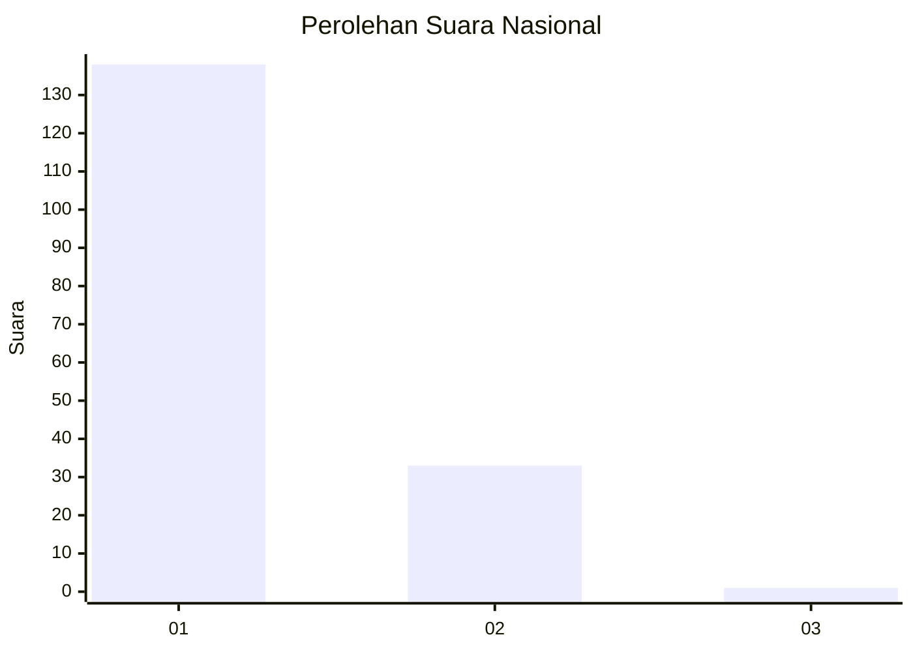
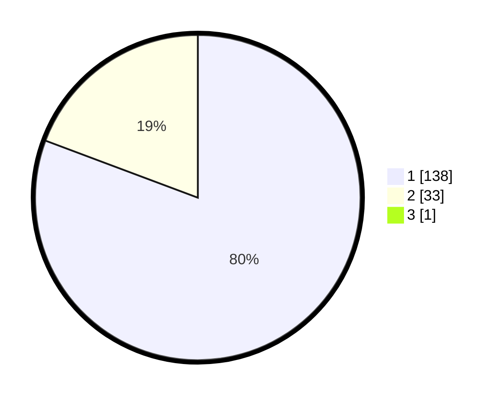

# Hasil

## Grafik

## Tabel

| No. | Nama Paslon    | Suara | Suara (raw) | Persentase |
|:--- |:-------------- | -----:| -----------:| ----------:|
| 1   | ANIES MUHAIMIN | 138   | [138][p-1]  | 80,23      |
| 2   | PRABOWO GIBRAN | 33    | [33][p-2]   | 19,19      |
| 3   | GANJAR MAHFUD  | 1     | [1][p-3]    | 0,58       |

[p-1]: https://github.com/gigit-pemilu/pemilu-2024/blob/main/pilpres/hitung-suara/sub/11-aceh/sub/08-aceh-utara/sub/12-tanah-luas/sub/2012-paya-beurandang/sub/001-tps/sub/paslon-1.txt
[p-2]: https://github.com/gigit-pemilu/pemilu-2024/blob/main/pilpres/hitung-suara/sub/11-aceh/sub/08-aceh-utara/sub/12-tanah-luas/sub/2012-paya-beurandang/sub/001-tps/sub/paslon-2.txt
[p-3]: https://github.com/gigit-pemilu/pemilu-2024/blob/main/pilpres/hitung-suara/sub/11-aceh/sub/08-aceh-utara/sub/12-tanah-luas/sub/2012-paya-beurandang/sub/001-tps/sub/paslon-3.txt

## Foto C Plano

https://sirekap-obj-formc.kpu.go.id/6a9f/pemilu/ppwp/11/08/12/20/12/1108122012001-20240215-033154--78cd031c-ca59-42f6-907b-0026c41bc541.jpg

https://sirekap-obj-formc.kpu.go.id/6a9f/pemilu/ppwp/11/08/12/20/12/1108122012001-20240215-033229--a9e52ef9-dcf4-46a1-b5c1-125b6d540b7b.jpg

https://sirekap-obj-formc.kpu.go.id/6a9f/pemilu/ppwp/11/08/12/20/12/1108122012001-20240215-033318--91149b5f-fa3d-4f2d-8295-e857eb1bee94.jpg

## Metadata

| Key        | Value               |
| ---------- | ------------------- |
| Time Stamp | 2024-02-17 16:00:02 |

