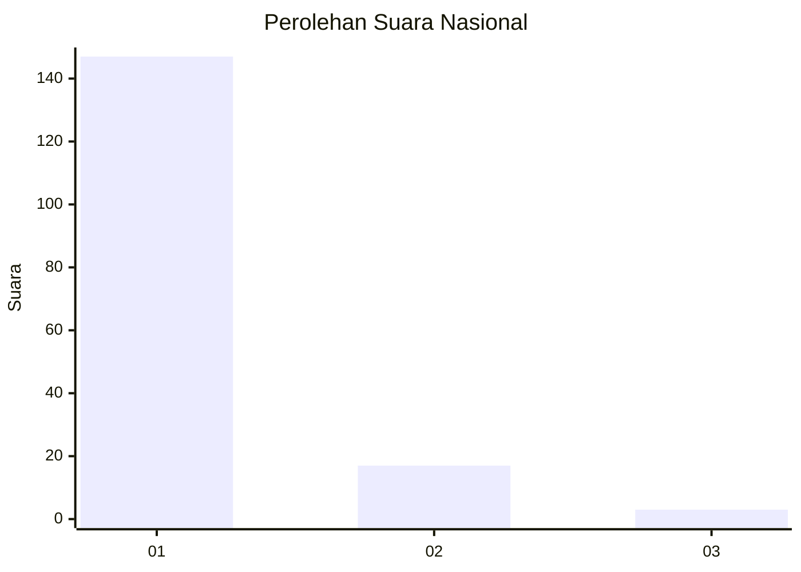
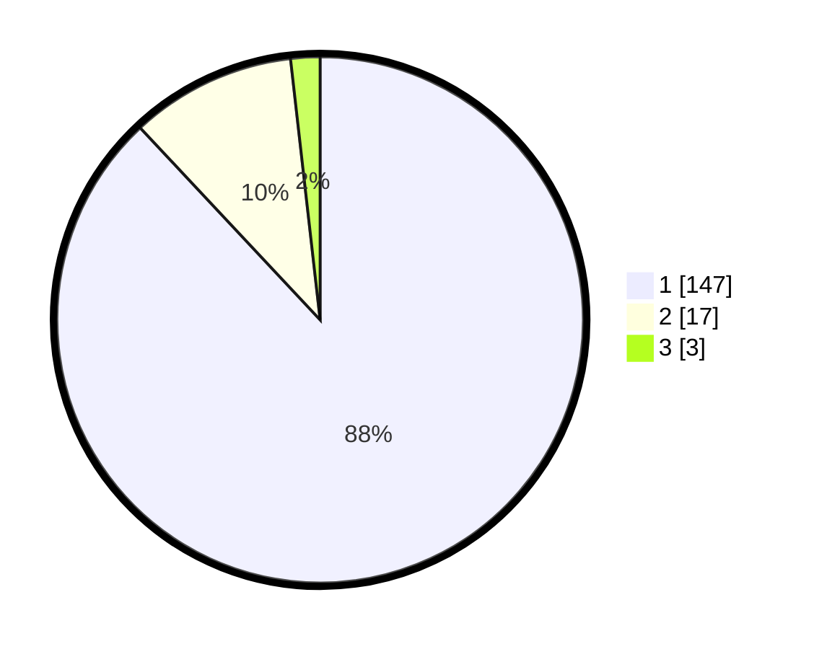

# Hasil

## Grafik

## Tabel

| No. | Nama Paslon    | Suara | Suara (raw) | Persentase |
|:--- |:-------------- | -----:| -----------:| ----------:|
| 1   | ANIES MUHAIMIN | 147   | [147][p-1]  | 88,02      |
| 2   | PRABOWO GIBRAN | 17    | [17][p-2]   | 10,18      |
| 3   | GANJAR MAHFUD  | 3     | [3][p-3]    | 1,80       |

[p-1]: https://github.com/gigit-pemilu/pemilu-2024/blob/main/pilpres/hitung-suara/sub/11-aceh/sub/08-aceh-utara/sub/12-tanah-luas/sub/2015-ampeh/sub/003-tps/sub/paslon-1.txt
[p-2]: https://github.com/gigit-pemilu/pemilu-2024/blob/main/pilpres/hitung-suara/sub/11-aceh/sub/08-aceh-utara/sub/12-tanah-luas/sub/2015-ampeh/sub/003-tps/sub/paslon-2.txt
[p-3]: https://github.com/gigit-pemilu/pemilu-2024/blob/main/pilpres/hitung-suara/sub/11-aceh/sub/08-aceh-utara/sub/12-tanah-luas/sub/2015-ampeh/sub/003-tps/sub/paslon-3.txt

## Foto C Plano

https://sirekap-obj-formc.kpu.go.id/41e0/pemilu/ppwp/11/08/12/20/15/1108122015003-20240215-112807--1752b814-fd18-476f-97db-23bbe1a92f5d.jpg

https://sirekap-obj-formc.kpu.go.id/41e0/pemilu/ppwp/11/08/12/20/15/1108122015003-20240215-113013--cd7baacb-1d87-4cd9-bb2f-3ed0343275f7.jpg

https://sirekap-obj-formc.kpu.go.id/41e0/pemilu/ppwp/11/08/12/20/15/1108122015003-20240215-113151--6ee8dd7e-265c-4b90-992b-877e440b7b29.jpg

## Metadata

| Key        | Value               |
| ---------- | ------------------- |
| Time Stamp | 2024-02-15 17:30:25 |

