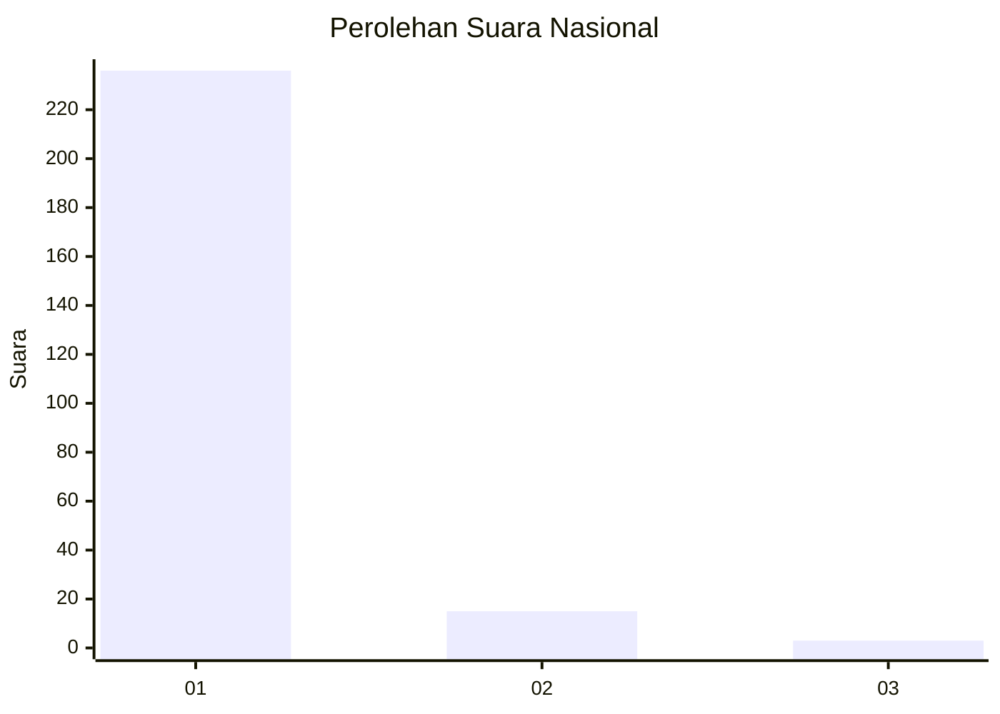
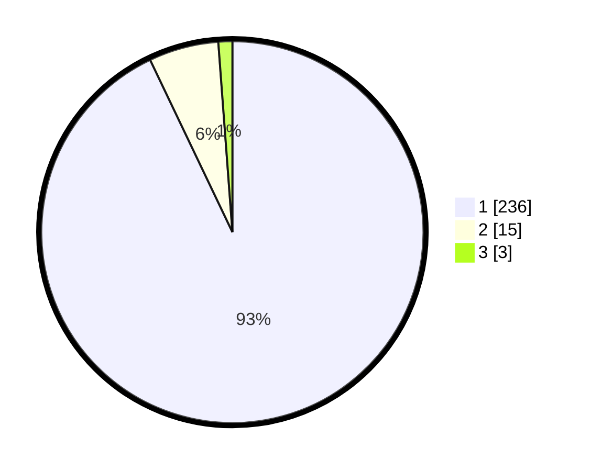

# Hasil

## Grafik

## Tabel

| No. | Nama Paslon    | Suara | Suara (raw) | Persentase |
|:--- |:-------------- | -----:| -----------:| ----------:|
| 1   | ANIES MUHAIMIN | 236   | [236][p-1]  | 92,91      |
| 2   | PRABOWO GIBRAN | 15    | [15][p-2]   | 5,91       |
| 3   | GANJAR MAHFUD  | 3     | [3][p-3]    | 1,18       |

[p-1]: https://github.com/gigit-pemilu/pemilu-2024/blob/main/pilpres/hitung-suara/sub/11-aceh/sub/08-aceh-utara/sub/12-tanah-luas/sub/2016-alue/sub/001-tps/sub/paslon-1.txt
[p-2]: https://github.com/gigit-pemilu/pemilu-2024/blob/main/pilpres/hitung-suara/sub/11-aceh/sub/08-aceh-utara/sub/12-tanah-luas/sub/2016-alue/sub/001-tps/sub/paslon-2.txt
[p-3]: https://github.com/gigit-pemilu/pemilu-2024/blob/main/pilpres/hitung-suara/sub/11-aceh/sub/08-aceh-utara/sub/12-tanah-luas/sub/2016-alue/sub/001-tps/sub/paslon-3.txt

## Foto C Plano

https://sirekap-obj-formc.kpu.go.id/988e/pemilu/ppwp/11/08/12/20/16/1108122016001-20240214-211056--690aee7d-876f-4b41-b37c-5273822ac014.jpg

https://sirekap-obj-formc.kpu.go.id/988e/pemilu/ppwp/11/08/12/20/16/1108122016001-20240214-210735--85f6417d-3a87-4b05-ba4d-0d20f260930f.jpg

https://sirekap-obj-formc.kpu.go.id/988e/pemilu/ppwp/11/08/12/20/16/1108122016001-20240214-210847--42f422db-3f32-4eef-a0e7-1a8acf397e20.jpg

## Metadata

| Key        | Value               |
| ---------- | ------------------- |
| Time Stamp | 2024-02-15 17:30:25 |

