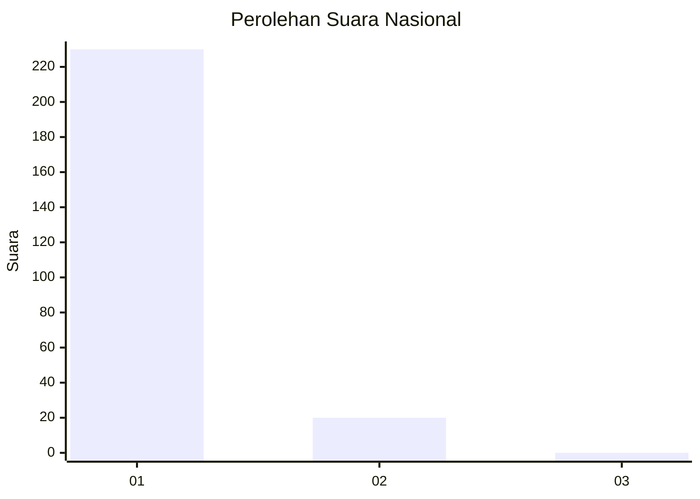
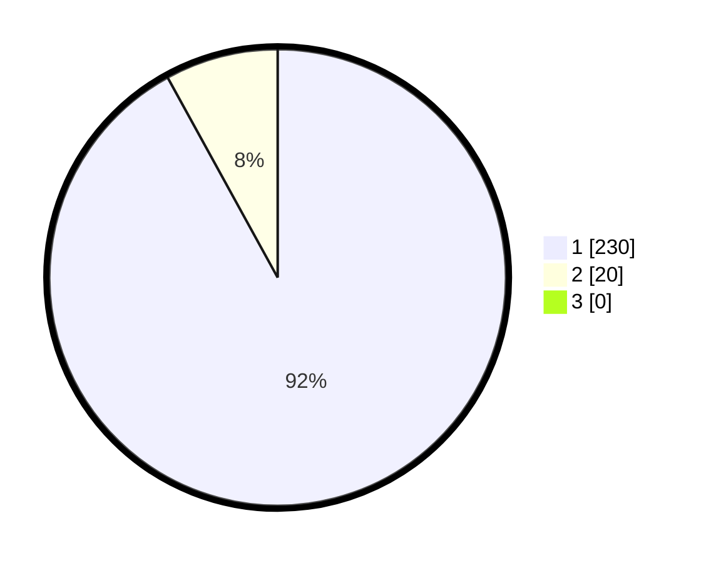

# Hasil

## Grafik

## Tabel

| No. | Nama Paslon    | Suara | Suara (raw) | Persentase |
|:--- |:-------------- | -----:| -----------:| ----------:|
| 1   | ANIES MUHAIMIN | 230   | [230][p-1]  | 92,00      |
| 2   | PRABOWO GIBRAN | 20    | [20][p-2]   | 8,00       |
| 3   | GANJAR MAHFUD  | 0     | [0][p-3]    | 0,00       |

[p-1]: https://github.com/gigit-pemilu/pemilu-2024/blob/main/pilpres/hitung-suara/sub/11-aceh/sub/08-aceh-utara/sub/12-tanah-luas/sub/2016-alue/sub/002-tps/sub/paslon-1.txt
[p-2]: https://github.com/gigit-pemilu/pemilu-2024/blob/main/pilpres/hitung-suara/sub/11-aceh/sub/08-aceh-utara/sub/12-tanah-luas/sub/2016-alue/sub/002-tps/sub/paslon-2.txt
[p-3]: https://github.com/gigit-pemilu/pemilu-2024/blob/main/pilpres/hitung-suara/sub/11-aceh/sub/08-aceh-utara/sub/12-tanah-luas/sub/2016-alue/sub/002-tps/sub/paslon-3.txt

## Foto C Plano

https://sirekap-obj-formc.kpu.go.id/e56c/pemilu/ppwp/11/08/12/20/16/1108122016002-20240214-194333--ad4a9b9a-0447-4f0d-907b-2136b42fd046.jpg

https://sirekap-obj-formc.kpu.go.id/e56c/pemilu/ppwp/11/08/12/20/16/1108122016002-20240214-194436--332a2b97-163d-40c8-b591-88aa1ba41c6b.jpg

https://sirekap-obj-formc.kpu.go.id/e56c/pemilu/ppwp/11/08/12/20/16/1108122016002-20240214-194614--8a64b397-6ffc-4798-aae5-fdb901ca8c08.jpg

## Metadata

| Key        | Value               |
| ---------- | ------------------- |
| Time Stamp | 2024-02-15 17:30:25 |

