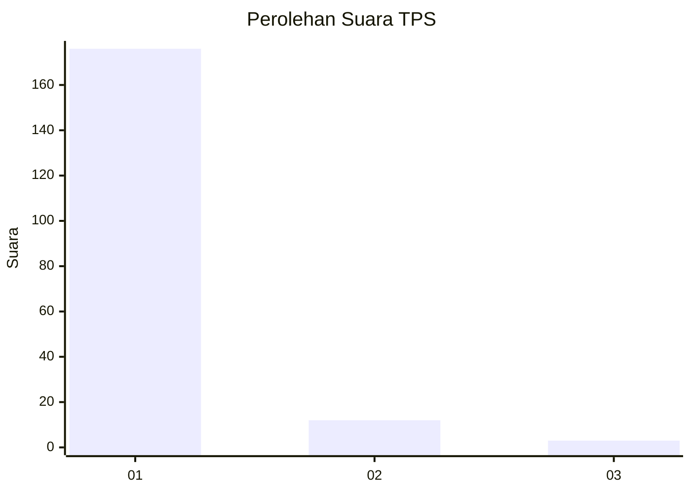
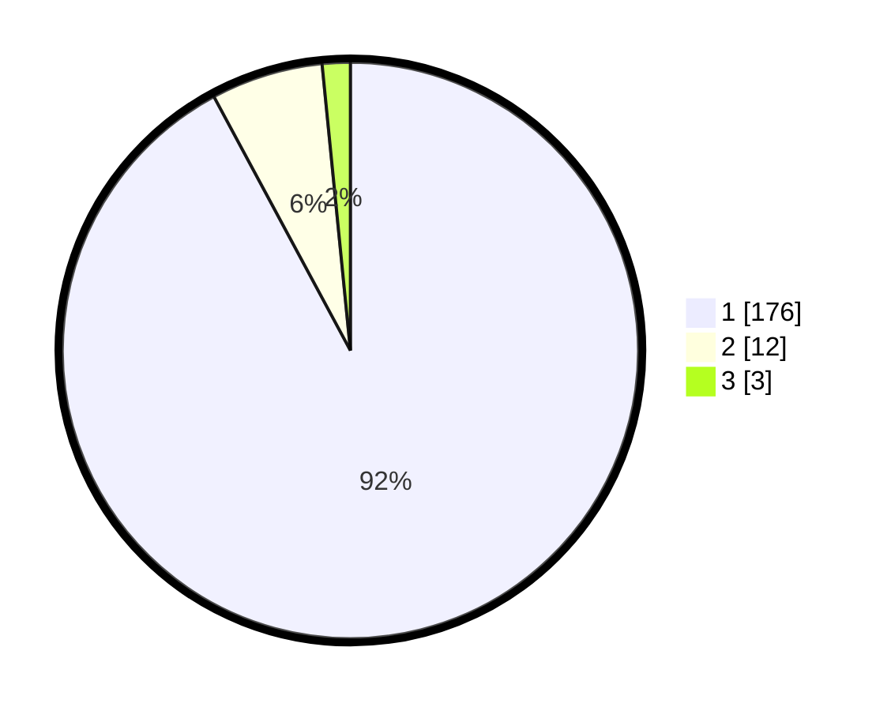

# Hasil

## Grafik

## Tabel

| No. | Nama Paslon    | Suara | Suara (raw) | Persentase |
|:--- |:-------------- | -----:| -----------:| ----------:|
| 1   | ANIES MUHAIMIN | 176   | [176][p-1]  | 92,15      |
| 2   | PRABOWO GIBRAN | 12    | [12][p-2]   | 6,28       |
| 3   | GANJAR MAHFUD  | 3     | [3][p-3]    | 1,57       |

[p-1]: https://github.com/gigit-pemilu/pemilu-2024-11-aceh/blob/main/pilpres/hitung-suara/sub/11-aceh/sub/08-aceh-utara/sub/12-tanah-luas/sub/2019-blang-jruen/sub/001-tps/sub/paslon-1.txt
[p-2]: https://github.com/gigit-pemilu/pemilu-2024-11-aceh/blob/main/pilpres/hitung-suara/sub/11-aceh/sub/08-aceh-utara/sub/12-tanah-luas/sub/2019-blang-jruen/sub/001-tps/sub/paslon-2.txt
[p-3]: https://github.com/gigit-pemilu/pemilu-2024-11-aceh/blob/main/pilpres/hitung-suara/sub/11-aceh/sub/08-aceh-utara/sub/12-tanah-luas/sub/2019-blang-jruen/sub/001-tps/sub/paslon-3.txt

## Foto C Plano

https://sirekap-obj-formc.kpu.go.id/f226/pemilu/ppwp/11/08/12/20/19/1108122019001-20240215-050705--4bfb22a8-c101-4f95-b592-603d5b140806.jpg

https://sirekap-obj-formc.kpu.go.id/f226/pemilu/ppwp/11/08/12/20/19/1108122019001-20240215-051025--1addc574-3439-4d90-911c-b5b5d1723bb7.jpg

https://sirekap-obj-formc.kpu.go.id/f226/pemilu/ppwp/11/08/12/20/19/1108122019001-20240215-051343--717854d1-55a7-41b7-bd7e-febeffddcb0a.jpg

## Metadata

| Key        | Value               |
| ---------- | ------------------- |
| Time Stamp | 2024-02-15 17:30:25 |

