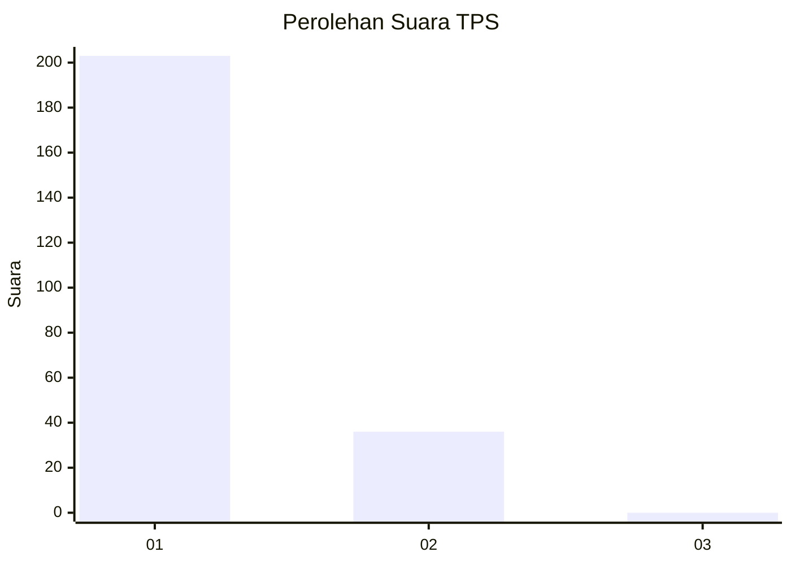
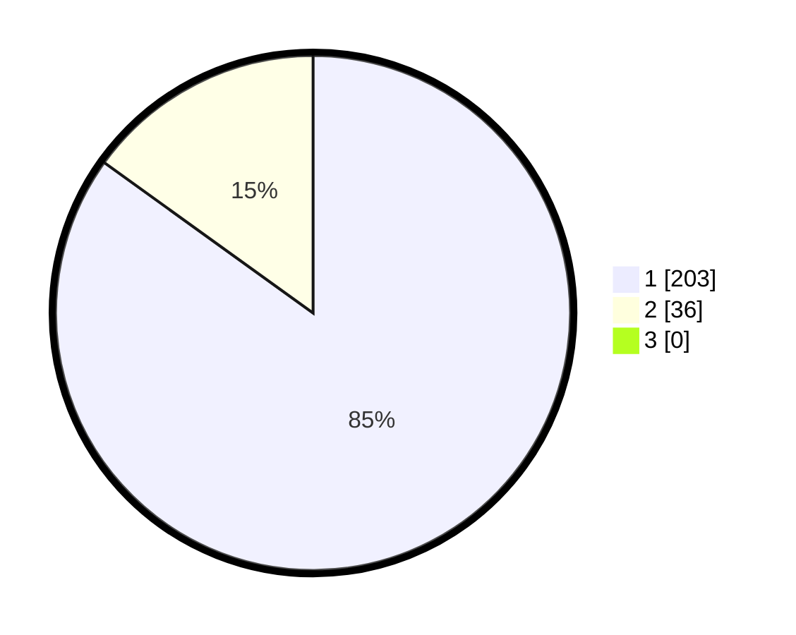

# Hasil

## Grafik

## Tabel

| No. | Nama Paslon    | Suara | Suara (raw) | Persentase |
|:--- |:-------------- | -----:| -----------:| ----------:|
| 1   | ANIES MUHAIMIN | 203   | [203][p-1]  | 84,94      |
| 2   | PRABOWO GIBRAN | 36    | [36][p-2]   | 15,06      |
| 3   | GANJAR MAHFUD  | 0     | [0][p-3]    | 0,00       |

[p-1]: https://github.com/gigit-pemilu/pemilu-2024-11-aceh/blob/main/pilpres/hitung-suara/sub/11-aceh/sub/08-aceh-utara/sub/12-tanah-luas/sub/2020-ujong-baroh-berghang/sub/001-tps/sub/paslon-1.txt
[p-2]: https://github.com/gigit-pemilu/pemilu-2024-11-aceh/blob/main/pilpres/hitung-suara/sub/11-aceh/sub/08-aceh-utara/sub/12-tanah-luas/sub/2020-ujong-baroh-berghang/sub/001-tps/sub/paslon-2.txt
[p-3]: https://github.com/gigit-pemilu/pemilu-2024-11-aceh/blob/main/pilpres/hitung-suara/sub/11-aceh/sub/08-aceh-utara/sub/12-tanah-luas/sub/2020-ujong-baroh-berghang/sub/001-tps/sub/paslon-3.txt

## Foto C Plano

https://sirekap-obj-formc.kpu.go.id/82cc/pemilu/ppwp/11/08/12/20/20/1108122020001-20240215-043439--641d4c5d-80d1-4751-bcd9-70f660a894bd.jpg

https://sirekap-obj-formc.kpu.go.id/82cc/pemilu/ppwp/11/08/12/20/20/1108122020001-20240215-043602--86e7a69e-ff80-42d2-9d3b-54f3146b9082.jpg

https://sirekap-obj-formc.kpu.go.id/82cc/pemilu/ppwp/11/08/12/20/20/1108122020001-20240215-043648--6395efef-2cf0-4b35-b9a4-66dc3b0507c7.jpg

## Metadata

| Key        | Value               |
| ---------- | ------------------- |
| Time Stamp | 2024-02-15 20:00:44 |

