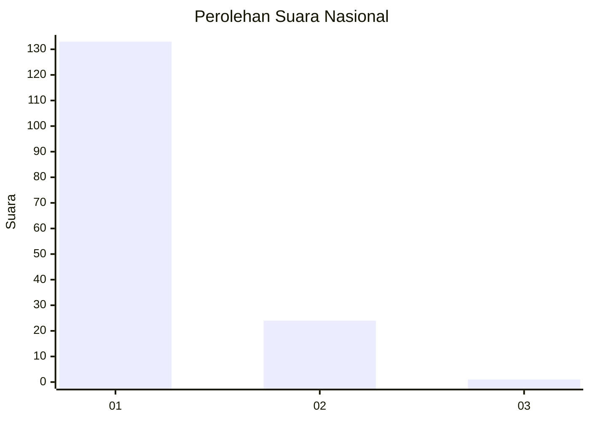
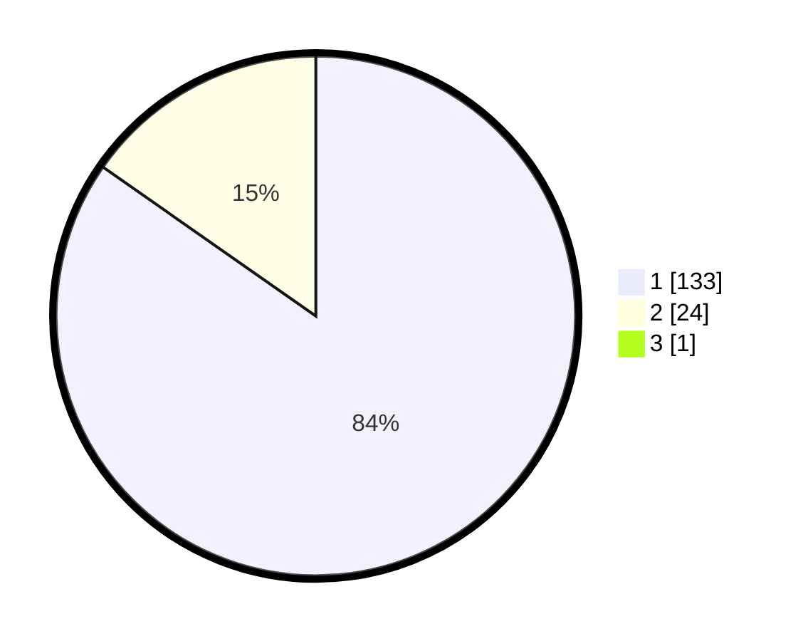

# Hasil

## Grafik

## Tabel

| No. | Nama Paslon    | Suara | Suara (raw) | Persentase |
|:--- |:-------------- | -----:| -----------:| ----------:|
| 1   | ANIES MUHAIMIN | 133   | [133][p-1]  | 84,18      |
| 2   | PRABOWO GIBRAN | 24    | [24][p-2]   | 15,19      |
| 3   | GANJAR MAHFUD  | 1     | [1][p-3]    | 0,63       |

[p-1]: https://github.com/gigit-pemilu/pemilu-2024/blob/main/pilpres/hitung-suara/sub/11-aceh/sub/08-aceh-utara/sub/12-tanah-luas/sub/2022-teungoh-berghang/sub/002-tps/sub/paslon-1.txt
[p-2]: https://github.com/gigit-pemilu/pemilu-2024/blob/main/pilpres/hitung-suara/sub/11-aceh/sub/08-aceh-utara/sub/12-tanah-luas/sub/2022-teungoh-berghang/sub/002-tps/sub/paslon-2.txt
[p-3]: https://github.com/gigit-pemilu/pemilu-2024/blob/main/pilpres/hitung-suara/sub/11-aceh/sub/08-aceh-utara/sub/12-tanah-luas/sub/2022-teungoh-berghang/sub/002-tps/sub/paslon-3.txt

## Foto C Plano

https://sirekap-obj-formc.kpu.go.id/85c1/pemilu/ppwp/11/08/12/20/22/1108122022002-20240215-113020--c5e34a4a-4c33-4bbf-8f56-dd81ed3f703d.jpg

https://sirekap-obj-formc.kpu.go.id/85c1/pemilu/ppwp/11/08/12/20/22/1108122022002-20240215-113220--6aa42f62-9709-439e-bdf3-42b97ad29300.jpg

https://sirekap-obj-formc.kpu.go.id/85c1/pemilu/ppwp/11/08/12/20/22/1108122022002-20240215-113345--d1a5be19-5438-4c78-af55-e6b6789c142a.jpg

## Metadata

| Key        | Value               |
| ---------- | ------------------- |
| Time Stamp | 2024-02-15 20:30:46 |

