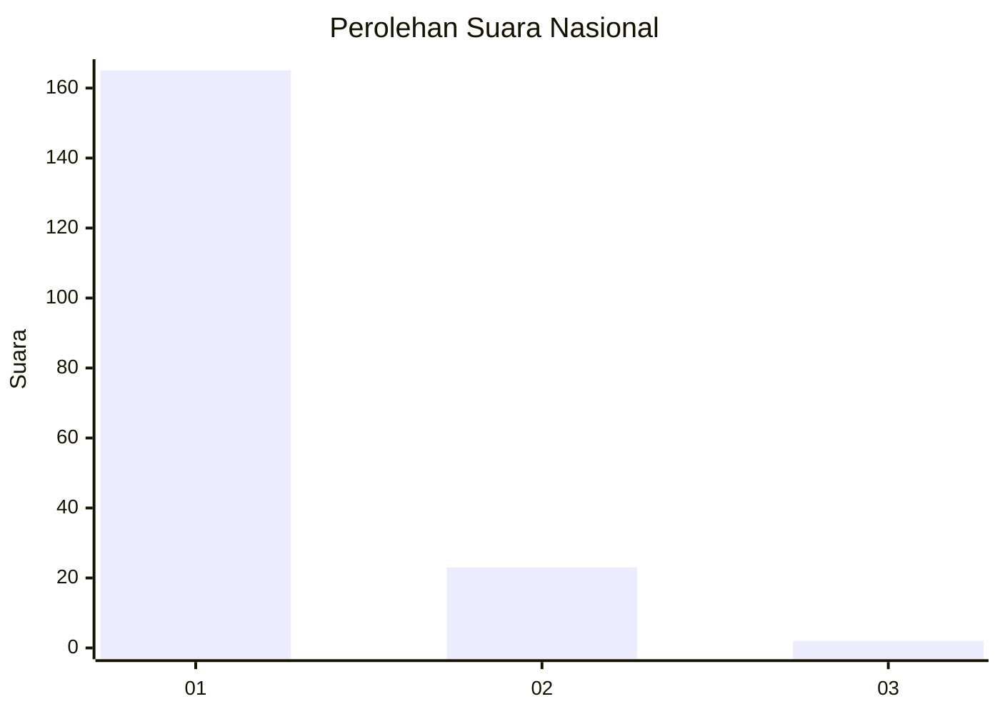
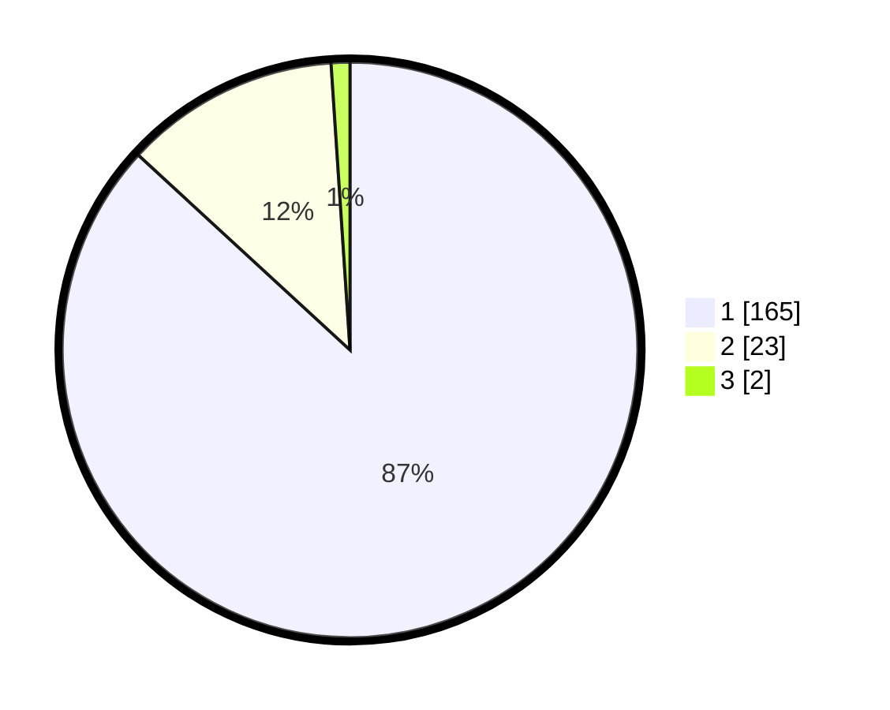

# Hasil

## Grafik

## Tabel

| No. | Nama Paslon    | Suara | Suara (raw) | Persentase |
|:--- |:-------------- | -----:| -----------:| ----------:|
| 1   | ANIES MUHAIMIN | 165   | [165][p-1]  | 86,84      |
| 2   | PRABOWO GIBRAN | 23    | [23][p-2]   | 12,11      |
| 3   | GANJAR MAHFUD  | 2     | [2][p-3]    | 1,05       |

[p-1]: https://github.com/gigit-pemilu/pemilu-2024/blob/main/pilpres/hitung-suara/sub/11-aceh/sub/08-aceh-utara/sub/12-tanah-luas/sub/2025-rayeuk-naleung/sub/001-tps/sub/paslon-1.txt
[p-2]: https://github.com/gigit-pemilu/pemilu-2024/blob/main/pilpres/hitung-suara/sub/11-aceh/sub/08-aceh-utara/sub/12-tanah-luas/sub/2025-rayeuk-naleung/sub/001-tps/sub/paslon-2.txt
[p-3]: https://github.com/gigit-pemilu/pemilu-2024/blob/main/pilpres/hitung-suara/sub/11-aceh/sub/08-aceh-utara/sub/12-tanah-luas/sub/2025-rayeuk-naleung/sub/001-tps/sub/paslon-3.txt

## Foto C Plano

https://sirekap-obj-formc.kpu.go.id/f7ad/pemilu/ppwp/11/08/12/20/25/1108122025001-20240223-005423--3ff3a1b6-1578-4d92-950f-a7d6dcab9ecd.jpg

https://sirekap-obj-formc.kpu.go.id/f7ad/pemilu/ppwp/11/08/12/20/25/1108122025001-20240223-005626--1f84b8e3-c6a1-496e-b20d-3124eb7b7f8d.jpg

https://sirekap-obj-formc.kpu.go.id/f7ad/pemilu/ppwp/11/08/12/20/25/1108122025001-20240223-005734--312cfd4f-99e1-4fb8-895b-8817849835fe.jpg

## Metadata

| Key        | Value               |
| ---------- | ------------------- |
| Time Stamp | 2024-02-24 22:31:28 |

