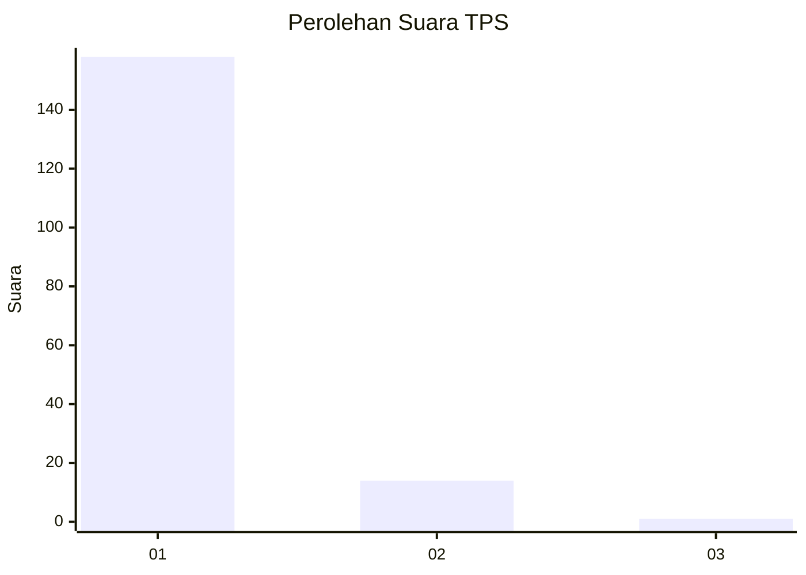
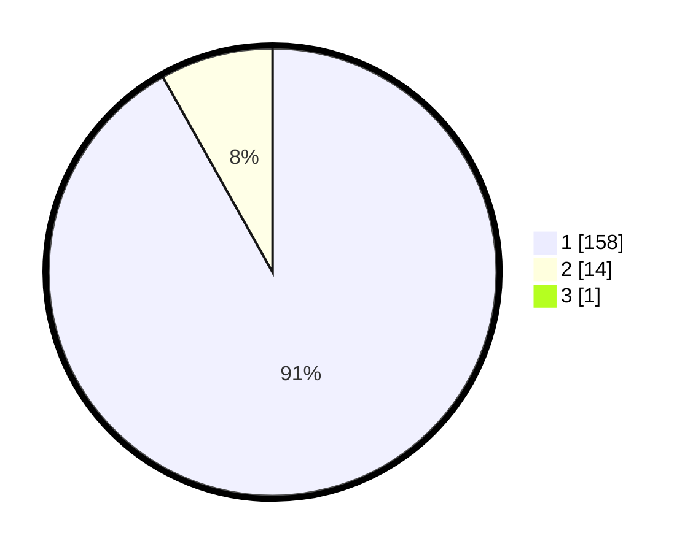

# Hasil

## Grafik

## Tabel

| No. | Nama Paslon    | Suara | Suara (raw) | Persentase |
|:--- |:-------------- | -----:| -----------:| ----------:|
| 1   | ANIES MUHAIMIN | 158   | [158][p-1]  | 91,33      |
| 2   | PRABOWO GIBRAN | 14    | [14][p-2]   | 8,09       |
| 3   | GANJAR MAHFUD  | 1     | [1][p-3]    | 0,58       |

[p-1]: https://github.com/gigit-pemilu/pemilu-2024-11-aceh/blob/main/pilpres/hitung-suara/sub/11-aceh/sub/08-aceh-utara/sub/12-tanah-luas/sub/2026-rangkaya/sub/001-tps/sub/paslon-1.txt
[p-2]: https://github.com/gigit-pemilu/pemilu-2024-11-aceh/blob/main/pilpres/hitung-suara/sub/11-aceh/sub/08-aceh-utara/sub/12-tanah-luas/sub/2026-rangkaya/sub/001-tps/sub/paslon-2.txt
[p-3]: https://github.com/gigit-pemilu/pemilu-2024-11-aceh/blob/main/pilpres/hitung-suara/sub/11-aceh/sub/08-aceh-utara/sub/12-tanah-luas/sub/2026-rangkaya/sub/001-tps/sub/paslon-3.txt

## Foto C Plano

https://sirekap-obj-formc.kpu.go.id/151a/pemilu/ppwp/11/08/12/20/26/1108122026001-20240215-074357--56db0d9d-a255-4e64-a42c-b5014caf4c68.jpg

https://sirekap-obj-formc.kpu.go.id/151a/pemilu/ppwp/11/08/12/20/26/1108122026001-20240215-074541--a68faed3-b894-4815-8f5b-db3b1b905d64.jpg

https://sirekap-obj-formc.kpu.go.id/151a/pemilu/ppwp/11/08/12/20/26/1108122026001-20240215-074848--6e0c121a-f130-4e09-b694-a71373d3efed.jpg

## Metadata

| Key        | Value               |
| ---------- | ------------------- |
| Time Stamp | 2024-02-17 16:00:02 |

