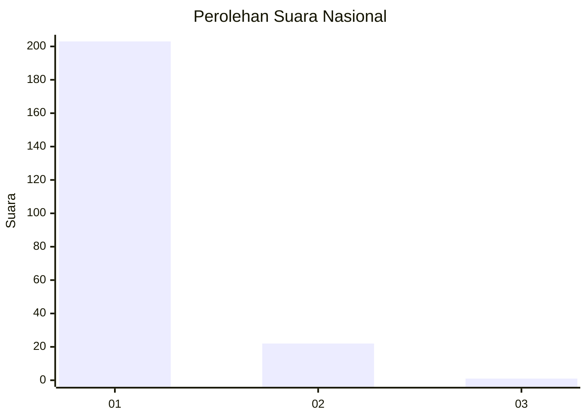
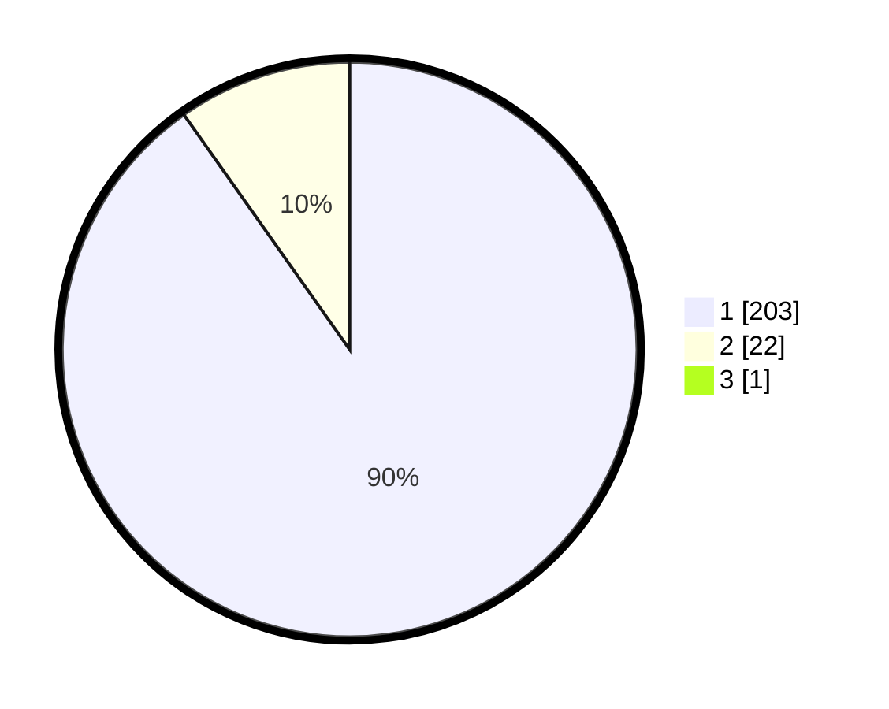

# Hasil

## Grafik

## Tabel

| No. | Nama Paslon    | Suara | Suara (raw) | Persentase |
|:--- |:-------------- | -----:| -----------:| ----------:|
| 1   | ANIES MUHAIMIN | 203   | [203][p-1]  | 89,82      |
| 2   | PRABOWO GIBRAN | 22    | [22][p-2]   | 9,73       |
| 3   | GANJAR MAHFUD  | 1     | [1][p-3]    | 0,44       |

[p-1]: https://github.com/gigit-pemilu/pemilu-2024/blob/main/pilpres/hitung-suara/sub/11-aceh/sub/08-aceh-utara/sub/12-tanah-luas/sub/2029-rayeuk-kuta/sub/003-tps/sub/paslon-1.txt
[p-2]: https://github.com/gigit-pemilu/pemilu-2024/blob/main/pilpres/hitung-suara/sub/11-aceh/sub/08-aceh-utara/sub/12-tanah-luas/sub/2029-rayeuk-kuta/sub/003-tps/sub/paslon-2.txt
[p-3]: https://github.com/gigit-pemilu/pemilu-2024/blob/main/pilpres/hitung-suara/sub/11-aceh/sub/08-aceh-utara/sub/12-tanah-luas/sub/2029-rayeuk-kuta/sub/003-tps/sub/paslon-3.txt

## Foto C Plano

https://sirekap-obj-formc.kpu.go.id/decd/pemilu/ppwp/11/08/12/20/29/1108122029003-20240215-004409--6afe1170-5708-48a9-a5fc-172260274974.jpg

https://sirekap-obj-formc.kpu.go.id/decd/pemilu/ppwp/11/08/12/20/29/1108122029003-20240215-004610--e4e9a65d-7f5b-4fdb-a80a-a2b121b099eb.jpg

https://sirekap-obj-formc.kpu.go.id/decd/pemilu/ppwp/11/08/12/20/29/1108122029003-20240215-013751--bdd68ad0-21f8-46fa-9eec-cd69b1abfb83.jpg

## Metadata

| Key        | Value               |
| ---------- | ------------------- |
| Time Stamp | 2024-02-17 16:00:02 |

