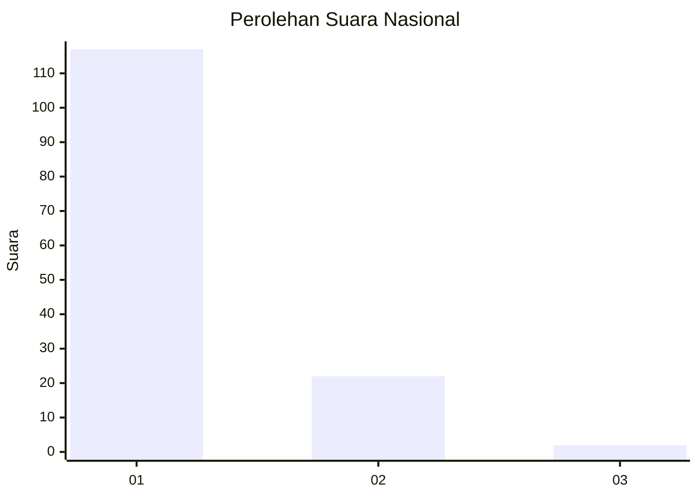
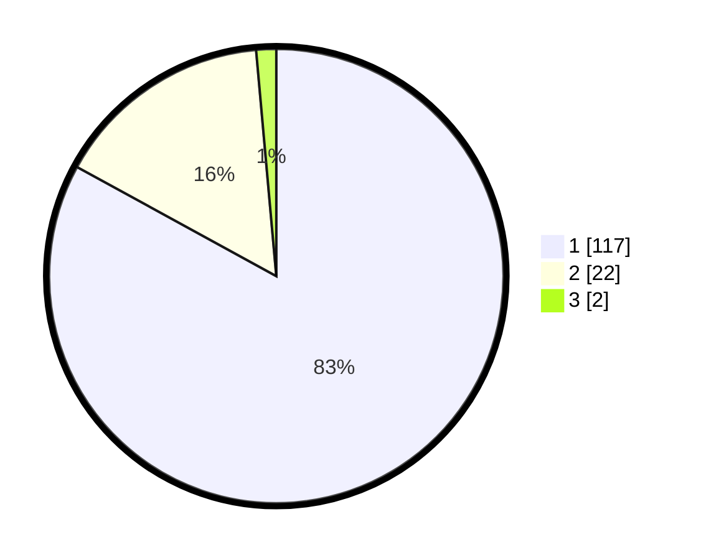

# Hasil

## Grafik

## Tabel

| No. | Nama Paslon    | Suara | Suara (raw) | Persentase |
|:--- |:-------------- | -----:| -----------:| ----------:|
| 1   | ANIES MUHAIMIN | 117   | [117][p-1]  | 82,98      |
| 2   | PRABOWO GIBRAN | 22    | [22][p-2]   | 15,60      |
| 3   | GANJAR MAHFUD  | 2     | [2][p-3]    | 1,42       |

[p-1]: https://github.com/gigit-pemilu/pemilu-2024/blob/main/pilpres/hitung-suara/sub/11-aceh/sub/08-aceh-utara/sub/12-tanah-luas/sub/2032-trieng/sub/002-tps/sub/paslon-1.txt
[p-2]: https://github.com/gigit-pemilu/pemilu-2024/blob/main/pilpres/hitung-suara/sub/11-aceh/sub/08-aceh-utara/sub/12-tanah-luas/sub/2032-trieng/sub/002-tps/sub/paslon-2.txt
[p-3]: https://github.com/gigit-pemilu/pemilu-2024/blob/main/pilpres/hitung-suara/sub/11-aceh/sub/08-aceh-utara/sub/12-tanah-luas/sub/2032-trieng/sub/002-tps/sub/paslon-3.txt

## Foto C Plano

https://sirekap-obj-formc.kpu.go.id/cd71/pemilu/ppwp/11/08/12/20/32/1108122032002-20240214-221041--cdacffb6-8f0f-4c54-8f94-b20c9d2a8f62.jpg

https://sirekap-obj-formc.kpu.go.id/cd71/pemilu/ppwp/11/08/12/20/32/1108122032002-20240214-221220--aad2fdbd-e05b-486e-974b-a72749f9e142.jpg

https://sirekap-obj-formc.kpu.go.id/cd71/pemilu/ppwp/11/08/12/20/32/1108122032002-20240214-221318--d21febcf-2fb3-48f3-a1e5-bbee360f5118.jpg

## Metadata

| Key        | Value               |
| ---------- | ------------------- |
| Time Stamp | 2024-02-17 16:00:02 |

