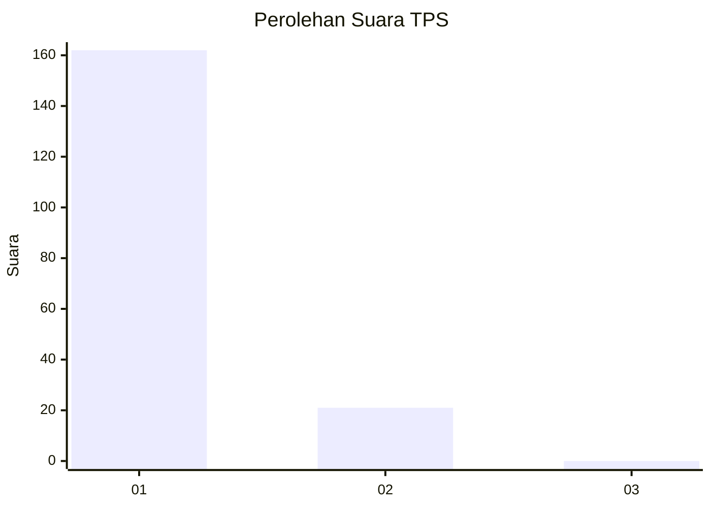
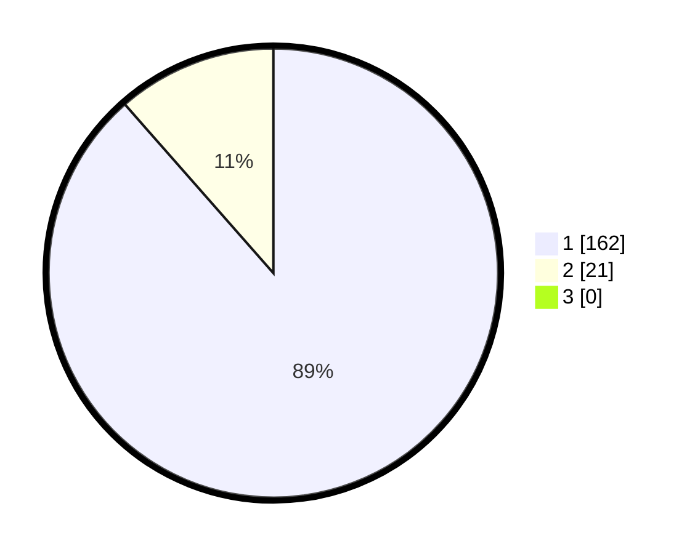

# Hasil

## Grafik

## Tabel

| No. | Nama Paslon    | Suara | Suara (raw) | Persentase |
|:--- |:-------------- | -----:| -----------:| ----------:|
| 1   | ANIES MUHAIMIN | 162   | [162][p-1]  | 88,52      |
| 2   | PRABOWO GIBRAN | 21    | [21][p-2]   | 11,48      |
| 3   | GANJAR MAHFUD  | 0     | [0][p-3]    | 0,00       |

[p-1]: https://github.com/gigit-pemilu/pemilu-2024-11-aceh/blob/main/pilpres/hitung-suara/sub/11-aceh/sub/08-aceh-utara/sub/12-tanah-luas/sub/2036-matang-mane/sub/001-tps/sub/paslon-1.txt
[p-2]: https://github.com/gigit-pemilu/pemilu-2024-11-aceh/blob/main/pilpres/hitung-suara/sub/11-aceh/sub/08-aceh-utara/sub/12-tanah-luas/sub/2036-matang-mane/sub/001-tps/sub/paslon-2.txt
[p-3]: https://github.com/gigit-pemilu/pemilu-2024-11-aceh/blob/main/pilpres/hitung-suara/sub/11-aceh/sub/08-aceh-utara/sub/12-tanah-luas/sub/2036-matang-mane/sub/001-tps/sub/paslon-3.txt

## Foto C Plano

https://sirekap-obj-formc.kpu.go.id/5222/pemilu/ppwp/11/08/12/20/36/1108122036001-20240215-023857--9076b30b-eca5-46cc-95b5-2bebe90e5539.jpg

https://sirekap-obj-formc.kpu.go.id/5222/pemilu/ppwp/11/08/12/20/36/1108122036001-20240215-025222--9351c268-8434-4ff7-b651-7aa872204561.jpg

https://sirekap-obj-formc.kpu.go.id/5222/pemilu/ppwp/11/08/12/20/36/1108122036001-20240215-025654--26c8aba7-428a-4903-ad57-12913eeeaaf9.jpg

## Metadata

| Key        | Value               |
| ---------- | ------------------- |
| Time Stamp | 2024-02-17 16:00:02 |

