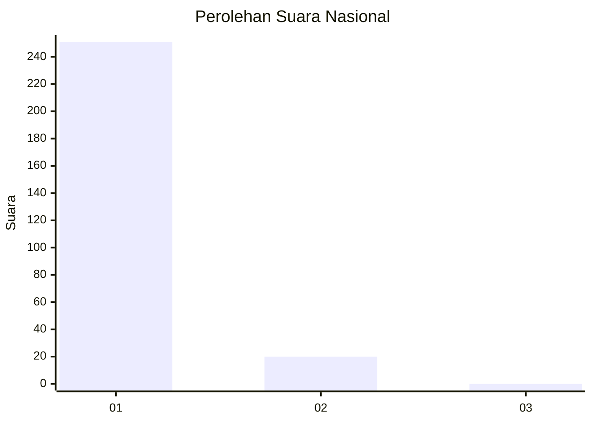
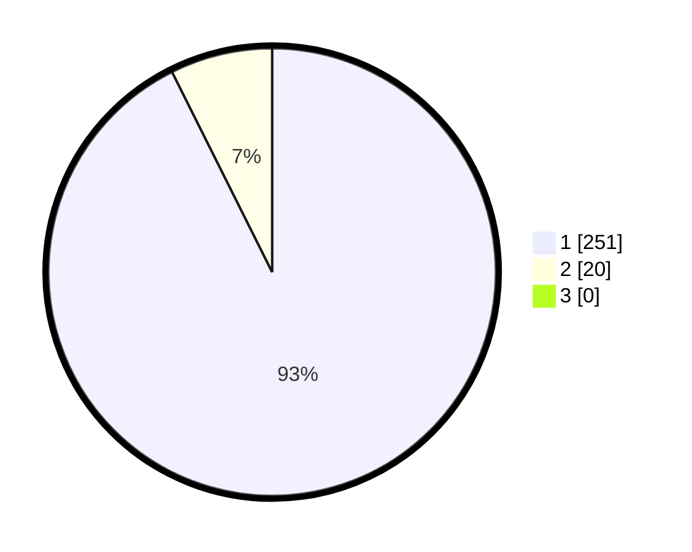

# Hasil

## Grafik

## Tabel

| No. | Nama Paslon    | Suara | Suara (raw) | Persentase |
|:--- |:-------------- | -----:| -----------:| ----------:|
| 1   | ANIES MUHAIMIN | 251   | [251][p-1]  | 92,62      |
| 2   | PRABOWO GIBRAN | 20    | [20][p-2]   | 7,38       |
| 3   | GANJAR MAHFUD  | 0     | [0][p-3]    | 0,00       |

[p-1]: https://github.com/gigit-pemilu/pemilu-2024/blob/main/pilpres/hitung-suara/sub/11-aceh/sub/08-aceh-utara/sub/12-tanah-luas/sub/2038-bayi/sub/001-tps/sub/paslon-1.txt
[p-2]: https://github.com/gigit-pemilu/pemilu-2024/blob/main/pilpres/hitung-suara/sub/11-aceh/sub/08-aceh-utara/sub/12-tanah-luas/sub/2038-bayi/sub/001-tps/sub/paslon-2.txt
[p-3]: https://github.com/gigit-pemilu/pemilu-2024/blob/main/pilpres/hitung-suara/sub/11-aceh/sub/08-aceh-utara/sub/12-tanah-luas/sub/2038-bayi/sub/001-tps/sub/paslon-3.txt

## Foto C Plano

https://sirekap-obj-formc.kpu.go.id/5a42/pemilu/ppwp/11/08/12/20/38/1108122038001-20240215-075503--fd46f41c-5f13-40bb-ba0a-2880a022bd5a.jpg

https://sirekap-obj-formc.kpu.go.id/5a42/pemilu/ppwp/11/08/12/20/38/1108122038001-20240214-230452--ae4eb31d-7477-44c5-9f02-df0a9b2228bb.jpg

https://sirekap-obj-formc.kpu.go.id/5a42/pemilu/ppwp/11/08/12/20/38/1108122038001-20240215-045027--3ae32a84-58e7-460d-9f1e-91426464bf8e.jpg

## Metadata

| Key        | Value               |
| ---------- | ------------------- |
| Time Stamp | 2024-02-17 16:00:02 |

