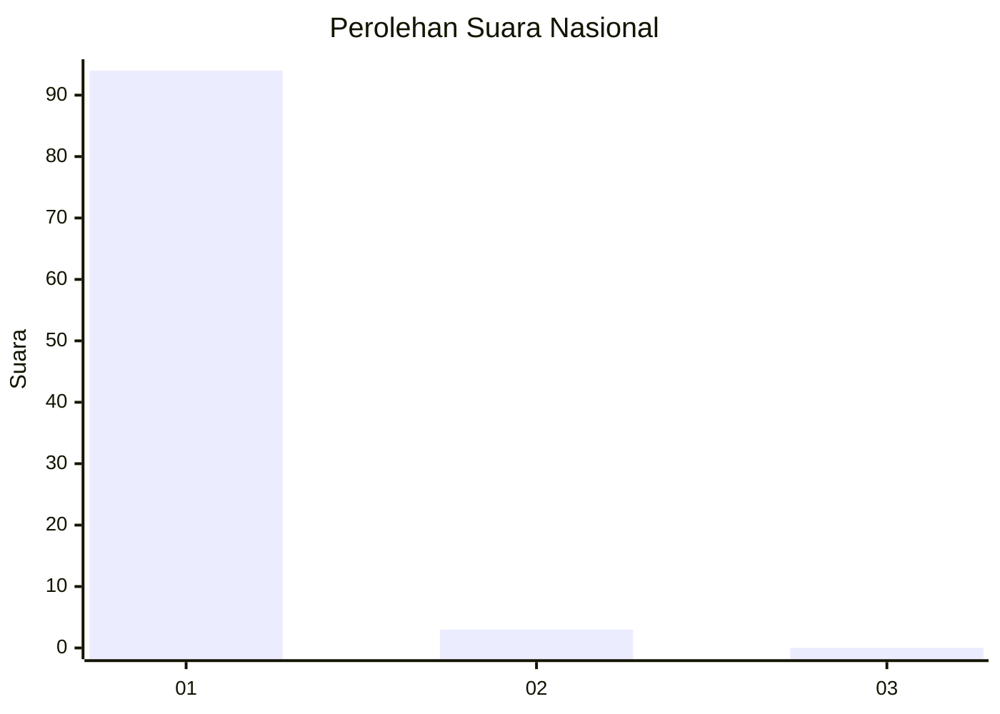
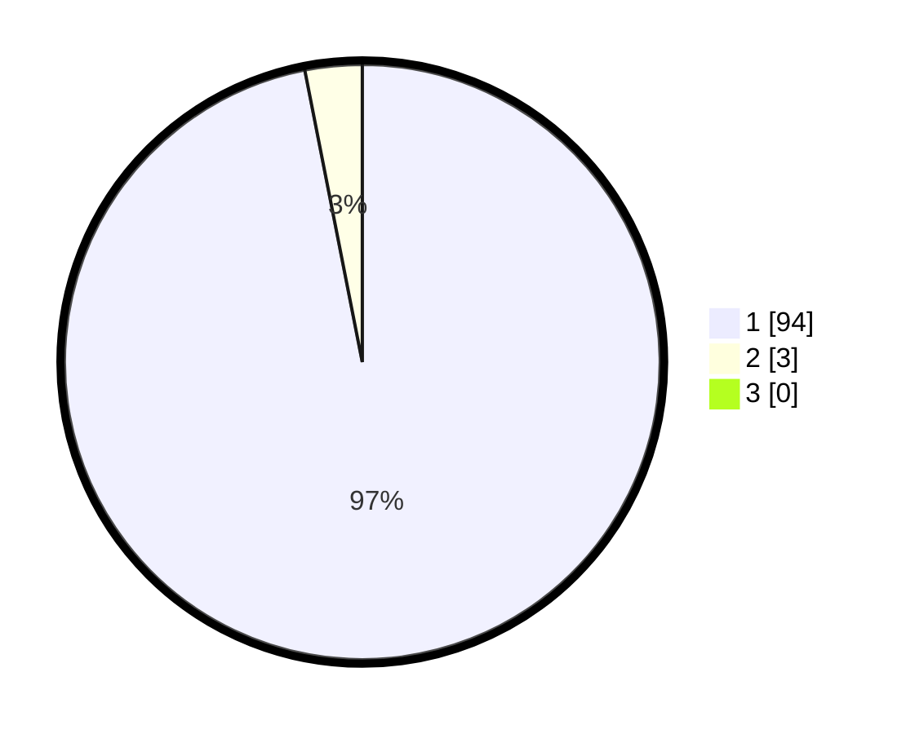

# Hasil

## Grafik

## Tabel

| No. | Nama Paslon    | Suara | Suara (raw) | Persentase |
|:--- |:-------------- | -----:| -----------:| ----------:|
| 1   | ANIES MUHAIMIN | 94    | [94][p-1]   | 96,91      |
| 2   | PRABOWO GIBRAN | 3     | [3][p-2]    | 3,09       |
| 3   | GANJAR MAHFUD  | 0     | [0][p-3]    | 0,00       |

[p-1]: https://github.com/gigit-pemilu/pemilu-2024/blob/main/pilpres/hitung-suara/sub/11-aceh/sub/08-aceh-utara/sub/12-tanah-luas/sub/2039-tumpok-aceh/sub/001-tps/sub/paslon-1.txt
[p-2]: https://github.com/gigit-pemilu/pemilu-2024/blob/main/pilpres/hitung-suara/sub/11-aceh/sub/08-aceh-utara/sub/12-tanah-luas/sub/2039-tumpok-aceh/sub/001-tps/sub/paslon-2.txt
[p-3]: https://github.com/gigit-pemilu/pemilu-2024/blob/main/pilpres/hitung-suara/sub/11-aceh/sub/08-aceh-utara/sub/12-tanah-luas/sub/2039-tumpok-aceh/sub/001-tps/sub/paslon-3.txt

## Foto C Plano

https://sirekap-obj-formc.kpu.go.id/c336/pemilu/ppwp/11/08/12/20/39/1108122039001-20240214-225335--07198895-9e57-4125-ac77-798dc73cdd05.jpg

https://sirekap-obj-formc.kpu.go.id/c336/pemilu/ppwp/11/08/12/20/39/1108122039001-20240214-224225--673f3d4b-a99c-45e3-908e-60333457f2c2.jpg

https://sirekap-obj-formc.kpu.go.id/c336/pemilu/ppwp/11/08/12/20/39/1108122039001-20240214-224628--f6bd0f6f-844c-4b04-abff-06191c5c4767.jpg

## Metadata

| Key        | Value               |
| ---------- | ------------------- |
| Time Stamp | 2024-02-17 16:00:02 |

