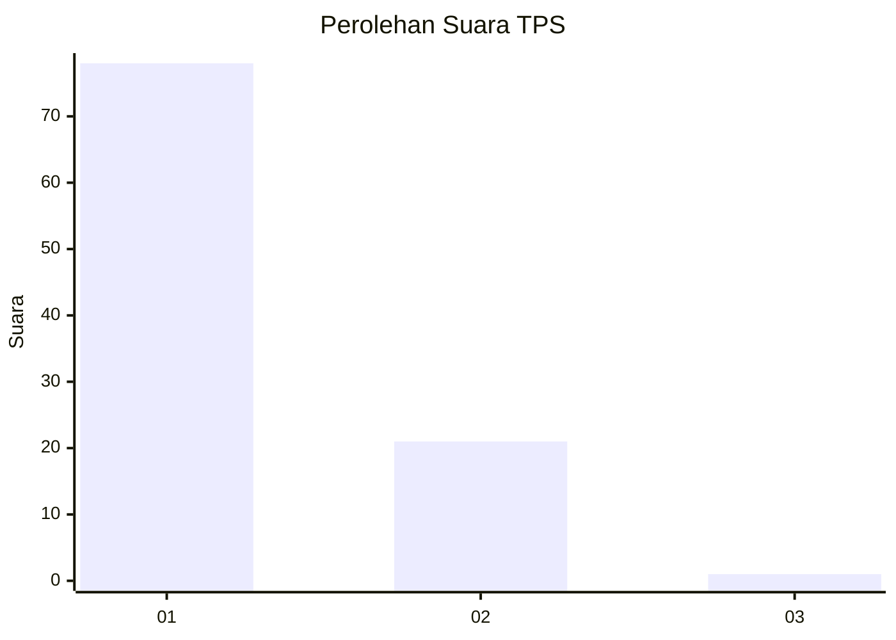
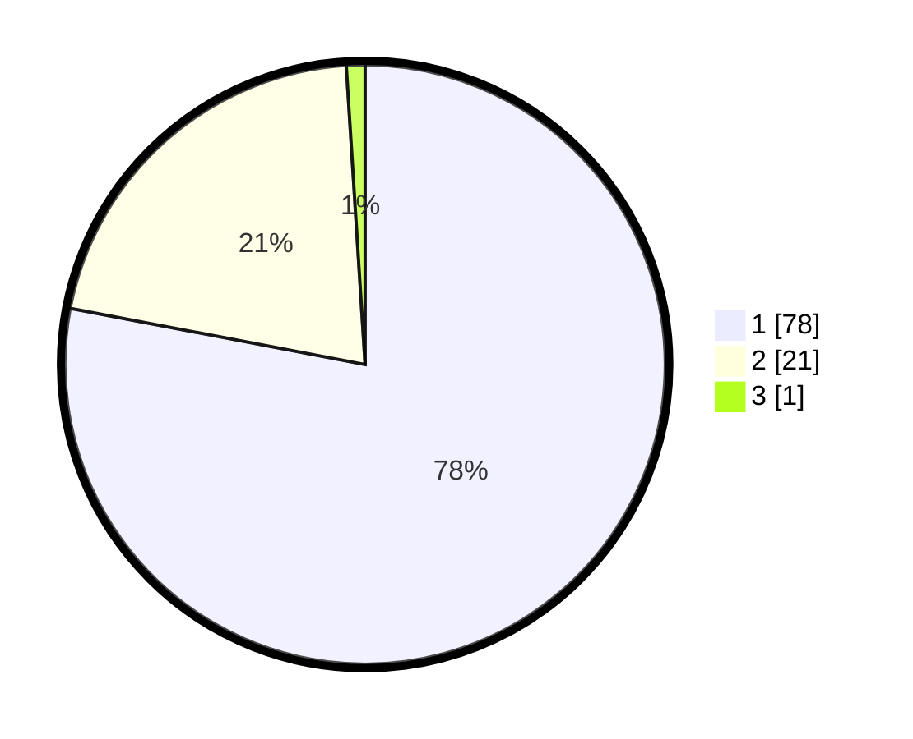

# Hasil

## Grafik

## Tabel

| No. | Nama Paslon    | Suara | Suara (raw) | Persentase |
|:--- |:-------------- | -----:| -----------:| ----------:|
| 1   | ANIES MUHAIMIN | 78    | [78][p-1]   | 78,00      |
| 2   | PRABOWO GIBRAN | 21    | [21][p-2]   | 21,00      |
| 3   | GANJAR MAHFUD  | 1     | [1][p-3]    | 1,00       |

[p-1]: https://github.com/gigit-pemilu/pemilu-2024-11-aceh/blob/main/pilpres/hitung-suara/sub/11-aceh/sub/08-aceh-utara/sub/12-tanah-luas/sub/2042-leupon-siren/sub/001-tps/sub/paslon-1.txt
[p-2]: https://github.com/gigit-pemilu/pemilu-2024-11-aceh/blob/main/pilpres/hitung-suara/sub/11-aceh/sub/08-aceh-utara/sub/12-tanah-luas/sub/2042-leupon-siren/sub/001-tps/sub/paslon-2.txt
[p-3]: https://github.com/gigit-pemilu/pemilu-2024-11-aceh/blob/main/pilpres/hitung-suara/sub/11-aceh/sub/08-aceh-utara/sub/12-tanah-luas/sub/2042-leupon-siren/sub/001-tps/sub/paslon-3.txt

## Foto C Plano

https://sirekap-obj-formc.kpu.go.id/d2ea/pemilu/ppwp/11/08/12/20/42/1108122042001-20240215-001901--07077157-9df2-4cdf-b4ec-582b2b5eb13a.jpg

https://sirekap-obj-formc.kpu.go.id/d2ea/pemilu/ppwp/11/08/12/20/42/1108122042001-20240215-003103--85dd0f4a-b965-4cd1-8c9b-c9354a3abeb8.jpg

## Metadata

| Key        | Value               |
| ---------- | ------------------- |
| Time Stamp | 2024-02-17 19:00:04 |

