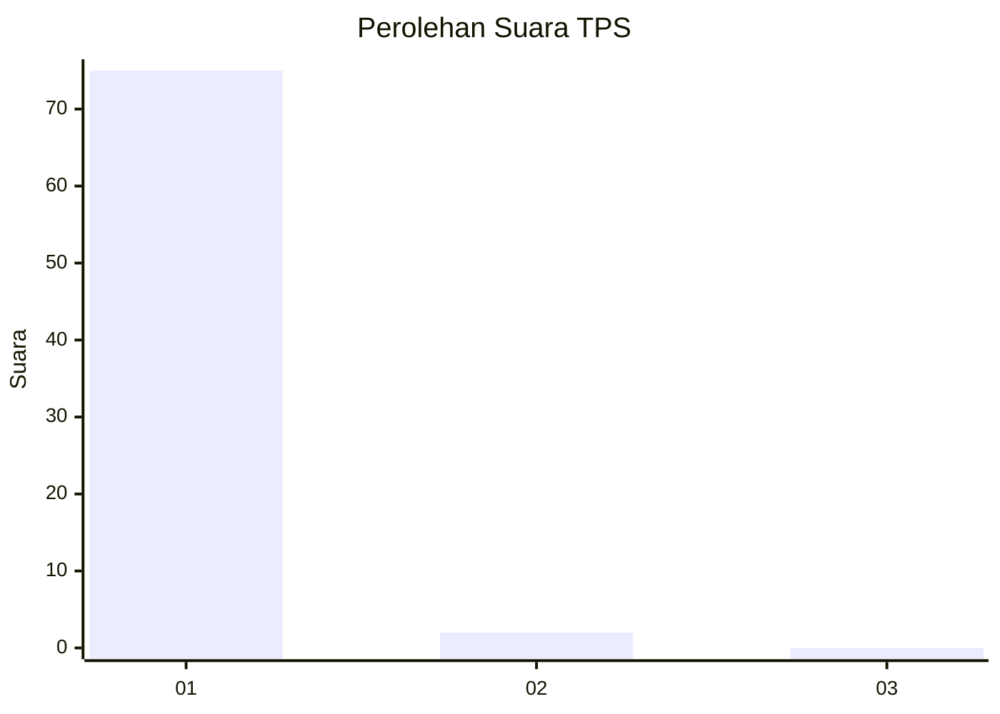
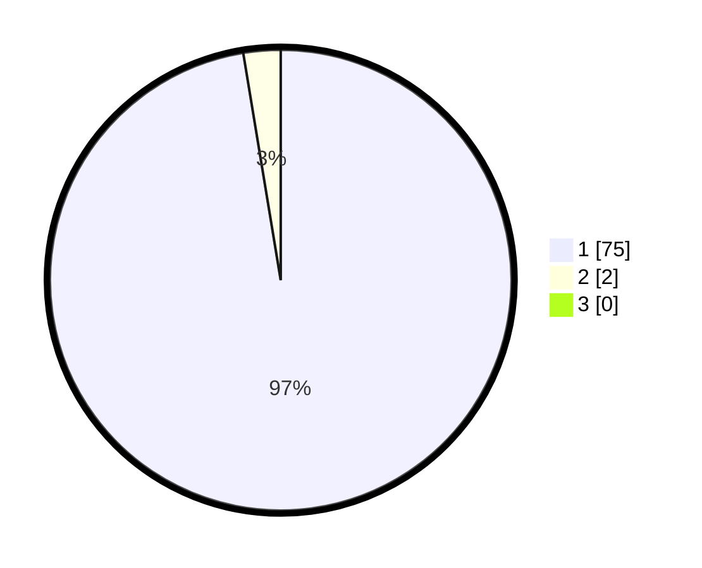

# Hasil

## Grafik

## Tabel

| No. | Nama Paslon    | Suara | Suara (raw) | Persentase |
|:--- |:-------------- | -----:| -----------:| ----------:|
| 1   | ANIES MUHAIMIN | 75    | [75][p-1]   | 97,40      |
| 2   | PRABOWO GIBRAN | 2     | [2][p-2]    | 2,60       |
| 3   | GANJAR MAHFUD  | 0     | [0][p-3]    | 0,00       |

[p-1]: https://github.com/gigit-pemilu/pemilu-2024-11-aceh/blob/main/pilpres/hitung-suara/sub/11-aceh/sub/08-aceh-utara/sub/12-tanah-luas/sub/2044-alue-sijuek/sub/001-tps/sub/paslon-1.txt
[p-2]: https://github.com/gigit-pemilu/pemilu-2024-11-aceh/blob/main/pilpres/hitung-suara/sub/11-aceh/sub/08-aceh-utara/sub/12-tanah-luas/sub/2044-alue-sijuek/sub/001-tps/sub/paslon-2.txt
[p-3]: https://github.com/gigit-pemilu/pemilu-2024-11-aceh/blob/main/pilpres/hitung-suara/sub/11-aceh/sub/08-aceh-utara/sub/12-tanah-luas/sub/2044-alue-sijuek/sub/001-tps/sub/paslon-3.txt

## Foto C Plano

https://sirekap-obj-formc.kpu.go.id/092e/pemilu/ppwp/11/08/12/20/44/1108122044001-20240223-001132--11c988db-e309-4fbb-affe-2df0d4c23b6e.jpg

https://sirekap-obj-formc.kpu.go.id/092e/pemilu/ppwp/11/08/12/20/44/1108122044001-20240223-001134--23182e66-de70-4e7c-83be-35193b014931.jpg

https://sirekap-obj-formc.kpu.go.id/092e/pemilu/ppwp/11/08/12/20/44/1108122044001-20240223-001133--1ebc466f-382d-481b-a4ef-6ed8d5accd23.jpg

## Metadata

| Key        | Value               |
| ---------- | ------------------- |
| Time Stamp | 2024-02-24 22:31:28 |

## DATA PEMILIH TETAP

Jumlah pemilih dalam DPT: **78**.
 * L: **36**.
 * P: **42**.

## DATA PENGGUNA HAK PILIH

Jumlah pengguna hak pilih dalam DPT: **77**.
 * L: **36**.
 * P: **41**.

Jumlah pengguna hak pilih dalam DPTb: **0**.
 * L: **0**.
 * P: **0**.

Jumlah pengguna hak pilih dalam DPK: **0**.
 * L: **0**.
 * P: **0**.

Jumlah pengguna hak pilih: **77**.
 * L: **36**.
 * P: **41**.

## JUMLAH SUARA SAH DAN TIDAK SAH

JUMLAH SELURUH SUARA SAH: **77**.

JUMLAH SUARA TIDAK SAH: **0**.

JUMLAH SELURUH SUARA SAH DAN SUARA TIDAK SAH: **77**.

