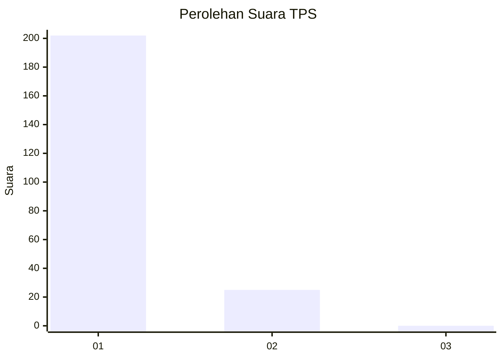
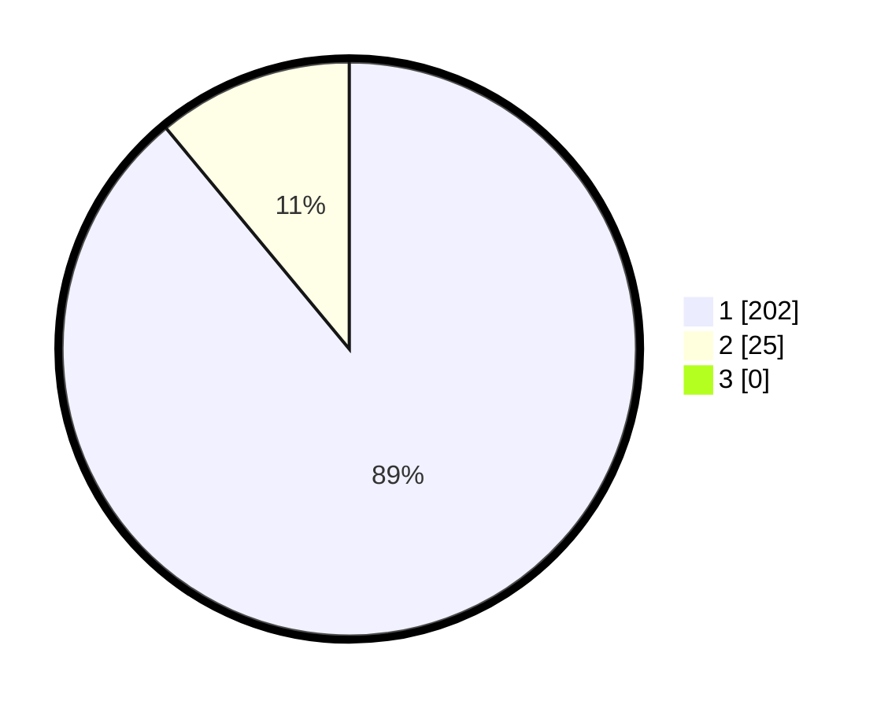

# Hasil

## Grafik

## Tabel

| No. | Nama Paslon    | Suara | Suara (raw) | Persentase |
|:--- |:-------------- | -----:| -----------:| ----------:|
| 1   | ANIES MUHAIMIN | 202   | [202][p-1]  | 88,99      |
| 2   | PRABOWO GIBRAN | 25    | [25][p-2]   | 11,01      |
| 3   | GANJAR MAHFUD  | 0     | [0][p-3]    | 0,00       |

[p-1]: https://github.com/gigit-pemilu/pemilu-2024-11-aceh/blob/main/pilpres/hitung-suara/sub/11-aceh/sub/08-aceh-utara/sub/12-tanah-luas/sub/2049-punti-seuleumak-barat/sub/001-tps/sub/paslon-1.txt
[p-2]: https://github.com/gigit-pemilu/pemilu-2024-11-aceh/blob/main/pilpres/hitung-suara/sub/11-aceh/sub/08-aceh-utara/sub/12-tanah-luas/sub/2049-punti-seuleumak-barat/sub/001-tps/sub/paslon-2.txt
[p-3]: https://github.com/gigit-pemilu/pemilu-2024-11-aceh/blob/main/pilpres/hitung-suara/sub/11-aceh/sub/08-aceh-utara/sub/12-tanah-luas/sub/2049-punti-seuleumak-barat/sub/001-tps/sub/paslon-3.txt

## Foto C Plano

https://sirekap-obj-formc.kpu.go.id/acd6/pemilu/ppwp/11/08/12/20/49/1108122049001-20240224-014217--744924de-a349-49c0-9199-d309d5f8f1b2.jpg

https://sirekap-obj-formc.kpu.go.id/acd6/pemilu/ppwp/11/08/12/20/49/1108122049001-20240224-014958--7f511dde-386b-4ba0-8b1d-9e6e0268f9e7.jpg

https://sirekap-obj-formc.kpu.go.id/acd6/pemilu/ppwp/11/08/12/20/49/1108122049001-20240224-014844--34d6c75e-006a-4fcc-a5e0-cadfd620952f.jpg

## Metadata

| Key        | Value               |
| ---------- | ------------------- |
| Time Stamp | 2024-02-24 22:31:28 |

