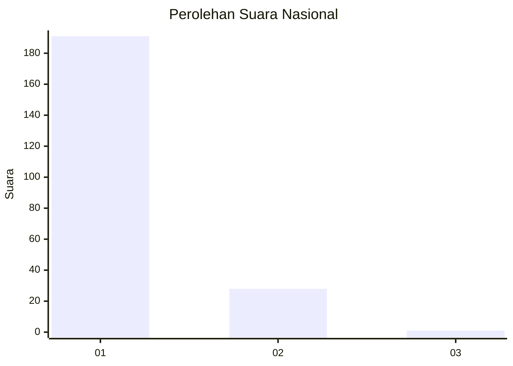
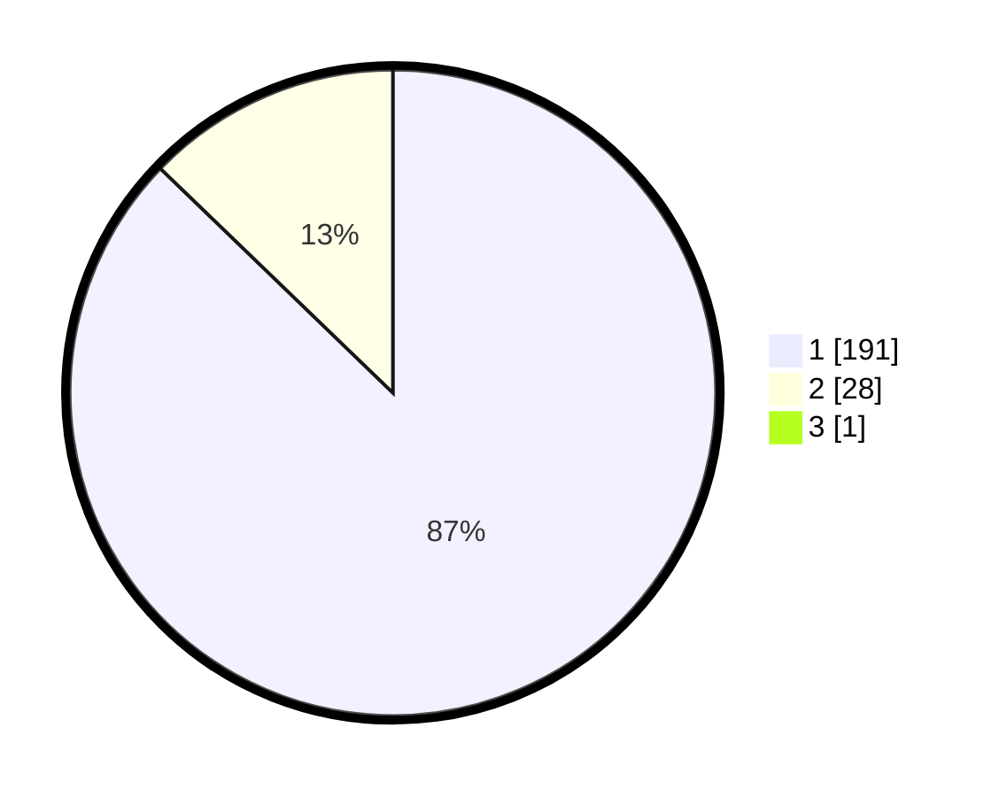

# Hasil

## Grafik

## Tabel

| No. | Nama Paslon    | Suara | Suara (raw) | Persentase |
|:--- |:-------------- | -----:| -----------:| ----------:|
| 1   | ANIES MUHAIMIN | 191   | [191][p-1]  | 86,82      |
| 2   | PRABOWO GIBRAN | 28    | [28][p-2]   | 12,73      |
| 3   | GANJAR MAHFUD  | 1     | [1][p-3]    | 0,45       |

[p-1]: https://github.com/gigit-pemilu/pemilu-2024/blob/main/pilpres/hitung-suara/sub/11-aceh/sub/08-aceh-utara/sub/12-tanah-luas/sub/2055-cot-barat/sub/001-tps/sub/paslon-1.txt
[p-2]: https://github.com/gigit-pemilu/pemilu-2024/blob/main/pilpres/hitung-suara/sub/11-aceh/sub/08-aceh-utara/sub/12-tanah-luas/sub/2055-cot-barat/sub/001-tps/sub/paslon-2.txt
[p-3]: https://github.com/gigit-pemilu/pemilu-2024/blob/main/pilpres/hitung-suara/sub/11-aceh/sub/08-aceh-utara/sub/12-tanah-luas/sub/2055-cot-barat/sub/001-tps/sub/paslon-3.txt

## Foto C Plano

https://sirekap-obj-formc.kpu.go.id/dde2/pemilu/ppwp/11/08/12/20/55/1108122055001-20240215-012645--9942aa87-da91-458c-916f-14042bcbb3cf.jpg

https://sirekap-obj-formc.kpu.go.id/dde2/pemilu/ppwp/11/08/12/20/55/1108122055001-20240215-013001--a5083d9b-5715-434a-a66f-38eb08ff70b1.jpg

https://sirekap-obj-formc.kpu.go.id/dde2/pemilu/ppwp/11/08/12/20/55/1108122055001-20240215-013151--7c63a82b-c59e-40ed-ad2e-78409deefe21.jpg

## Metadata

| Key        | Value               |
| ---------- | ------------------- |
| Time Stamp | 2024-02-17 16:00:02 |

