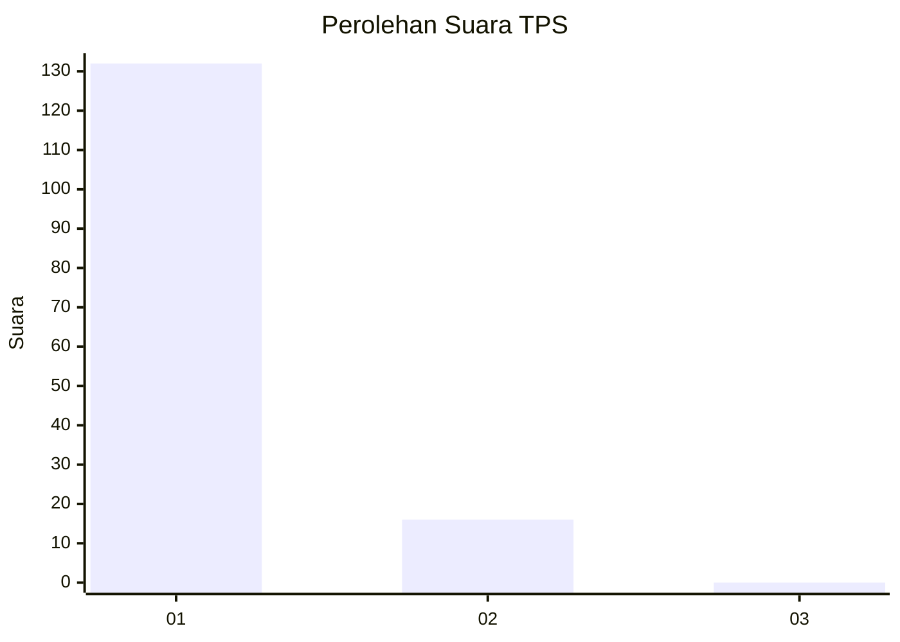
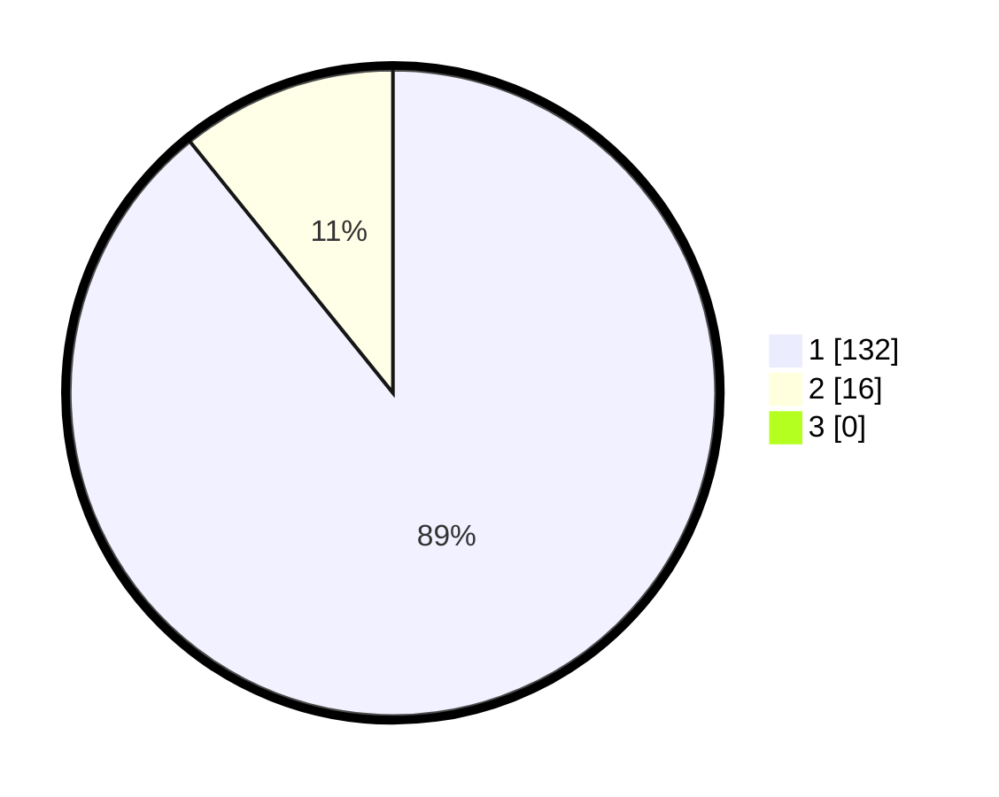

# Hasil

## Grafik

## Tabel

| No. | Nama Paslon    | Suara | Suara (raw) | Persentase |
|:--- |:-------------- | -----:| -----------:| ----------:|
| 1   | ANIES MUHAIMIN | 132   | [132][p-1]  | 89,19      |
| 2   | PRABOWO GIBRAN | 16    | [16][p-2]   | 10,81      |
| 3   | GANJAR MAHFUD  | 0     | [0][p-3]    | 0,00       |

[p-1]: https://github.com/gigit-pemilu/pemilu-2024-11-aceh/blob/main/pilpres/hitung-suara/sub/11-aceh/sub/08-aceh-utara/sub/13-tanah-pasir/sub/2001-alue/sub/001-tps/sub/paslon-1.txt
[p-2]: https://github.com/gigit-pemilu/pemilu-2024-11-aceh/blob/main/pilpres/hitung-suara/sub/11-aceh/sub/08-aceh-utara/sub/13-tanah-pasir/sub/2001-alue/sub/001-tps/sub/paslon-2.txt
[p-3]: https://github.com/gigit-pemilu/pemilu-2024-11-aceh/blob/main/pilpres/hitung-suara/sub/11-aceh/sub/08-aceh-utara/sub/13-tanah-pasir/sub/2001-alue/sub/001-tps/sub/paslon-3.txt

## Foto C Plano

https://sirekap-obj-formc.kpu.go.id/3c5f/pemilu/ppwp/11/08/13/20/01/1108132001001-20240303-165342--75750a7a-f249-4970-b43e-ec848488f47c.jpg

https://sirekap-obj-formc.kpu.go.id/3c5f/pemilu/ppwp/11/08/13/20/01/1108132001001-20240303-165355--f12f623a-8a70-4924-b892-8c6132e80cdc.jpg

https://sirekap-obj-formc.kpu.go.id/3c5f/pemilu/ppwp/11/08/13/20/01/1108132001001-20240303-165408--8acf0b66-c08f-47f7-bf83-b40246594c68.jpg

## Metadata

| Key        | Value               |
| ---------- | ------------------- |
| Time Stamp | 2024-03-10 22:00:00 |

