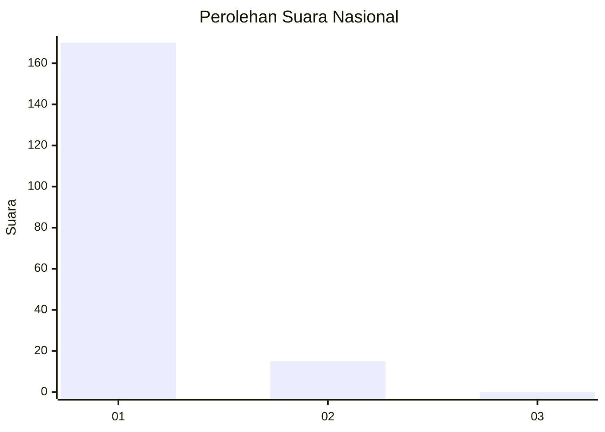
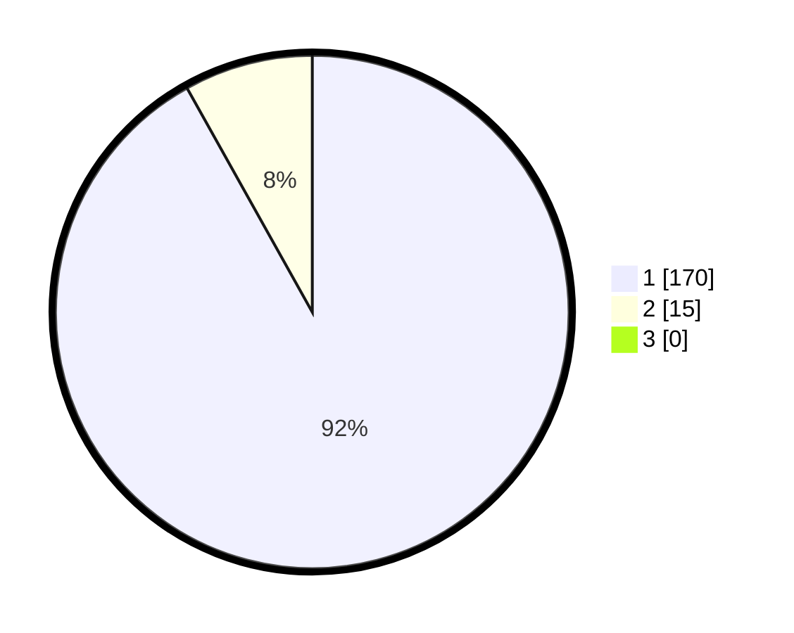

# Hasil

## Grafik

## Tabel

| No. | Nama Paslon    | Suara | Suara (raw) | Persentase |
|:--- |:-------------- | -----:| -----------:| ----------:|
| 1   | ANIES MUHAIMIN | 170   | [170][p-1]  | 91,89      |
| 2   | PRABOWO GIBRAN | 15    | [15][p-2]   | 8,11       |
| 3   | GANJAR MAHFUD  | 0     | [0][p-3]    | 0,00       |

[p-1]: https://github.com/gigit-pemilu/pemilu-2024/blob/main/pilpres/hitung-suara/sub/11-aceh/sub/08-aceh-utara/sub/13-tanah-pasir/sub/2002-mee-matang-panyang/sub/001-tps/sub/paslon-1.txt
[p-2]: https://github.com/gigit-pemilu/pemilu-2024/blob/main/pilpres/hitung-suara/sub/11-aceh/sub/08-aceh-utara/sub/13-tanah-pasir/sub/2002-mee-matang-panyang/sub/001-tps/sub/paslon-2.txt
[p-3]: https://github.com/gigit-pemilu/pemilu-2024/blob/main/pilpres/hitung-suara/sub/11-aceh/sub/08-aceh-utara/sub/13-tanah-pasir/sub/2002-mee-matang-panyang/sub/001-tps/sub/paslon-3.txt

## Foto C Plano

https://sirekap-obj-formc.kpu.go.id/978b/pemilu/ppwp/11/08/13/20/02/1108132002001-20240304-163117--636229f5-bc3f-4389-943d-86dfd5aba236.jpg

https://sirekap-obj-formc.kpu.go.id/978b/pemilu/ppwp/11/08/13/20/02/1108132002001-20240304-163232--44629f3c-cc8d-4bc9-a5cc-8d523b8410ff.jpg

https://sirekap-obj-formc.kpu.go.id/978b/pemilu/ppwp/11/08/13/20/02/1108132002001-20240304-163252--2f78389e-bdfa-412a-aa26-9d5ac42823c1.jpg

## Metadata

| Key        | Value               |
| ---------- | ------------------- |
| Time Stamp | 2024-03-10 22:00:00 |

