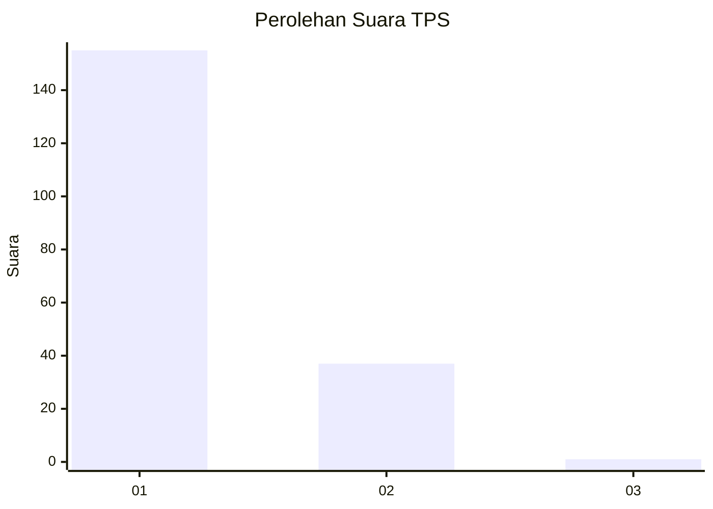
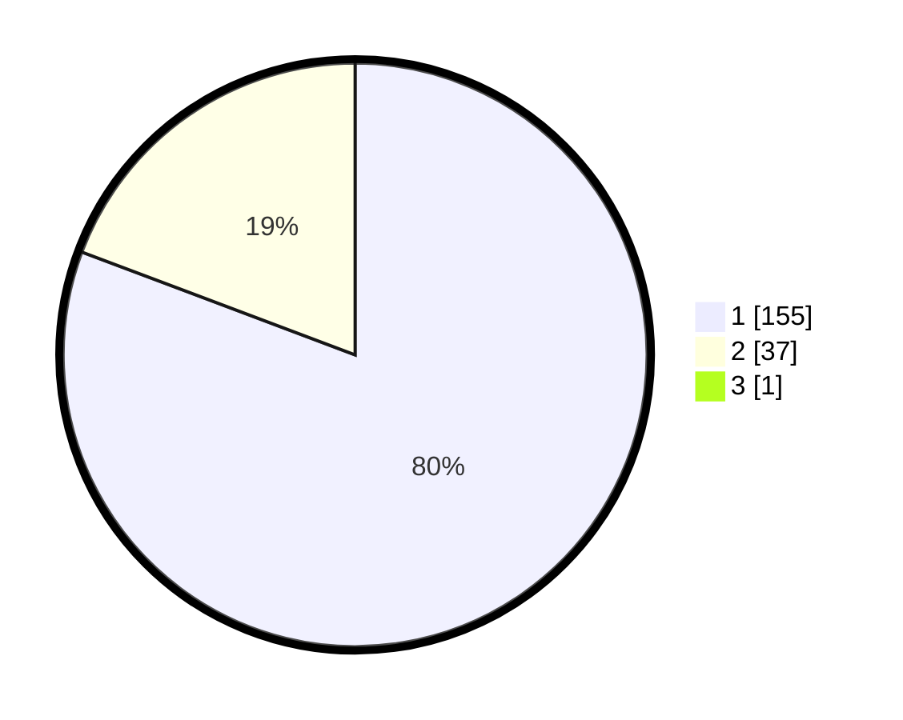

# Hasil

## Grafik

## Tabel

| No. | Nama Paslon    | Suara | Suara (raw) | Persentase |
|:--- |:-------------- | -----:| -----------:| ----------:|
| 1   | ANIES MUHAIMIN | 155   | [155][p-1]  | 80,31      |
| 2   | PRABOWO GIBRAN | 37    | [37][p-2]   | 19,17      |
| 3   | GANJAR MAHFUD  | 1     | [1][p-3]    | 0,52       |

[p-1]: https://github.com/gigit-pemilu/pemilu-2024-11-aceh/blob/main/pilpres/hitung-suara/sub/11-aceh/sub/08-aceh-utara/sub/13-tanah-pasir/sub/2004-paloh/sub/003-tps/sub/paslon-1.txt
[p-2]: https://github.com/gigit-pemilu/pemilu-2024-11-aceh/blob/main/pilpres/hitung-suara/sub/11-aceh/sub/08-aceh-utara/sub/13-tanah-pasir/sub/2004-paloh/sub/003-tps/sub/paslon-2.txt
[p-3]: https://github.com/gigit-pemilu/pemilu-2024-11-aceh/blob/main/pilpres/hitung-suara/sub/11-aceh/sub/08-aceh-utara/sub/13-tanah-pasir/sub/2004-paloh/sub/003-tps/sub/paslon-3.txt

## Foto C Plano

https://sirekap-obj-formc.kpu.go.id/9a5d/pemilu/ppwp/11/08/13/20/04/1108132004003-20240221-153248--136de679-d483-46c0-96ff-0c5305970c08.jpg

https://sirekap-obj-formc.kpu.go.id/9a5d/pemilu/ppwp/11/08/13/20/04/1108132004003-20240221-153651--6be446b2-0769-404f-b50f-0f54bb28cd60.jpg

https://sirekap-obj-formc.kpu.go.id/9a5d/pemilu/ppwp/11/08/13/20/04/1108132004003-20240221-153401--6dbd1f55-3507-4fa1-b695-c8f4ed77f1e3.jpg

## Metadata

| Key        | Value               |
| ---------- | ------------------- |
| Time Stamp | 2024-02-21 16:00:00 |

