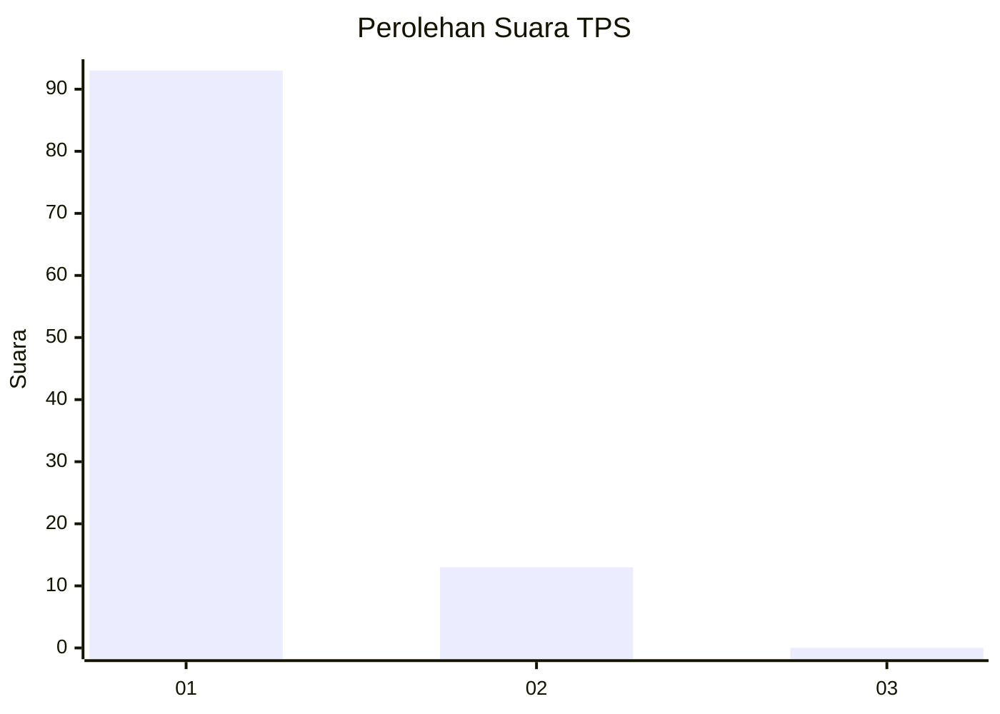
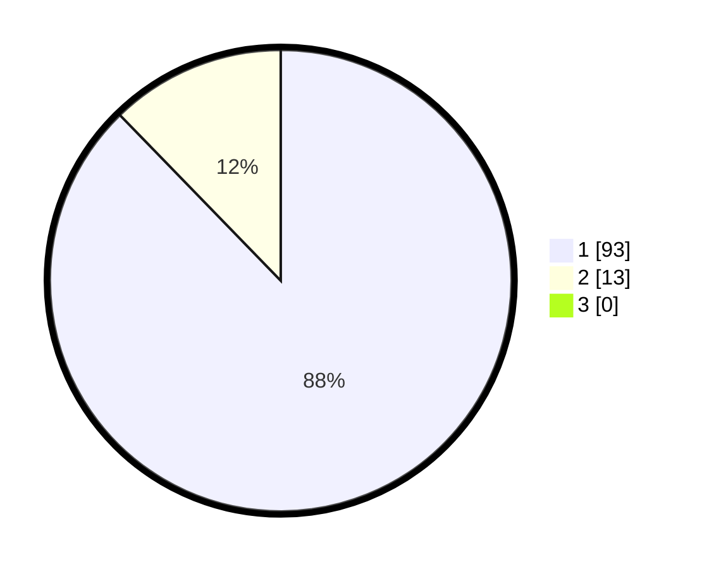

# Hasil

## Grafik

## Tabel

| No. | Nama Paslon    | Suara | Suara (raw) | Persentase |
|:--- |:-------------- | -----:| -----------:| ----------:|
| 1   | ANIES MUHAIMIN | 93    | [93][p-1]   | 87,74      |
| 2   | PRABOWO GIBRAN | 13    | [13][p-2]   | 12,26      |
| 3   | GANJAR MAHFUD  | 0     | [0][p-3]    | 0,00       |

[p-1]: https://github.com/gigit-pemilu/pemilu-2024-11-aceh/blob/main/pilpres/hitung-suara/sub/11-aceh/sub/08-aceh-utara/sub/13-tanah-pasir/sub/2005-keude-matang-payang/sub/001-tps/sub/paslon-1.txt
[p-2]: https://github.com/gigit-pemilu/pemilu-2024-11-aceh/blob/main/pilpres/hitung-suara/sub/11-aceh/sub/08-aceh-utara/sub/13-tanah-pasir/sub/2005-keude-matang-payang/sub/001-tps/sub/paslon-2.txt
[p-3]: https://github.com/gigit-pemilu/pemilu-2024-11-aceh/blob/main/pilpres/hitung-suara/sub/11-aceh/sub/08-aceh-utara/sub/13-tanah-pasir/sub/2005-keude-matang-payang/sub/001-tps/sub/paslon-3.txt

## Foto C Plano

https://sirekap-obj-formc.kpu.go.id/4e6c/pemilu/ppwp/11/08/13/20/05/1108132005001-20240301-161053--5671113d-3b19-4af2-8bd5-e10480430ec1.jpg

https://sirekap-obj-formc.kpu.go.id/4e6c/pemilu/ppwp/11/08/13/20/05/1108132005001-20240301-161125--16a310e7-82eb-4738-9a01-a009dc1703a4.jpg

https://sirekap-obj-formc.kpu.go.id/4e6c/pemilu/ppwp/11/08/13/20/05/1108132005001-20240301-161200--2b4f4d35-e888-4e69-a81e-9c5f0cbf97fa.jpg

## Metadata

| Key        | Value               |
| ---------- | ------------------- |
| Time Stamp | 2024-03-10 22:00:00 |

