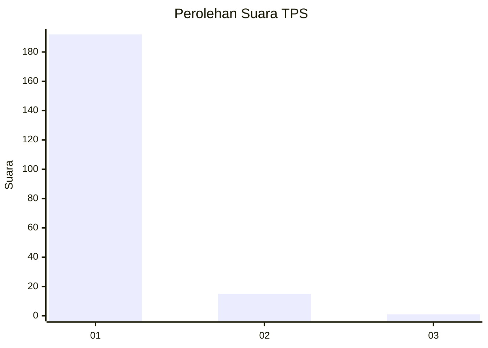
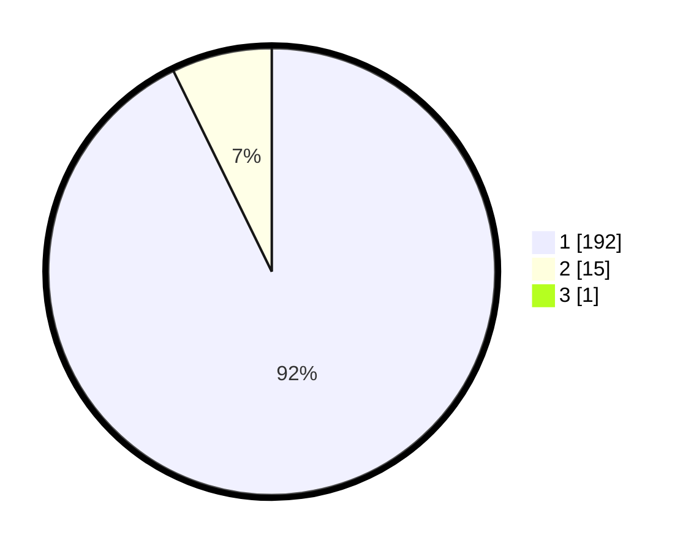

# Hasil

## Grafik

## Tabel

| No. | Nama Paslon    | Suara | Suara (raw) | Persentase |
|:--- |:-------------- | -----:| -----------:| ----------:|
| 1   | ANIES MUHAIMIN | 192   | [192][p-1]  | 92,31      |
| 2   | PRABOWO GIBRAN | 15    | [15][p-2]   | 7,21       |
| 3   | GANJAR MAHFUD  | 1     | [1][p-3]    | 0,48       |

[p-1]: https://github.com/gigit-pemilu/pemilu-2024-11-aceh/blob/main/pilpres/hitung-suara/sub/11-aceh/sub/08-aceh-utara/sub/13-tanah-pasir/sub/2006-gampong-pande/sub/001-tps/sub/paslon-1.txt
[p-2]: https://github.com/gigit-pemilu/pemilu-2024-11-aceh/blob/main/pilpres/hitung-suara/sub/11-aceh/sub/08-aceh-utara/sub/13-tanah-pasir/sub/2006-gampong-pande/sub/001-tps/sub/paslon-2.txt
[p-3]: https://github.com/gigit-pemilu/pemilu-2024-11-aceh/blob/main/pilpres/hitung-suara/sub/11-aceh/sub/08-aceh-utara/sub/13-tanah-pasir/sub/2006-gampong-pande/sub/001-tps/sub/paslon-3.txt

## Foto C Plano

https://sirekap-obj-formc.kpu.go.id/2479/pemilu/ppwp/11/08/13/20/06/1108132006001-20240304-103558--19bb9644-5b72-44c9-ae01-c4b1c293d3dd.jpg

https://sirekap-obj-formc.kpu.go.id/2479/pemilu/ppwp/11/08/13/20/06/1108132006001-20240304-103629--cb14f0f7-fe10-4e7d-b9c6-faac262e977b.jpg

https://sirekap-obj-formc.kpu.go.id/2479/pemilu/ppwp/11/08/13/20/06/1108132006001-20240304-103652--76b7ef59-2901-4b5f-9bc2-39b7ecb1e4e1.jpg

## Metadata

| Key        | Value               |
| ---------- | ------------------- |
| Time Stamp | 2024-03-10 22:00:00 |

