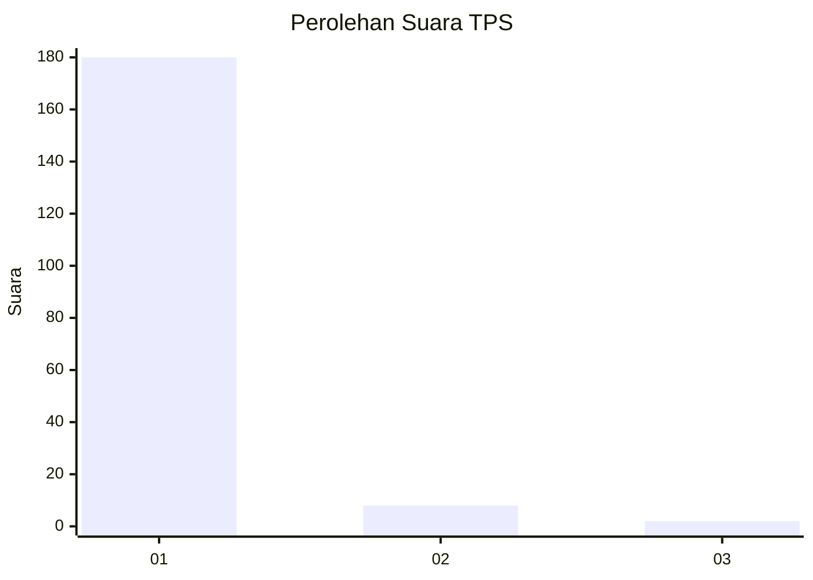
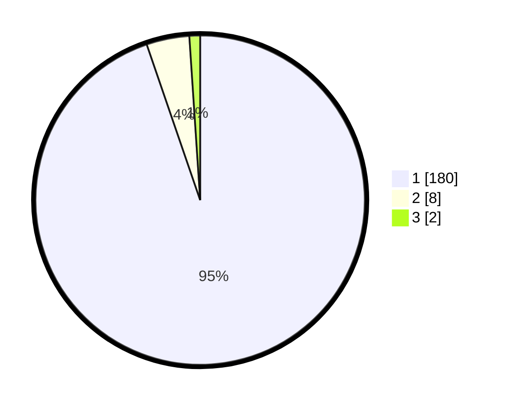

# Hasil

## Grafik

## Tabel

| No. | Nama Paslon    | Suara | Suara (raw) | Persentase |
|:--- |:-------------- | -----:| -----------:| ----------:|
| 1   | ANIES MUHAIMIN | 180   | [180][p-1]  | 94,74      |
| 2   | PRABOWO GIBRAN | 8     | [8][p-2]    | 4,21       |
| 3   | GANJAR MAHFUD  | 2     | [2][p-3]    | 1,05       |

[p-1]: https://github.com/gigit-pemilu/pemilu-2024-11-aceh/blob/main/pilpres/hitung-suara/sub/11-aceh/sub/08-aceh-utara/sub/13-tanah-pasir/sub/2006-gampong-pande/sub/002-tps/sub/paslon-1.txt
[p-2]: https://github.com/gigit-pemilu/pemilu-2024-11-aceh/blob/main/pilpres/hitung-suara/sub/11-aceh/sub/08-aceh-utara/sub/13-tanah-pasir/sub/2006-gampong-pande/sub/002-tps/sub/paslon-2.txt
[p-3]: https://github.com/gigit-pemilu/pemilu-2024-11-aceh/blob/main/pilpres/hitung-suara/sub/11-aceh/sub/08-aceh-utara/sub/13-tanah-pasir/sub/2006-gampong-pande/sub/002-tps/sub/paslon-3.txt

## Foto C Plano

https://sirekap-obj-formc.kpu.go.id/626b/pemilu/ppwp/11/08/13/20/06/1108132006002-20240304-115507--082a55ce-dce9-4139-8ebd-2b869af2891f.jpg

https://sirekap-obj-formc.kpu.go.id/626b/pemilu/ppwp/11/08/13/20/06/1108132006002-20240304-115528--46aaef19-fe57-44bd-afdd-c39b97690f23.jpg

https://sirekap-obj-formc.kpu.go.id/626b/pemilu/ppwp/11/08/13/20/06/1108132006002-20240304-115550--faf81182-d8b7-41d4-9f39-73f6070bcdeb.jpg

## Metadata

| Key        | Value               |
| ---------- | ------------------- |
| Time Stamp | 2024-03-10 23:00:00 |

